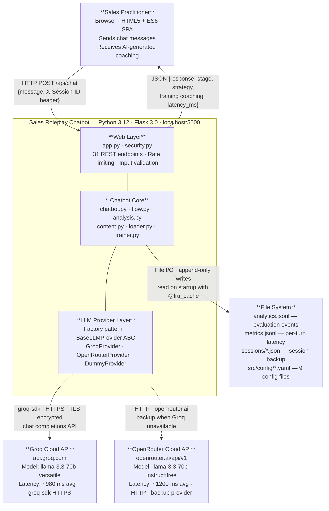
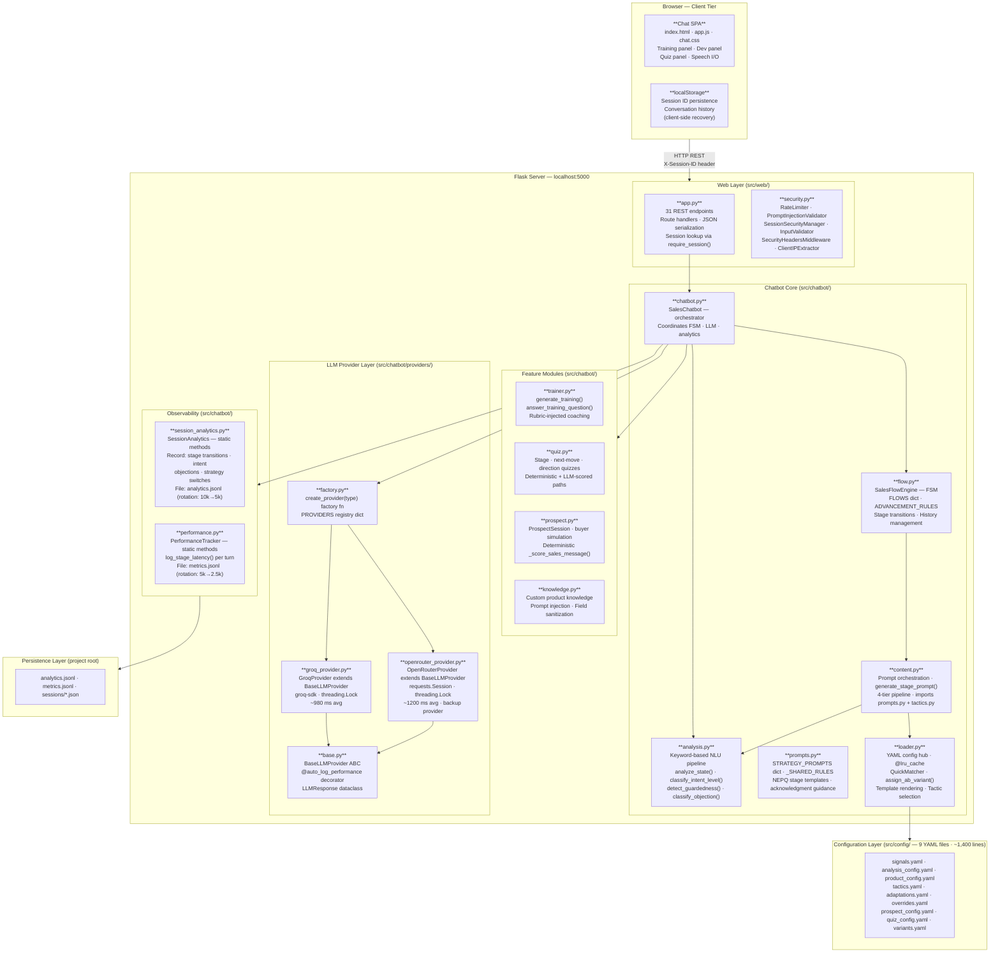
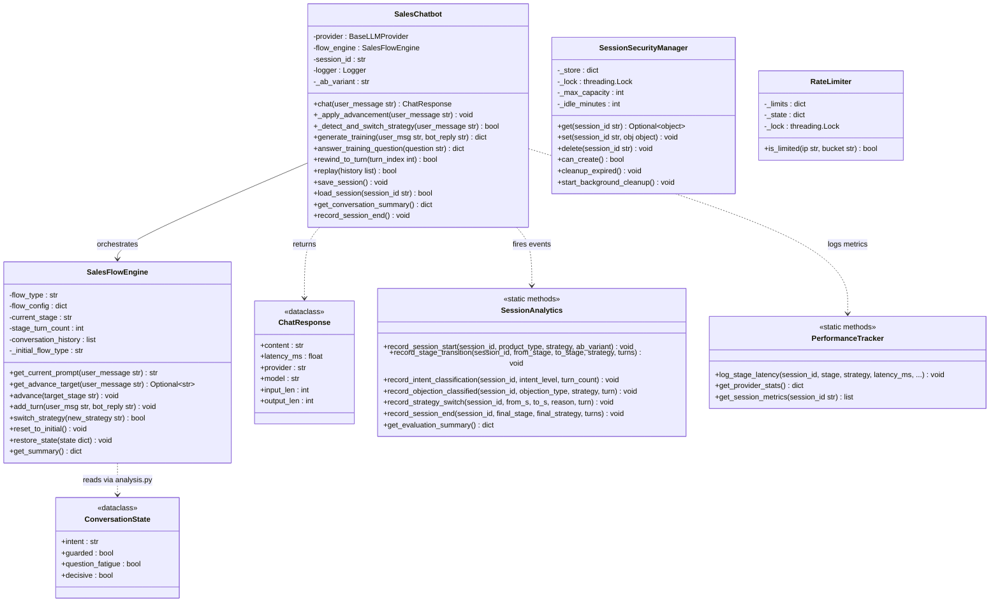
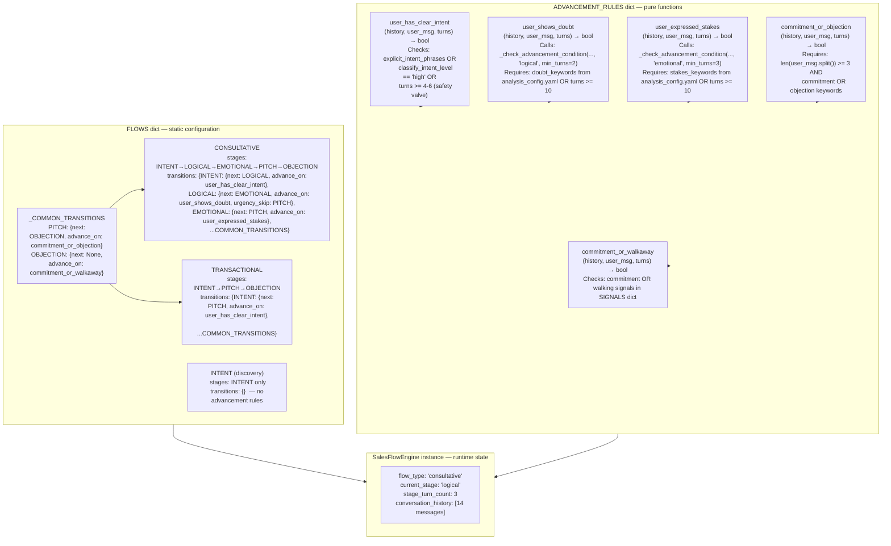
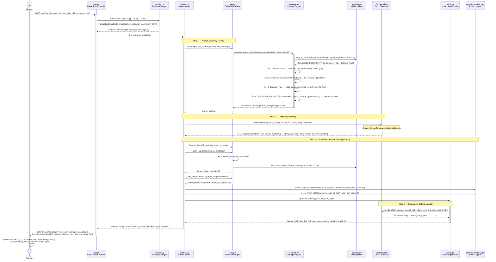
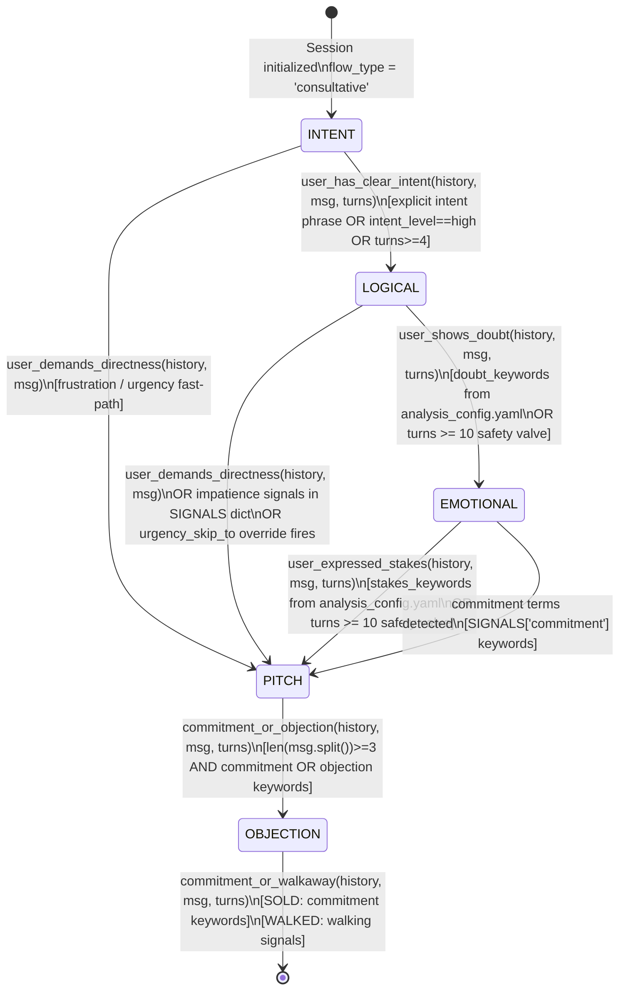
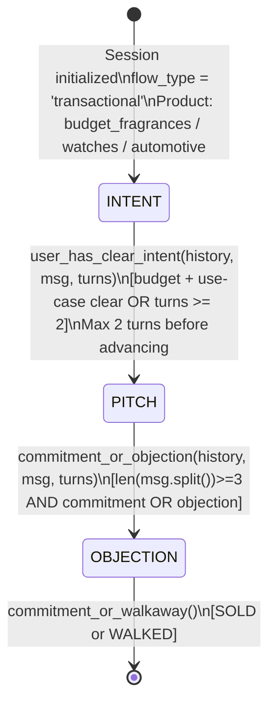
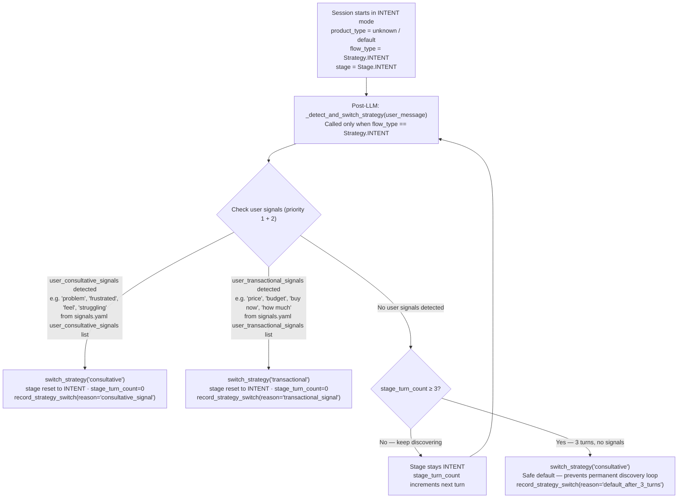
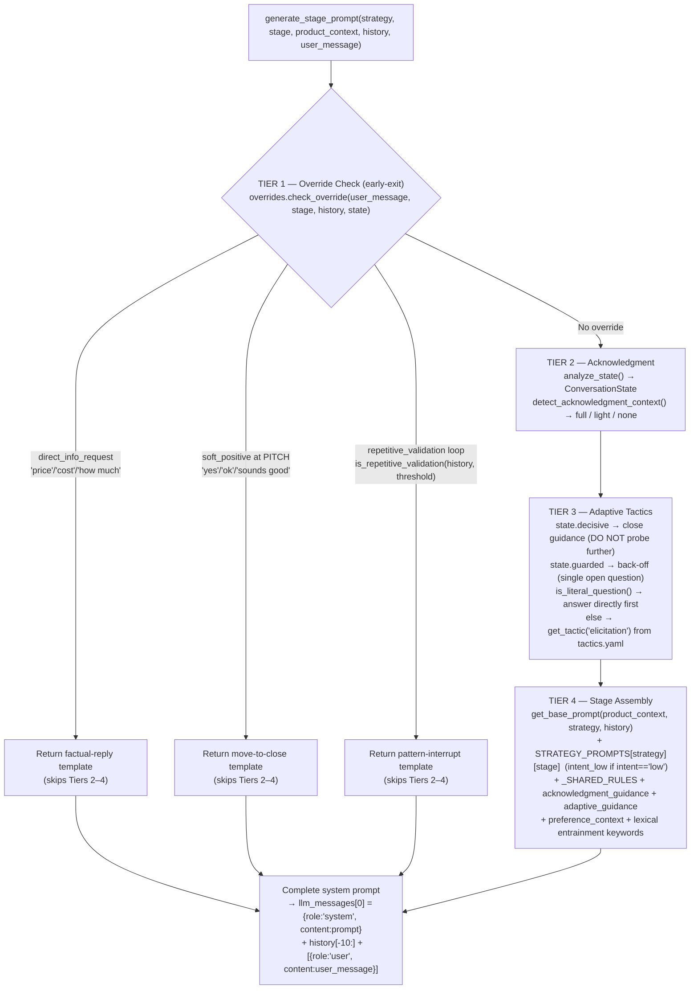

# Sales Roleplay Chatbot — System Architecture

**Document Version:** 3.0
**Date:** 21 March 2026
**Template:** arc42 (adapted for FYP)
**Status:** Complete — reflects current codebase

> **Related Documents:**
> - [Project-doc.md](Project-doc.md) — Full project report
> - [technical_audit.md](technical_audit.md) — Code quality analysis and fixes
> - [TESTING_STRATEGY.md](../TESTING_STRATEGY.md) — Test design and validation

---

## Table of Contents

1. [Introduction & Goals](#1-introduction--goals)
2. [Architecture Constraints](#2-architecture-constraints)
3. [System Scope & Context](#3-system-scope--context)
4. [Solution Strategy](#4-solution-strategy)
5. [Building Block View](#5-building-block-view)
   - 5.1 Level 1 — System Context
   - 5.2 Level 2 — Containers
   - 5.3 Level 3 — Components (all modules)
6. [Runtime View](#6-runtime-view)
   - 6.1 Chat Turn Lifecycle
   - 6.2 FSM Advancement
   - 6.3 Prompt Assembly Pipeline
   - 6.4 Prospect Mode Turn
   - 6.5 Session Lifecycle
7. [Deployment View](#7-deployment-view)
8. [Cross-Cutting Concerns](#8-cross-cutting-concerns)
   - 8.1 Security
   - 8.2 Thread Safety
   - 8.3 Error Handling & Resilience
   - 8.4 Performance & Observability
9. [Architecture Decisions](#9-architecture-decisions)
10. [Quality & Technical Debt](#10-quality--technical-debt)
11. [API Reference](#11-api-reference)
12. [Configuration Architecture](#12-configuration-architecture)
13. [Design Patterns Catalogue](#13-design-patterns-catalogue)
14. [Evolution History](#14-evolution-history)
15. [Glossary](#15-glossary)

**Appendix A:** [File Reference Index](#appendix-a-file-reference-index)

---

## 1. Introduction & Goals

### 1.1 Purpose

An AI-powered sales roleplay chatbot that trains users in consultative and transactional selling techniques. The system uses a **Finite State Machine** to enforce structured sales methodology (NEPQ for consultative, NEEDS→MATCH→CLOSE for transactional), a **multi-stage NLU pipeline** for deterministic signal detection, and **adaptive prompt engineering** to generate stage-aware LLM responses.

### 1.2 Key Requirements

| ID | Requirement | How Achieved |
|----|-------------|--------------|
| R1 | Structured sales conversation flow | FSM with 5-stage consultative + 3-stage transactional paths |
| R2 | Real-time coaching feedback | `trainer.py` generates per-turn coaching via lightweight LLM call |
| R3 | Multiple LLM provider support | Factory pattern — Groq primary (~980 ms), OpenRouter Fallback 1 (~1200 ms, auto-switch on Groq 429) |
| R4 | Response latency < 2 seconds | Deterministic NLU (<50ms) + single LLM call (~980ms Groq) |
| R5 | Configurable without code changes | 9 YAML config files (~1,400 lines) with `@lru_cache` |
| R6 | Prospect Mode (buyer simulation) | `prospect.py` — AI plays buyer, user practises selling |
| R7 | Assessment & quizzes | `quiz.py` — stage identification, next-move, direction quizzes |
| R8 | Custom product knowledge | `knowledge.py` — user uploads product specs injected into prompts |
| R9 | Session persistence & recovery | In-memory + disk JSON; replay from client-side history |
| R10 | Evaluation data collection | `session_analytics.py` — stage transitions, intent, objections, A/B variants |

### 1.3 Stakeholders

| Stakeholder | Concern |
|-------------|---------|
| Sales practitioner (end user) | Realistic practice, actionable feedback, measurable improvement |
| FYP examiner | Architectural rigour, design patterns, code quality, methodology adherence |
| Developer (maintainer) | Clear module boundaries, testability, extensibility |

### 1.4 System at a Glance

> **Note on Code Metrics:** SLOC (Source Lines of Code) metrics have been intentionally removed from this document. Line counts are poor indicators of architectural quality, complexity, or maintainability. Focus is placed instead on design patterns, module responsibilities, and data flow.

| Metric | Value |
|--------|-------|
| Core Python modules | 26 (17 chatbot + 7 providers + 2 web) |
| YAML configuration | 9 files (~1,400 lines) |
| REST API endpoints | 31 |
| Design patterns | Factory, FSM, Strategy, Decorator, Observer, Template Method |
| Test coverage | 96.2% (150/156 passing) |

---

## 2. Architecture Constraints

| Constraint | Rationale |
|------------|-----------|
| **Python 3.10+ / Flask 3.0+** | FYP requirement; Flask lightweight for single-server deployment |
| **No database** | Deliberate trade-off: JSONL files + in-memory sessions avoid DB complexity for FYP scope |
| **Single-server deployment** | No horizontal scaling needed; in-memory sessions are acceptable |
| **External LLM dependency** | Groq API (primary) or OpenRouter (cloud backup); no self-hosted training |
| **YAML-only configuration** | Non-engineers can edit signals, products, thresholds without code changes |
| **Browser-only frontend** | HTML5 + CSS3 + vanilla ES6 JavaScript; no framework dependency |

---

## 3. System Scope & Context

### 3.1 Business Context

**Figure 1 — System Context Diagram (C4 Level 1):** Shows all actors, system boundaries, external dependencies, communication protocols, and data exchanged. This is the highest-level architectural view.



### 3.2 Technical Context

| External System | Protocol | Purpose |
|----------------|----------|---------|
| Groq API | HTTPS (groq-sdk) | Primary LLM — Llama-3.3-70b-versatile, ~980ms avg |
| OpenRouter API | HTTPS (requests) | Backup LLM — llama-3.3-70b-instruct:free, ~1200ms avg |
| Browser | HTTP/HTTPS | Single-page chat UI with localStorage persistence |
| File system | Local I/O | Session JSON, metrics JSONL, analytics JSONL, YAML config |

---

## 4. Solution Strategy

### 4.1 Core Architectural Decisions

| Decision | Approach | Trade-off |
|----------|----------|-----------|
| **Conversation control** | Finite State Machine (not free-form) | Deterministic + testable, but constrained flexibility |
| **Signal detection** | Keyword-based NLU (not LLM) | Fast (<50ms) + reproducible, but requires keyword curation |
| **Prompt generation** | 4-tier assembly pipeline (override → acknowledgment → tactics → stage template) | Prevents conflicting instructions from different layers, but adds assembly complexity |
| **Provider abstraction** | Factory + ABC interface | Hot-swappable providers, zero code changes to switch |
| **Session management** | In-memory dict + `SessionSecurityManager` | Simple + bounded, but lost on server restart |
| **Configuration** | YAML + `@lru_cache` | Editable without code, but requires restart for changes |
| **Prospect scoring** | Deterministic keyword signals (not LLM) | Halves latency, but less nuanced than LLM rating |

### 4.2 Technology Stack

```
┌─────────────────────────────────────────────────┐
│ FRONTEND                                        │
│  HTML5 · CSS3 · ES6 JavaScript · Web Speech API │
│  localStorage for session persistence           │
├─────────────────────────────────────────────────┤
│ BACKEND                                         │
│  Python 3.10+ · Flask 3.0+ · Jinja2            │
│  threading.Lock · functools.lru_cache           │
├─────────────────────────────────────────────────┤
│ LLM PROVIDERS                                   │
│  Groq SDK (cloud) · OpenRouter (cloud backup)   │
├─────────────────────────────────────────────────┤
│ PERSISTENCE                                     │
│  JSONL (metrics, analytics) · JSON (sessions)   │
│  YAML (9 config files, @lru_cache)              │
└─────────────────────────────────────────────────┘
```

---

## 5. Building Block View

### 5.1 Level 1 — System Context

The system has three external boundaries:

1. **User boundary** — Browser ↔ Flask API (HTTP)
2. **LLM boundary** — Chatbot Core ↔ Groq/OpenRouter (HTTP/SDK)
3. **Persistence boundary** — Core ↔ File system (JSONL, JSON, YAML)

### 5.2 Level 2 — Containers

**Figure 2 — Container Diagram (C4 Level 2):** Decomposes the system into its six major containers with data flow direction and technology choices. Each container maps to a distinct directory in the source tree.



**Container responsibilities:**

| Container | Owner File(s) | Key Responsibility |
|-----------|--------------|-------------------|
| Chat SPA | `index.html` · `app.js` | Single-page UI, localStorage session recovery, training/dev panels |
| Web Layer | `app.py` · `security.py` | HTTP routing, input sanitization, rate limiting, session lifecycle |
| Chatbot Core | `chatbot.py` · `flow.py` · `analysis.py` · `content.py` · `loader.py` | FSM + NLU + prompt generation + LLM orchestration |
| Feature Modules | `trainer.py` · `quiz.py` · `prospect.py` · `knowledge.py` | Coaching, assessment, buyer simulation, custom knowledge |
| Observability | `session_analytics.py` · `performance.py` | Event logging, latency tracking, evaluation data |
| Provider Layer | `providers/` (4 files) | LLM abstraction — hot-swappable Groq/OpenRouter backends |

### 5.3 Level 3 — Component Detail

#### 5.3.1 Dependency Graph

```
app.py ─────────────────────────────────────────────────────────┐
  │                                                             │
  ├── security.py  [NO business logic deps — pure defensive]    │
  │                                                             │
  ├── chatbot.py  (orchestrator)                                │
  │     ├── flow.py  (FSM)                                      │
  │     │     ├── content.py  (prompts)                         │
  │     │     │     ├── analysis.py  (NLU)                      │
  │     │     │     └── loader.py  (config)                     │
  │     │     └── analysis.py                                   │
  │     ├── analysis.py                                         │
  │     ├── loader.py                                           │
  │     ├── providers/factory.py → base.py → groq/openrouter   │
  │     ├── trainer.py  [uses provider, not chatbot]            │
  │     ├── session_analytics.py  [static methods, no deps]     │
  │     └── performance.py  [static methods, no deps]           │
  │                                                             │
  ├── prospect.py  (buyer simulation)                           │
  │     ├── prospect_evaluator.py                               │
  │     ├── loader.py                                           │
  │     └── providers/factory.py                                │
  │                                                             │
  ├── quiz.py  (assessment)                                     │
  │     └── loader.py                                           │
  │                                                             │
  ├── knowledge.py  (custom product knowledge)                  │
  │                                                             │
  └── utils.py  (enums: Strategy, Stage; helpers: clamp, etc.)  │
                                                                │
  KEY: No circular imports. content.py → analysis.py imports     │
       happen inside function calls, not at module level.        │
```

#### 5.3.2 chatbot.py — Orchestrator

**Purpose:** Coordinate LLM calls, FSM state, session management, analytics recording, and training generation.

**Class: `SalesChatbot`**

| Method | Purpose |
|--------|---------|
| `__init__(provider_type, model, product_type, session_id)` | Init provider, FSM, analytics, A/B variant |
| `chat(user_message) → ChatResponse` | Core loop: prompt → LLM → advancement → analytics |
| `_apply_advancement(user_message)` | Check FSM conditions, record stage transitions |
| `_detect_and_switch_strategy(user_message) → bool` | Signal-based strategy switching at INTENT stage |
| `rewind(steps)` / `rewind_to_turn(turn_index)` | Time-travel: reset FSM, replay history |
| `replay(history)` | Rebuild from client-side history (disaster recovery) |
| `generate_training(user_msg, bot_reply)` | Delegate to `trainer.py` |
| `answer_training_question(question)` | Delegate to `trainer.py` |
| `save_session()` / `load_session(session_id)` | File-based persistence (`sessions/*.json`) |
| `record_session_end()` | Log final stage/strategy/turns to analytics |

**Data structure:**
```python
@dataclass
class ChatResponse:
    content: str          # Bot reply text
    latency_ms: float     # LLM round-trip time
    provider: str         # e.g. "groq"
    model: str            # e.g. "llama-3.3-70b-versatile"
    input_len: int        # User message character count
    output_len: int       # Bot reply character count
```

**Does NOT contain:** FSM logic, prompt generation, NLU analysis, training content, LLM response generation.

---

#### 5.3.3 flow.py — Finite State Machine

**Purpose:** Define sales flow stages, advancement rules, and state transitions.

**Class: `SalesFlowEngine`**

| Method | Purpose |
|--------|---------|
| `get_current_prompt(user_message) → str` | Delegate to `content.generate_stage_prompt()` |
| `get_advance_target(user_message) → Optional[Stage]` | Evaluate all advancement rules |
| `advance(target_stage)` | Transition FSM, reset `stage_turn_count` |
| `add_turn(user_msg, bot_reply)` | Append to history, increment counters |
| `switch_strategy(new_strategy)` | Change FSM mode (INTENT → CONSULTATIVE/TRANSACTIONAL) |
| `reset_to_initial()` | Full reset: history cleared, return to INTENT |
| `restore_state(dict)` | Deserialize from saved JSON |

**State definitions (FLOWS dict):**

```
INTENT strategy:        [INTENT]  (single stage — discovery loop)
CONSULTATIVE strategy:  [INTENT] → [LOGICAL] → [EMOTIONAL] → [PITCH] → [OBJECTION]
TRANSACTIONAL strategy: [INTENT] → [PITCH] → [OBJECTION]
```

**Shared transitions:** `_COMMON_TRANSITIONS` dict extracts pitch/objection blocks shared by both strategies (deduplication fix P1-7).

**Advancement functions (pure, testable):**

| Function | Stage | Signal Required | Safety Valve |
|----------|-------|-----------------|--------------|
| `user_has_clear_intent()` | INTENT | Goal/intent keywords OR intent lock | 4-6 turns |
| `user_shows_doubt()` | LOGICAL | Doubt keywords **required** | 10 turns |
| `user_expressed_stakes()` | EMOTIONAL | Stakes keywords **required** | 10 turns |
| `commitment_or_objection()` | PITCH | Commitment OR objection signal | — |
| `commitment_or_walkaway()` | OBJECTION | Commitment OR walkaway signal | — |

**Helper:** `_check_advancement_condition()` — generic detector shared by `user_shows_doubt` and `user_expressed_stakes` (deduplication fix P1-8).

---

#### 5.3.4 analysis.py — NLU Pipeline

**Purpose:** Pure signal detection functions. **No decisions, no state transitions** — only returns measurements.

**Core data structure:**
```python
@dataclass
class ConversationState:
    intent: str       # "low" | "medium" | "high"
    guarded: bool     # guardedness_level > 0.4
    question_fatigue: bool  # ≥3 questions in recent bot messages
    decisive: bool    # commitment AND high_intent AND NOT guarded
```

**Key functions:**

| Function | Returns | Purpose |
|----------|---------|---------|
| `analyze_state(history, user_message, signal_keywords)` | `ConversationState` | Composite state analysis |
| `classify_intent_level(history, user_message, signal_keywords)` | `"low"\|"medium"\|"high"` | Intent with lock mechanism |
| `detect_guardedness(user_message, history)` | `float [0.0, 1.0]` | Guardedness scoring (4 categories) |
| `text_contains_any_keyword(text, keywords)` | `bool` | Negation-aware, word-boundary, regex cached |
| `is_literal_question(user_message)` | `bool` | Genuine vs rhetorical question |
| `user_demands_directness(history, user_message)` | `bool` | Frustration/urgency detection |
| `is_repetitive_validation(history, threshold)` | `bool` | Over-validation detection |
| `detect_acknowledgment_context(user_message, history, state)` | `"full"\|"light"\|"none"` | Emotional validation warranted? |
| `extract_preferences(history)` | `str` | Comma-separated preference categories |
| `extract_user_keywords(history, max_keywords)` | `list[str]` | Nouns/descriptors for lexical entrainment |
| `classify_objection(user_message, history)` | `dict` | Type + strategy + guidance |

**Objection types:** `smokescreen`, `partner`, `money`, `fear`, `logistical`, `think`, `unknown`

**Guardedness scoring** (4 priority-ordered cases, then fallback to weighted):
1. Single agreement word (`ok`, `yes`, `sure`…) AND history ≥ 2 turns → context check: if recent user msg ≥ 8 words AND recent bot msg has `?` → `0.0` (genuine agreement, not guarded)
2. Single dismissal word (`no`, `nope`, `whatever`…) → `0.9` (strongly guarded)
3. Agreement word at start + elaboration (msg > 3 words, e.g. "yes but I think…") → `0.1` (low guardedness)
4. Weighted category scoring (from `signals.yaml`): evasive × 0.50, sarcasm × 0.35, deflection × 0.20, defensive × 0.10; context multiplier × 1.4 if short reply (< 8 words) to long bot message (> 50 words); clamp to [0.0, 1.0]
- **Threshold:** `score > 0.4` → `guarded = True`

**Critical implementation details:**
- **Intent Lock:** Once `user_stated_clear_goal` triggers → `"high"` forever (no regression)
- **Finditer pattern:** `text_contains_any_keyword()` uses `finditer()` to skip negated first match (P1 regex fix)
- **Regex caching:** `@lru_cache(256)` on `_build_union_pattern()` — compile once per keyword set

---

#### 5.3.5 Prompt System (refactored into 4 modules)

The prompt system was refactored from a monolithic `content.py` into four smaller, focused modules:

**content.py — Prompt Orchestration**

Coordinates prompt assembly via 4-tier pipeline:
```
Tier 1 (Overrides)    → Direct info requests, soft positives, validation loops
Tier 2 (Acknowledgment) → Emotional validation guidance from state
Tier 3 (Tactics)      → Adaptive tactical guidance based on user state
Tier 4 (Assembly)     → Base + stage prompt + context + preferences
```

| Function | Purpose |
|----------|---------|
| `generate_stage_prompt(strategy, stage, product_context, history, user_message)` | Main entry — assembles complete system prompt |
| `_get_stage_specific_prompt(strategy, stage, state, user_message, history)` | Handle intent_low vs intent, objection classification |
| `_get_preference_and_keyword_context(history, preferences)` | Extract and format lexical entrainment |

**prompts.py — Stage Templates**

Contains `STRATEGY_PROMPTS` dict and shared prompt rules:
```
"consultative"  → { "intent", "intent_low", "logical", "emotional", "pitch", "objection" }
"transactional" → { "intent", "intent_low", "pitch", "objection" }
```

| Function | Purpose |
|----------|---------|
| `get_prompt(strategy, stage)` | Retrieve raw template from `STRATEGY_PROMPTS` |
| `get_base_prompt(product_context, strategy, history)` | Build base prompt with context |
| `generate_init_greeting(strategy)` | Initial bot message |
| `get_acknowledgment_guidance(context_type)` | Emotional validation text |

**overrides.py — Early-Exit Conditions**

Handles high-priority overrides that bypass normal prompt assembly:
- Direct info requests ("price", "cost", "how much")
- Soft positives at PITCH stage ("yes", "ok", "sounds good")
- Excessive validation detection

**tactics.py — Adaptive Guidance**

Builds tactical guidance based on user state (decisive, guarded, literal questions).

**NEPQ framework mapping** (consultative strategy):
| Stage | NEPQ Phase | Impact formula.txt Lines |
|-------|-----------|--------------------------|
| intent | "Get tangible and experience" | Lines 3-12 |
| logical | Two-phase probe (cause → like/dislike) | Lines 15-33 |
| emotional | Identity Frame → Future Pacing → COI | Lines 36-58 |
| pitch | Commitment → 3-pillar → assumptive close | Lines 59-71 |
| objection | Classify → Reframe pattern | — |

---

#### 5.3.6 loader.py — Configuration Hub

**Purpose:** Load and cache all YAML configs; provide product matching, template rendering, and A/B variant assignment.

**YAML loaders (all `@lru_cache` — single load per process):**

| Function | Config File | Returns |
|----------|------------|---------|
| `load_signals()` | `signals.yaml` | Keyword lists (commitment, objection, walking, etc.) |
| `load_analysis_config()` | `analysis_config.yaml` | Thresholds, goal indicators, preference keywords |
| `load_product_config()` | `product_config.yaml` | Product definitions with strategy per product |
| `load_prospect_config()` | `prospect_config.yaml` | Personas, difficulty profiles, evaluation criteria |
| `load_tactics()` | `tactics.yaml` | Elicitation and lead-in tactics |
| `load_overrides()` | `overrides.yaml` | Override prompt templates |
| `load_adaptations()` | `adaptations.yaml` | Stage-specific adaptation templates |

**QuickMatcher class** — fuzzy product detection:

| Method | Purpose |
|--------|---------|
| `normalize(text) → str` | Lowercase, strip, collapse whitespace |
| `match_product(text) → (key, confidence)` | Public wrapper — normalizes then delegates |
| `_match_product_normalized(text) → (key, confidence)` | Cached — exact → alias → fuzzy → context |
| `match_signals(text, category) → list[str]` | Find matched keywords in signal category |
| `detect_preferences(text) → dict` | `{category: [matched_keywords]}` |
| `score_text_match(text, target, method) → float` | Methods: exact, contains, fuzzy |
| `find_best_match(text, candidates, threshold) → (candidate, score)` | Best match above threshold |

**Confidence tiers:** Exact key = 1.0, Alias = 0.95, Fuzzy + context = 0.6-0.8

**Template utilities:**

| Function | Purpose |
|----------|---------|
| `render_template(template_str, **kwargs)` | `{placeholder}` substitution |
| `get_tactic(category, subtype, context)` | Random tactic selection |
| `get_override_template(override_type, **kwargs)` | Override prompt rendering |
| `get_adaptation_template(adaptation_type, strategy, **kwargs)` | Strategy-scoped adaptation |

**A/B variant system:**

| Function | Purpose |
|----------|---------|
| `assign_ab_variant(session_id) → "variant_a"\|"variant_b"` | Deterministic MD5-based 50/50 split |
| `get_variant_prompt(base_prompt, variant_type, strategy)` | Variant-specific prompt from `variants.yaml` |

---

#### 5.3.7 providers/ — LLM Abstraction Layer

**Architecture:**

```
┌──────────────────────────────────────────────┐
│  BaseLLMProvider (ABC)  — base.py            │
│                                              │
│  Abstract methods:                           │
│    chat(messages, temperature, max_tokens)    │
│      → LLMResponse                           │
│    is_available() → bool                     │
│    get_model_name() → str                    │
│                                              │
│  Decorator: @auto_log_performance            │
│    Wraps chat() to measure latency,          │
│    log metrics, handle errors                │
└───────┬──────────────┬──────────────┬────────┘
        │              │              │
        ▼              ▼              ▼
┌──────────────┐ ┌─────────────┐ ┌───────────┐
│GroqProvider  │ │OpenRouter   │ │DummyProvid│
│groq-sdk      │ │Provider     │ │er         │
│              │ │requests     │ │Testing    │
│Model:        │ │             │ │stub       │
│ llama-3.3-   │ │Model:       │ │Returns    │
│ 70b-versatile│ │ llama-3.3-  │ │fixed text │
│              │ │ 70b-instruct│ │           │
│Key:          │ │             │ │           │
│ SAFE_GROQ_   │ │Key:         │ │           │
│ API_KEY      │ │OPENROUTER_  │ │           │
│              │ │API_KEY      │ │           │
│~980ms avg    │ │~1200ms avg  │ │<1ms       │
└──────────────┘ └─────────────┘ └───────────┘
```

**Factory** — `factory.py`:
```python
PROVIDERS = {
    "groq": GroqProvider,              # primary (~980 ms)
    "openrouter": OpenRouterProvider,  # fallback 1 (~1200 ms, auto-switch on 429)
    "dummy": DummyProvider             # test stub only
}
create_provider(provider_type, model=None) → BaseLLMProvider
get_available_providers() → dict  # Check all providers' is_available()
```

> `sambanova_provider.py` exists in the providers directory but is **not registered** in `factory.py` and not used by any active code path.

**VoiceProvider** (`voice_provider.py` — 361 SLOC, separate from `BaseLLMProvider`):

| Component | Technology | Purpose |
|-----------|-----------|---------|
| STT primary | Deepgram SDK | Speech-to-text (~200–500 ms) |
| STT backup | Groq Whisper API | Failover when Deepgram rate-limited |
| TTS | Edge TTS (Microsoft) | Text-to-speech, 4 neural voices |

Lazy-loaded by `app.py` on first voice request. Not involved in text-mode chat turns.

**LLMResponse:**
```python
@dataclass
class LLMResponse:
    content: str
    model: str
    latency_ms: float
    error: Optional[str] = None
```

---

#### 5.3.8 prospect.py — Buyer Simulation

**Purpose:** AI plays a realistic buyer; user practises selling. No FSM — readiness-based progression.

**Class: `ProspectSession`**

| Method | Purpose |
|--------|---------|
| `__init__(provider_type, product_type, difficulty, persona, session_id)` | Init with persona + difficulty profile |
| `get_opening_message() → ProspectResponse` | Prospect's first message |
| `process_turn(user_message, show_hints) → ProspectResponse` | Handle one salesperson turn |
| `_update_readiness(user_msg, bot_response)` | Score message → update readiness |
| `_score_sales_message(user_msg, bot_response) → int [1,5]` | **Deterministic** keyword scoring |
| `_check_end_conditions() → "sold"\|"walked"\|None` | Check if conversation should end |
| `_generate_coaching_hint(user_message) → dict` | Optional LLM coaching |
| `_build_system_prompt() → str` | Render prospect persona template |
| `get_evaluation() → dict` | Delegate to `prospect_evaluator.py` |
| `to_dict()` / `from_dict()` | Serialization for persistence |

**State model:**
```python
@dataclass
class ProspectState:
    readiness: float        # [0.0, 1.0] — how close to buying
    objections_raised: int
    turn_count: int
    needs_disclosed: list   # What the prospect has revealed
    has_committed: bool
    has_walked: bool
    persona: dict           # Name, role, personality traits
    difficulty: str         # "easy" | "medium" | "hard"
    product_type: str
```

**Readiness scoring** (`_score_sales_message` — deterministic, no LLM call):
- Signals from `signals.yaml`: commitment (+2), high_intent (+1), walking (-2), objection (-0.5), impatience (-1)
- Message quality: length bonus, question presence bonus
- Context: early-turn penalty for premature price/feature mentions
- Output: integer 1-5

**Readiness update rules:**
| Score | Readiness Change |
|-------|-----------------|
| 4-5 | + gain (prospect getting interested) |
| 1-2 | - loss (losing the prospect) |
| 3 | + 0.01 (neutral slight gain) |

**End conditions:**
| Outcome | Condition |
|---------|-----------|
| Sold | `readiness ≥ 0.85` AND `turn_count ≥ 3` |
| Walked | (`turn_count ≥ patience_turns` AND `readiness < 0.4`) OR `readiness ≤ 0.0` |

**Difficulty profiles** (from `prospect_config.yaml` — exact values set in YAML):
| Difficulty | Initial Readiness | Gain per good turn | Loss per poor turn | Patience (turns) |
|-----------|-------------------|--------------------|--------------------|------------------|
| Easy | ~0.40 (higher starting point) | +0.15 | -0.08 | Long (lenient) |
| Medium | ~0.25 (moderate start) | +0.10 | -0.12 | Moderate |
| Hard | ~0.10 (low — must earn trust) | +0.07 | -0.20 | Short (strict) |

> Exact values configurable in `prospect_config.yaml` without code changes.

---

#### 5.3.9 prospect_evaluator.py — Post-Session Evaluation

**Purpose:** Single LLM call to evaluate the user's sales performance after a prospect session ends.

**Function:** `evaluate_prospect_session(provider, conversation_history, prospect_state, product_context) → dict`

**Evaluation criteria** (from `prospect_config.yaml`, weighted):
- `needs_discovery` — Did the user uncover the prospect's needs?
- `rapport_building` — Was trust established?
- `objection_handling` — Were objections addressed effectively?
- `solution_presentation` — Was the product positioned well?
- `conversation_flow` — Was the conversation natural?

**Output:**
```python
{
    "overall_score": int,       # [0, 100] weighted average
    "grade": str,               # "A" | "B" | "C" | "D" | "F"
    "outcome": str,             # "sold" | "walked" | "active"
    "criteria_scores": {
        "needs_discovery": {"score": int, "feedback": str},
        # ... per criterion
    },
    "strengths": [str],
    "improvements": [str],
    "summary": str
}
```

**Grade thresholds:** `[60, 70, 80, 90]` → `["F", "D", "C", "B", "A"]`

---

#### 5.3.10 trainer.py — Coaching Feedback

**Purpose:** Generate per-turn coaching notes and answer trainee questions about sales technique.

| Function | Purpose | LLM Config |
|----------|---------|-----------|
| `generate_training(provider, flow_engine, user_msg, bot_reply)` | Post-turn coaching | temp=0.3, max_tokens=350 |
| `answer_training_question(provider, flow_engine, question)` | Q&A about technique | temp=0.5, max_tokens=250 |

**Training output:**
```python
{
    "stage_goal": str,       # What the current stage aims to achieve
    "what_bot_did": str,     # Analysis of the bot's response
    "next_trigger": str,     # What would advance to next stage
    "where_heading": str,    # Preview of next stage
    "watch_for": [str]       # Common pitfalls at this stage
}
```

**Design:** Pure functions taking `(provider, flow_engine)` as parameters — loose coupling, no dependency on `SalesChatbot` class.

---

#### 5.3.11 quiz.py — Assessment System

**Purpose:** Three quiz types testing the user's understanding of sales methodology.

| Function | Quiz Type | Evaluation |
|----------|-----------|-----------|
| `evaluate_stage_quiz(user_answer, bot)` | Stage identification — "What stage is the conversation in?" | Deterministic (string matching) |
| `evaluate_next_move_quiz(user_answer, bot)` | Next move — "What should the bot do next?" | LLM-scored |
| `evaluate_direction_quiz(user_answer, bot)` | Strategic direction — "Where is this heading?" | LLM-scored |

**Supporting functions:**
| Function | Purpose |
|----------|---------|
| `get_stage_rubric(stage, strategy) → dict` | `{goal, advance_when, key_concepts, next_stage}` |
| `get_quiz_question(quiz_type) → str` | Random question from `quiz_config.yaml` |
| `grade_quiz_answer(score, threshold=50)` | `"pass"` or `"fail"` |

---

#### 5.3.12 knowledge.py — Custom Product Knowledge

**Purpose:** Allow users to upload custom product information that gets injected into LLM prompts.

| Function | Purpose |
|----------|---------|
| `load_custom_knowledge() → dict` | Load from `custom_knowledge.yaml` |
| `save_custom_knowledge(data) → bool` | Validate + sanitize + save |
| `get_custom_knowledge_text() → str` | Formatted text for prompt injection |
| `clear_custom_knowledge() → bool` | Delete knowledge file |

**Allowed fields:** `product_name`, `pricing`, `specifications`, `company_info`, `selling_points`, `additional_notes`

**Sanitization (`_sanitize_knowledge`):**
- Whitelist fields only (rejects unknown keys)
- Collapse spaces/tabs (preserves newlines)
- Cap consecutive blank lines (max 2)
- Enforce max length (1000 chars per field)

---

#### 5.3.13 session_analytics.py — Evaluation Analytics

**Purpose:** Record conversation-level events for FYP evaluation chapter. File-based, append-only.

**Class: `SessionAnalytics` (static methods):**

| Method | Event Type | When Called |
|--------|-----------|------------|
| `record_session_start(session_id, product_type, initial_strategy, ab_variant)` | `session_start` | `SalesChatbot.__init__` |
| `record_stage_transition(session_id, from_stage, to_stage, strategy, user_turns_in_stage)` | `stage_transition` | `_apply_advancement()` |
| `record_intent_classification(session_id, intent_level, user_turn_count)` | `intent_classification` | Each `chat()` turn |
| `record_objection_classified(session_id, objection_type, strategy, user_turn_count)` | `objection_classified` | At OBJECTION stage |
| `record_strategy_switch(session_id, from_strategy, to_strategy, reason, user_turn_count)` | `strategy_switch` | On FSM strategy change |
| `record_session_end(session_id, final_stage, final_strategy, user_turn_count, bot_turn_count)` | `session_end` | Before session closes |
| `get_session_analytics(session_id) → list[dict]` | — | API query |
| `get_evaluation_summary() → dict` | — | Aggregated stats for evaluation |

**Persistence:**
- File: `analytics.jsonl` (one JSON event per line)
- Thread-safe: `threading.Lock`
- Rotation: 10,000 lines → trim to newest 5,000

**Evaluation summary output:**
```python
{
    "stage_reach": {"intent": N, "logical": N, "emotional": N, "pitch": N, "objection": N},
    "intent_distribution": {"low": N, "medium": N, "high": N},
    "objection_types": {"money": N, "fear": N, "partner": N, ...},
    "initial_strategy": {"consultative": N, "transactional": N, "intent": N},
    "strategy_switches": N,
    "ab_variants": {"variant_a": N, "variant_b": N},
    "sessions_reached_pitch": N,
    "sessions_reached_objection": N
}
```

---

#### 5.3.14 performance.py — Latency Metrics

**Purpose:** Per-turn LLM latency tracking for operational monitoring.

**Class: `PerformanceTracker` (static methods):**

| Method | Purpose |
|--------|---------|
| `log_stage_latency(session_id, stage, strategy, latency_ms, provider, model, user_msg_len, bot_resp_len)` | Append metric |
| `get_provider_stats() → dict` | Aggregate by provider (count, avg_latency_ms), 30s cache TTL |
| `get_session_metrics(session_id) → list[dict]` | All metrics for a session |

**Persistence:**
- File: `metrics.jsonl`
- Rotation: `MAX_METRICS_LINES = 5000` → trim to newest 2,500
- Thread-safe: `threading.Lock`

---

#### 5.3.15 utils.py — Shared Utilities

**Enums** (all `str` subclass for JSON serialization):
```python
class Strategy(str, Enum):
    CONSULTATIVE = "consultative"
    TRANSACTIONAL = "transactional"
    INTENT = "intent"

class Stage(str, Enum):
    INTENT = "intent"
    LOGICAL = "logical"
    EMOTIONAL = "emotional"
    PITCH = "pitch"
    OBJECTION = "objection"
```

**Helper functions:**
| Function | Purpose |
|----------|---------|
| `clamp_score(value, default=50) → int` | Clamp to [0, 100] |
| `clamp(value, lo=0.0, hi=1.0) → float` | General clamp |
| `extract_json_from_llm(content) → dict\|None` | Regex-based JSON extraction from LLM text |
| `range_label(value, thresholds, labels) → str` | Bisect-based mapping (e.g., score → grade) |

---

#### 5.3.16 security.py — Defensive Infrastructure

**Purpose:** Centralized security controls. **Zero dependencies on business logic** — one-way import only (`app.py → security.py`).

**Components:**

```
┌─────────────────────────────────────────────────────┐
│  SecurityConfig                                     │
│  MAX_SESSIONS = 200 · SESSION_IDLE_MINUTES = 60     │
│  CLEANUP_INTERVAL_SECONDS = 900                     │
│  MAX_MESSAGE_LENGTH = 1000                          │
│  RATE_LIMITS = {"init": (10,60), "chat": (60,60)}   │
├─────────────────────────────────────────────────────┤
│  RateLimiter                                        │
│  Sliding window per (IP, bucket) · thread-safe      │
│  is_limited(ip, bucket) → bool                      │
├─────────────────────────────────────────────────────┤
│  PromptInjectionValidator                           │
│  14 regex patterns · sanitize(text) → str           │
│  contains_injection(text) → bool                    │
├─────────────────────────────────────────────────────┤
│  InputValidator                                     │
│  validate_message(text, validator, max_length)       │
│  validate_knowledge_data(data, allowed_fields)       │
├─────────────────────────────────────────────────────┤
│  SessionSecurityManager                             │
│  In-memory dict · capacity ceiling · idle timeout   │
│  get/set/delete/can_create/cleanup_expired           │
│  start_background_cleanup() → daemon thread         │
├─────────────────────────────────────────────────────┤
│  SecurityHeadersMiddleware                          │
│  X-Frame-Options · X-Content-Type-Options           │
│  X-XSS-Protection · Referrer-Policy                 │
├─────────────────────────────────────────────────────┤
│  ClientIPExtractor                                  │
│  Proxy-aware (X-Forwarded-For, X-Real-IP)           │
└─────────────────────────────────────────────────────┘
```

**Decorator usage:**
```python
@require_rate_limit('init')   # 10 requests per 60 seconds
@require_rate_limit('chat')   # 60 requests per 60 seconds
```

---

#### 5.3.17 web_search.py — Objection-Time Context Enrichment

**Purpose:** Fetch DuckDuckGo search results during OBJECTION stage to ground the bot's response with external validation (statistics, industry data).

**Class: `WebSearchService`**

| Method | Purpose |
|--------|---------|
| `search(query, max_results=3) → SearchResponse` | Fetch + cache results; never raises |
| `_fetch(query, max_results) → list[SearchResult]` | DuckDuckGo (`duckduckgo-search` library) |
| `_normalize_query(query) → str` | Strip special chars, cap at 100 chars |

**Trigger (in `chatbot.py`):** `should_trigger_web_search(stage, objection_type, user_message, ws_config)` — only fires at OBJECTION stage on certain objection types. Rate-limited via `last_search_time` tracked in `SalesChatbot`.

**Cache:** TTL-based in-memory dict (default 30 min). No external cache dependency.

**Output:**
```python
@dataclass
class SearchResponse:
    results: list[SearchResult]  # [SearchResult(title, snippet, url), ...]
    query: str
    cached: bool
    error: str | None
```

---

### 5.4 Class Diagrams

#### 5.4.1 Core Class Diagram

**Figure 3 — Core Class Diagram (Low-Level):** Shows primary classes with their attributes, methods, return types, and relationships. Uses UML notation: `+` public, `-` private, `..>` dependency, `-->` association, `<|--` inheritance.



#### 5.4.2 LLM Provider Class Hierarchy

**Figure 4 — Provider Class Hierarchy (Low-Level):** Shows the Factory + Template Method pattern used for LLM abstraction. `BaseLLMProvider` defines the interface; concrete providers implement it. `@auto_log_performance` wraps `chat()` to add latency measurement transparently.

```mermaid
classDiagram
    class BaseLLMProvider {
        <<abstract>>
        +chat(messages list, temperature float, max_tokens int) LLMResponse
        +is_available() bool
        +get_model_name() str
    }

    class GroqProvider {
        -_client : groq.Groq
        -_model : str
        -_lock : threading.Lock
        -MODEL_DEFAULT : str = "llama-3.3-70b-versatile"
        +chat(messages list, temperature float, max_tokens int) LLMResponse
        +is_available() bool
        +get_model_name() str
    }

    class OpenRouterProvider {
        -api_key : str
        -model : str
        -_session : requests.Session
        -_session_lock : threading.Lock
        +chat(messages list, temperature float, max_tokens int) LLMResponse
        +is_available() bool
        +get_model_name() str
    }

    class SambanovaProvider {
        -_client : openai.OpenAI
        -_model : str
        +chat(messages list, temperature float, max_tokens int) LLMResponse
        +is_available() bool
        +get_model_name() str
    }

    class DummyProvider {
        -_response_text : str
        +chat(messages list, temperature float, max_tokens int) LLMResponse
        +is_available() bool
        +get_model_name() str
    }

    class LLMResponse {
        <<dataclass>>
        +content : str
        +model : str
        +latency_ms : float
        +error : Optional~str~
    }

    BaseLLMProvider <|-- GroqProvider : extends
    BaseLLMProvider <|-- OpenRouterProvider : extends
    BaseLLMProvider <|-- SambanovaProvider : extends
    BaseLLMProvider <|-- DummyProvider : extends
    BaseLLMProvider ..> LLMResponse : returns

    note for BaseLLMProvider "Decorated with @auto_log_performance\nWraps chat() to: measure wall-clock latency,\nfill response.latency_ms if 0, log error if set"
    note for GroqProvider "Env: SAFE_GROQ_API_KEY or GROQ_API_KEY\nModel: llama-3.3-70b-versatile · ~980 ms avg\nthreading.Lock · primary provider"
    note for OpenRouterProvider "Env: OPENROUTER_API_KEY\nModel: llama-3.3-70b-instruct:free · ~1200 ms avg\nrequests.Session · Fallback 1 (triggers on 429)"
    note for SambanovaProvider "File exists (sambanova_provider.py) but NOT registered in factory.py\nModel: Meta-Llama-3.1-70B-Instruct · openai SDK compat endpoint\nNot used in any active code path"
    note for DummyProvider "Returns 'Test response' · latency_ms=0\nNo API key needed · test suite only"
```



#### 5.4.3 FSM Data Structures (Zoomed In)

**Figure 5 — FSM Data Structures (Low-Level):** Shows the internal structure of `flow.py` — how the `FLOWS` dict encodes stage transitions, how `SalesFlowEngine` maintains state, and how pure-function advancement rules are wired to FSM transitions.



---

## 6. Runtime View

### 6.1 Chat Turn Lifecycle

**Figure 6 — Chat Turn Sequence Diagram (Low-Level):** Shows the complete message flow for a single user turn, with real class names, method signatures, and timing information. Demonstrates how `app.py → SalesChatbot → SalesFlowEngine → PromptEngine → Provider → Analytics` coordinate to produce a response. See `03_chat_turn_sequence.mmd` for the full 8-step version with 8 participants.



---

### 6.2 FSM State Machines

**Figure 7 — FSM State Diagram — Consultative Flow (Medium-Level):** Shows the 5-stage NEPQ-based consultative flow with guard conditions, shortcut paths, and advancement rule names. States map directly to `Stage` enum values in `utils.py`.



**Figure 8 — FSM State Diagram — Transactional Flow (Medium-Level):** The 3-stage fast-track flow for price-driven products. Skips logical and emotional probing entirely; moves from intent directly to pitch once budget and use-case are clear.



**Figure 9 — Strategy Detection Flow (Medium-Level):** Shows how INTENT discovery mode resolves to a strategy. `_detect_and_switch_strategy()` runs inside `_apply_advancement()` after the LLM response, only when `flow_type == Strategy.INTENT`.



**Guard conditions summary:**

| Stage | Rule | Keywords Required | Safety Valve |
|-------|------|-------------------|--------------|
| INTENT | `user_has_clear_intent()` | Goal/intent keywords OR intent lock | 4-6 turns |
| LOGICAL | `user_shows_doubt()` | **Doubt keywords required** | 10 turns |
| EMOTIONAL | `user_expressed_stakes()` | **Stakes keywords required** | 10 turns |
| PITCH | `commitment_or_objection()` | Commitment OR objection | None |
| OBJECTION | `commitment_or_walkaway()` | Commitment OR walkaway | None |

---

### 6.3 Prompt Assembly Pipeline (4-Tier System)

**Figure 10 — Prompt Assembly Pipeline (Low-Level):** Shows the 4-tier assembly algorithm inside `content.generate_stage_prompt()`. Tier 1 is an early-exit override layer; Tiers 2–4 build the state-aware prompt. See `04_prompt_assembly.mmd` for full detail.



**Tier resolution:** If Tier 1 fires, Tiers 2–4 are skipped entirely. This prevents override templates from being contaminated by acknowledgment or tactical guidance intended for normal conversation turns.

---

### 6.4 Prospect Mode Turn Lifecycle

```
User (salesperson) sends message
       │
       ▼
┌──────────────────────────────────────────────────────────┐
│  1. prospect.process_turn(user_message)                  │
│                                                          │
│  ├─ Build system prompt from persona + difficulty        │
│  ├─ provider.chat() → prospect's response (single call)  │
│  │                                                       │
│  ├─ _update_readiness(user_msg, bot_response)            │
│  │   └─ _score_sales_message() [deterministic, no LLM]   │
│  │       ├─ commitment signals   → +2                    │
│  │       ├─ high_intent signals  → +1                    │
│  │       ├─ walking signals      → -2                    │
│  │       ├─ objection signals    → -0.5                  │
│  │       ├─ impatience signals   → -1                    │
│  │       ├─ message length bonus                         │
│  │       └─ early-turn pitch penalty                     │
│  │                                                       │
│  │   Score 4-5 → readiness += gain                       │
│  │   Score 1-2 → readiness -= loss                       │
│  │   Score 3   → readiness += 0.01                       │
│  │                                                       │
│  ├─ _check_end_conditions()                              │
│  │   ├─ readiness ≥ 0.85 AND turns ≥ 3 → "sold"         │
│  │   ├─ turns ≥ patience AND readiness < 0.4 → "walked"  │
│  │   └─ readiness ≤ 0.0 → "walked"                      │
│  │                                                       │
│  └─ Return ProspectResponse                              │
│      {content, readiness, readiness_label, outcome,      │
│       hint (if show_hints=True), turn_count, latency_ms} │
└──────────────────────────────────────────────────────────┘
```

---

### 6.5 Session Lifecycle

```
┌─────────────┐     POST /api/init       ┌─────────────────────┐
│   Browser    │  ──────────────────────> │  Create session     │
│              │  <────────────────────── │  SessionSecurityMgr │
│              │     {session_id,         │  .set(id, bot)      │
│              │      greeting}           │  + analytics start  │
└──────┬──────┘                          └─────────────────────┘
       │
       │  POST /api/chat  (N turns)
       │  ←→ Session looked up by X-Session-ID header
       │
       │  POST /api/edit  (rewind + regenerate)
       │  POST /api/restore  (rebuild from client history)
       │
       ├────────────────────────────────────────┐
       │                                        │
       ▼                                        ▼
┌─────────────┐                          ┌─────────────────────┐
│ User closes │                          │ Idle timeout (60m)  │
│ POST /reset │                          │ Background cleanup  │
└──────┬──────┘                          │ daemon thread       │
       │                                 │ (every 900 seconds) │
       ▼                                 └──────────┬──────────┘
┌─────────────────────┐                             │
│  SessionSecurityMgr │  <──────────────────────────┘
│  .delete(id)        │
│  + analytics end    │
└─────────────────────┘

Two SessionSecurityManager instances:
  Main sessions:     max=200, idle=60 min
  Prospect sessions: max=100, idle=30 min
```

---

## 7. Deployment View

```
┌───────────────────────────────────────────────────────────┐
│  LOCAL MACHINE (Development)                              │
│                                                           │
│  ┌───────────────────────────────────────────────────┐   │
│  │  Flask Server  (localhost:5000)                    │   │
│  │  ├── Gunicorn / Flask dev server                  │   │
│  │  ├── 31 REST endpoints                            │   │
│  │  ├── In-memory session store (dict + Lock)        │   │
│  │  └── File I/O: sessions/, metrics.jsonl,          │   │
│  │       analytics.jsonl, src/config/*.yaml          │   │
│  └───────────┬───────────────────────────────────────┘   │
│              │                                            │
│  ┌───────────▼───────────────────────────────────────┐   │
│  │  Browser (localhost:5000)                          │   │
│  │  ├── index.html (chat UI)                         │   │
│  │  ├── knowledge.html (knowledge editor)            │   │
│  │  ├── app.js + chat.css + speech.js                │   │
│  │  └── localStorage (session persistence)           │   │
│  └───────────────────────────────────────────────────┘   │
└───────────────────────────────────────────────────────────┘
              │
              │ HTTPS (outbound only)
              ▼
┌───────────────────────────┐   ┌───────────────────────────┐
│  Groq Cloud API           │   │  OpenRouter Cloud API     │
│  api.groq.com             │   │  openrouter.ai/api/v1     │
│  SAFE_GROQ_API_KEY env    │   │  OPENROUTER_API_KEY env   │
└───────────────────────────┘   └───────────────────────────┘
```

**Environment variables:**

| Variable | Purpose | Default |
|----------|---------|---------|
| `SAFE_GROQ_API_KEY` | Groq API authentication (LLM + Whisper backup STT) | Required for Groq |
| `GROQ_MODEL` | Groq LLM model selection | `llama-3.3-70b-versatile` |
| `OPENROUTER_API_KEY` | OpenRouter API (auto-fallback when Groq 429s) | Optional |
| `OPENROUTER_MODEL` | OpenRouter model selection | `meta-llama/llama-3.3-70b-instruct:free` |
| `DEEPGRAM_API` | Deepgram STT (primary voice transcription) | Optional (voice mode) |
| `GROQ_WHISPER_KEY` | Groq Whisper key (STT backup, falls back to GROQ_API_KEY) | Optional |
| `ENABLE_DEBUG_PANEL` | Enable `/api/debug/*` endpoints | `false` |
| `ALLOWED_ORIGINS` | CORS allowed origins | localhost |

---

## 8. Cross-Cutting Concerns

### 8.1 Security Architecture

```
Request arrives
       │
       ▼
┌─ Layer 1: Transport ──────────────────────────────────┐
│  SecurityHeadersMiddleware (every response)           │
│  X-Frame-Options: DENY                               │
│  X-Content-Type-Options: nosniff                     │
│  X-XSS-Protection: 1; mode=block                     │
│  Referrer-Policy: strict-origin-when-cross-origin    │
└──────────────────────────────────────────────────────┘
       │
       ▼
┌─ Layer 2: Rate Limiting ─────────────────────────────┐
│  RateLimiter (sliding window per IP + bucket)        │
│  init:   10 requests / 60 seconds                    │
│  chat:   60 requests / 60 seconds                    │
│  knowledge: separate bucket                          │
└──────────────────────────────────────────────────────┘
       │
       ▼
┌─ Layer 3: Input Validation ──────────────────────────┐
│  InputValidator                                      │
│  ├─ Length check (≤ MAX_MESSAGE_LENGTH = 1000)       │
│  ├─ PromptInjectionValidator.sanitize()              │
│  │    14 regex patterns → '[removed]'                │
│  └─ Content sanitization (collapse whitespace)       │
└──────────────────────────────────────────────────────┘
       │
       ▼
┌─ Layer 4: Session Security ──────────────────────────┐
│  SessionSecurityManager                              │
│  ├─ Capacity ceiling (200 main / 100 prospect)      │
│  ├─ Idle timeout (60 min main / 30 min prospect)    │
│  ├─ Background cleanup daemon (every 900s)          │
│  └─ X-Session-ID header validation                  │
└──────────────────────────────────────────────────────┘
       │
       ▼
┌─ Layer 5: Frontend ──────────────────────────────────┐
│  User messages: textContent (XSS-safe)               │
│  Bot messages: parseMarkdown() (safe subset only)    │
│  No innerHTML with raw user input                    │
└──────────────────────────────────────────────────────┘
```

### 8.2 Thread Safety

| Resource | Protection Mechanism |
|----------|---------------------|
| Session store (main) | `SessionSecurityManager` internal `threading.Lock` |
| Session store (prospect) | Separate `SessionSecurityManager` instance with own lock |
| Rate limiter state | `threading.Lock` inside `RateLimiter` |
| `metrics.jsonl` file | `threading.Lock` in `PerformanceTracker` |
| `analytics.jsonl` file | `threading.Lock` in `SessionAnalytics` |
| Groq API client | `threading.Lock` in `GroqProvider` (persistent client) |
| YAML config | `@lru_cache` — immutable after first load, thread-safe by design |
| OpenRouter session | `threading.Lock` in `OpenRouterProvider._session_lock` |

### 8.3 Error Handling & Resilience

| Scenario | Handling |
|----------|----------|
| LLM API failure | `LLMResponse.error` set; chatbot returns fallback message |
| LLM timeout | Provider-level timeout; error propagated to response |
| Session not found | `require_session()` returns 400 with clear message |
| Server at capacity | `can_create()` check returns 503 |
| Invalid input | `InputValidator` returns 400 with sanitized error |
| Prompt injection | `PromptInjectionValidator` strips patterns, logs attempt |
| Training LLM failure | `trainer.py` returns static default coaching |
| Quiz LLM failure | Returns score 50 (median) as fallback |
| JSONL rotation failure | Logged, continues without rotation |
| Session restore failure | `replay()` rebuilds from client-side history |

### 8.4 Performance & Observability

**Per-turn metrics** (logged to `metrics.jsonl`):
```json
{
    "timestamp": "2026-03-21T14:30:00Z",
    "session_id": "abc123",
    "stage": "logical",
    "strategy": "consultative",
    "provider": "groq",
    "model": "llama-3.3-70b-versatile",
    "latency_ms": 982.5,
    "user_msg_len": 45,
    "bot_resp_len": 312
}
```

**Performance budget:**

| Phase | Budget | Actual |
|-------|--------|--------|
| Input validation + sanitization | < 5ms | ~1ms |
| NLU analysis (analyze_state) | < 50ms | ~10ms |
| Prompt assembly (4-tier) | < 20ms | ~5ms |
| LLM call (Groq) | < 2000ms | ~980ms avg |
| LLM call (OpenRouter) | < 2000ms | ~1200ms |
| Post-response (advancement + logging) | < 10ms | ~3ms |
| Training generation (2nd LLM call) | < 2000ms | ~500ms |
| **Total per turn (Groq)** | **< 2500ms** | **~1500ms** |

---

## 9. Architecture Decisions

### ADR-1: Finite State Machine for Conversation Control

**Context:** Sales conversations follow psychological stages. Need deterministic, testable flow.

**Decision:** FSM with explicit stages and signal-based advancement rules.

**Consequences:**
- (+) Deterministic + testable; advancement rules are pure functions
- (+) Stage-aware prompts; each stage uses different tactics
- (+) Replayable conversations for debugging
- (+) Sales trainers can understand and validate behaviour
- (-) Less flexible than free-form dialogue (acceptable for training context)

### ADR-2: Keyword-Based NLU Instead of LLM Classification

**Context:** Need to detect user intent, guardedness, objections on every turn.

**Decision:** Deterministic keyword matching with 700+ keywords in YAML.

**Consequences:**
- (+) <50ms latency (vs +1000ms for LLM call)
- (+) Reproducible and explainable results
- (+) Zero token cost for analysis
- (+) Cacheable regex patterns (`@lru_cache`)
- (-) Requires keyword curation (mitigated by 1,400-line YAML config)

### ADR-3: Factory Pattern for LLM Providers

**Context:** Need to support multiple LLM backends with potential for future additions.

**Decision:** Abstract base class + provider registry + factory function.

**Consequences:**
- (+) Runtime provider switching without code changes
- (+) Easy testing with `DummyProvider`
- (+) New providers added by implementing 3 methods + registering in PROVIDERS dict
- (-) Slight indirection overhead (negligible)

### ADR-4: In-Memory Sessions with File Backup

**Context:** Need session persistence without database complexity.

**Decision:** `SessionSecurityManager` (in-memory dict + Lock + idle timeout) with JSON disk backup.

**Consequences:**
- (+) Simple, fast, bounded memory
- (+) No database dependency
- (+) File backup enables session restore
- (-) Sessions lost on server restart (mitigated by client-side replay)
- (-) Single-server only (acceptable for FYP scope)

### ADR-5: Deterministic Prospect Scoring

**Context:** Prospect mode initially used a second LLM call per turn to rate salesperson performance 1-5. This doubled latency.

**Decision:** Replace with `_score_sales_message()` — deterministic keyword scoring using `signals.yaml`.

**Consequences:**
- (+) Halves prospect mode latency
- (+) Zero API cost for scoring
- (+) Reproducible scoring
- (-) Less nuanced than LLM rating (adequate for training context)

### ADR-6: YAML-Driven Configuration

**Context:** Signals, products, thresholds need to be editable without code changes.

**Decision:** 9 YAML files with `@lru_cache` (single load per process).

**Consequences:**
- (+) Non-engineers can edit keywords, products, thresholds
- (+) Runtime caching eliminates re-parsing overhead
- (-) Requires process restart for config changes (acceptable for FYP)

---

## 10. Quality & Technical Debt

### 10.1 Code Quality Audit (20 Issues)

**All P0-P3 fixed (15 issues).** See [technical_audit.md](technical_audit.md) for full details.

| Priority | Count | Status | Examples |
|----------|-------|--------|----------|
| P0 (dead code) | 3 | Fixed | Dead assignment in `app.py:350`, never-read `max_turns` in FLOWS, unreachable guard in `chatbot.py:198` |
| P1 (deduplication) | 6 | Fixed | Shared rules extracted to `_SHARED_RULES`, common transitions to `_COMMON_TRANSITIONS`, advancement helper `_check_advancement_condition()` |
| P2 (bugs) | 3 | Fixed | Removed 11 near-universal verbs from `goal_indicators`, walk-detection guard before objection reframe, extracted `_detect_and_switch_strategy()` |
| P3 (operational) | 3 | Fixed | Deleted dead `max_reframes` config, added metrics rotation cap (5000 lines), debug panel gated behind env var |

### 10.2 External Technical Review (21 March 2026)

| Issue | Severity | Outcome |
|-------|----------|---------|
| Dual session management | High | **Fixed** — unified to `SessionSecurityManager` for both session types |
| Double LLM call in prospect mode | Medium | **Fixed** — deterministic `_score_sales_message()` |
| Cache key normalization | Low | **Fixed** — `_match_product_normalized()` |
| content.py SRP violation | Medium | **Fixed** — refactored into content.py (157), prompts.py (473), overrides.py (43), tactics.py (39) |
| Guardedness threshold claim | Low | **Rejected** — review's claim was factually incorrect |
| performance.py cold-start scan | Low | **Deferred** — deliberate trade-off vs database |
| Quiz fallback scores | Low | **Deferred** — LLM failures rare |
| Strategy detection fragility | Medium | **Disputed** — user signals have priority; bot fallback only after 3 turns |
| Session analytics | — | **Out of scope** — per user directive |
| A/B prompt testing | — | **Out of scope** — infrastructure ready for future use |

### 10.3 Known Limitations

| Limitation | Impact | Mitigation |
|-----------|--------|------------|
| JSONL cold-start scan | First `get_provider_stats()` after restart reads full file | File capped at 5000 lines; <100ms scan |
| Sessions lost on restart | Active conversations reset | Client-side history + `replay()` endpoint |
| No horizontal scaling | Single-server only | Adequate for FYP / demo context |
| YAML changes require restart | Config not hot-reloadable | `@lru_cache` is process-lifetime; acceptable for FYP |

---

## 11. API Reference

### 11.1 Session Endpoints

| Method | Path | Purpose | Auth | Rate Limit |
|--------|------|---------|------|-----------|
| `POST` | `/api/init` | Create session, return greeting + training | None | `init` (10/60s) |
| `POST` | `/api/restore` | Rebuild bot from client-side history | `X-Session-ID` | `init` |
| `POST` | `/api/reset` | Delete session | `X-Session-ID` | — |
| `GET` | `/api/health` | Provider status + performance stats | None | — |
| `GET` | `/api/config` | Expose limits, products, strategies | None | — |

**POST /api/init** — Request:
```json
{
    "provider": "groq",           // optional, default "groq"
    "model": null,                // optional, provider-specific
    "product_type": "luxury_cars" // optional, default "default"
}
```

**POST /api/init** — Response:
```json
{
    "session_id": "uuid-string",
    "greeting": "Hey! What brings you here today?",
    "training": {"stage_goal": "...", "what_bot_did": "...", ...},
    "state": {"stage": "intent", "strategy": "consultative"}
}
```

### 11.2 Conversation Endpoints

| Method | Path | Purpose | Auth | Rate Limit |
|--------|------|---------|------|-----------|
| `POST` | `/api/chat` | Send message, get response + training | `X-Session-ID` | `chat` (60/60s) |
| `POST` | `/api/edit` | Rewind to turn before edit, regenerate | `X-Session-ID` | `chat` |
| `GET` | `/api/summary` | FSM summary (stages, strategy, turns) | `X-Session-ID` | — |

**POST /api/chat** — Request:
```json
{
    "message": "I'm looking for a reliable family car"
}
```

**POST /api/chat** — Response:
```json
{
    "response": "Great to hear you're thinking about a family car! ...",
    "latency_ms": 982.5,
    "state": {"stage": "intent", "strategy": "consultative"},
    "training": {
        "stage_goal": "Discover the user's core need",
        "what_bot_did": "Open-ended discovery question",
        "next_trigger": "User states clear goal or budget",
        "where_heading": "Logical stage — probe cause and impact",
        "watch_for": ["Premature product mention", "Closed questions"]
    },
    "metrics": {
        "provider": "groq",
        "model": "llama-3.3-70b-versatile",
        "input_len": 42,
        "output_len": 187
    }
}
```

### 11.3 Training & Quiz Endpoints

| Method | Path | Purpose | Auth |
|--------|------|---------|------|
| `POST` | `/api/training/ask` | Answer trainee's question about technique | `X-Session-ID` |
| `GET` | `/api/quiz/question` | Random question from quiz_config.yaml by type | `X-Session-ID` |
| `POST` | `/api/quiz/stage` | Stage identification quiz (deterministic) | `X-Session-ID` |
| `POST` | `/api/quiz/next-move` | Next move quiz (LLM-scored) | `X-Session-ID` |
| `POST` | `/api/quiz/direction` | Strategic direction quiz (LLM-scored) | `X-Session-ID` |

### 11.4 Prospect Mode Endpoints

| Method | Path | Purpose | Auth |
|--------|------|---------|------|
| `POST` | `/api/prospect/init` | Start prospect session (persona + difficulty) | None |
| `POST` | `/api/prospect/chat` | Process one salesperson turn | `X-Session-ID` |
| `GET` | `/api/prospect/state` | Get readiness, persona, turn count | `X-Session-ID` |
| `POST` | `/api/prospect/evaluate` | Post-session evaluation (LLM-scored rubric) | `X-Session-ID` |
| `POST` | `/api/prospect/reset` | End prospect session + clear state | `X-Session-ID` |

**POST /api/prospect/init** — Request:
```json
{
    "provider": "groq",
    "product_type": "luxury_cars",
    "difficulty": "medium",
    "persona": null              // optional, auto-selected from config
}
```

### 11.5 Analytics Endpoints

| Method | Path | Purpose | Auth |
|--------|------|---------|------|
| `GET` | `/api/analytics/summary` | Aggregated evaluation stats | None |
| `GET` | `/api/analytics/session/<id>` | Full event log for a session | None |

### 11.6 Knowledge Endpoints

| Method | Path | Purpose | Auth | Rate Limit |
|--------|------|---------|------|-----------|
| `GET` | `/api/knowledge` | Load current custom knowledge | None | — |
| `POST` | `/api/knowledge` | Save custom knowledge (validated) | None | `knowledge` |
| `DELETE` | `/api/knowledge` | Delete custom knowledge | None | `knowledge` |

### 11.7 Debug Endpoints

| Method | Path | Purpose | Guard |
|--------|------|---------|-------|
| `GET` | `/api/debug/config` | Full app config dump | `ENABLE_DEBUG_PANEL=true` |
| `GET` | `/api/debug/prompt` | Assembled prompt for current session state | `ENABLE_DEBUG_PANEL=true` |
| `POST` | `/api/debug/stage` | Force FSM stage override | `ENABLE_DEBUG_PANEL=true` |
| `POST` | `/api/debug/analyse` | Run NLU analysis on a test message | `ENABLE_DEBUG_PANEL=true` |

### 11.8 Voice Endpoints

| Method | Path | Purpose | Auth |
|--------|------|---------|------|
| `GET` | `/api/voice/status` | Deepgram + Edge TTS availability check | None |
| `POST` | `/api/voice/transcribe` | Audio → text (Deepgram primary, Groq Whisper backup) | `X-Session-ID` |
| `POST` | `/api/voice/synthesize` | Text → audio (Edge TTS, choice of 4 neural voices) | None |
| `POST` | `/api/voice/chat` | Transcribe → chat → synthesize in one request | `X-Session-ID` |

---

## 12. Configuration Architecture

### 12.1 Configuration Files Index

| File | Lines | Purpose | Key Fields |
|------|-------|---------|-----------|
| `signals.yaml` | ~400 | Behavioural signal keywords | commitment, objection, walking, low_intent, high_intent, guardedness_keywords, demand_directness, direct_info_requests, soft_positive, validation_phrases, *_bot_indicators, user_*_signals, emotional_disclosure |
| `analysis_config.yaml` | ~370 | Analysis thresholds and patterns | objection_handling (classification_order, reframe_strategies), goal_indicators, preference_keywords, advancement (doubt_keywords, stakes_keywords, max_turns), thresholds |
| `product_config.yaml` | ~250 | Product catalogue with strategy | Per product: strategy, context, aliases, knowledge (specs, pricing, differentiators) |
| `tactics.yaml` | ~125 | Conversational tactics | elicitation (presumptive, combined, discovery_focused), lead_ins, reframe tactics |
| `adaptations.yaml` | ~50 | Stage-specific prompt adaptations | decisive_user, literal_question, low_intent_guarded (strategy-specific) |
| `overrides.yaml` | ~40 | Early-return override prompts | direct_info_request, soft_positive_at_pitch, excessive_validation |
| `prospect_config.yaml` | ~350 | Buyer personas and difficulty | personas (per product), difficulty_profiles (easy/medium/hard), behaviour_rules, system_prompt_template, evaluation criteria (weighted) |
| `quiz_config.yaml` | ~100 | Quiz questions and rubrics | Per stage/strategy: questions, rubrics, scoring criteria |
| `variants.yaml` | ~35 | A/B prompt variants | Template for prompt experiment (NEPQ vs generic) |

### 12.2 YAML Loading & Caching

```
┌──────────────────────────────────────┐
│  src/config/*.yaml (9 files)         │
└──────────────────┬───────────────────┘
                   │ yaml.safe_load()
                   ▼
┌──────────────────────────────────────┐
│  loader.py                           │
│                                      │
│  @lru_cache(maxsize=None)            │
│  def load_yaml(filename):            │
│      """Single load per file per     │
│      process lifetime."""            │
│                                      │
│  Specialised wrappers:               │
│  ├─ load_signals()                   │
│  ├─ load_analysis_config()           │
│  ├─ load_product_config()            │
│  ├─ load_prospect_config()           │
│  ├─ load_tactics()                   │
│  ├─ load_overrides()                 │
│  └─ load_adaptations()              │
└──────────────────┬───────────────────┘
                   │ Cached dict (immutable after first load)
                   ▼
    ┌──────────────┼──────────────┐
    │              │              │
    ▼              ▼              ▼
analysis.py    flow.py      content.py
(keywords)     (advance     (prompts,
               rules)       tactics)
```

**Important:** Cached loaders don't reflect YAML changes without process restart. Acceptable for FYP scope.

### 12.3 Product Configuration & Strategy Selection

Products define their sales strategy in `product_config.yaml`:

| Product | Strategy | Type |
|---------|----------|------|
| luxury_cars | consultative | High-value, relationship-building |
| fitness | consultative | Complex, coaching-based |
| insurance | consultative | Trust-dependent |
| jewellery | consultative | Emotional purchase |
| financial_services | consultative | High-value, trust-based |
| budget_fragrances | transactional | Price-driven |
| watches | transactional | Feature-comparison |
| automotive | transactional | Spec-driven |
| premium_electronics | transactional | Feature-comparison |
| default | intent (discovery) | Strategy auto-detected |

**Matching pipeline:**
```
User input: "I want to buy a car"
       │
       ▼
QuickMatcher.match_product()
  ├─ Exact key match?     → confidence 1.0
  ├─ Alias match?         → confidence 0.95
  ├─ Fuzzy + context?     → confidence 0.6-0.8
  └─ No match             → "default" (intent discovery)
```

---

## 13. Design Patterns Catalogue

### 13.1 Factory Pattern

**Where:** `providers/factory.py`
**Purpose:** Create LLM provider instances from string identifier.
**Implementation:** `PROVIDERS` registry dict + `create_provider()` function.
**Benefit:** Add new providers by implementing `BaseLLMProvider` + registering in dict.

### 13.2 Finite State Machine

**Where:** `flow.py` — `FLOWS` dict + `SalesFlowEngine`
**Purpose:** Enforce structured sales conversation progression.
**Implementation:** State dict with stages, transitions, and advancement rule references.
**Benefit:** Deterministic, testable, replayable conversation flow.

### 13.3 Strategy Pattern

**Where:** `content.py` — `STRATEGY_PROMPTS`; `flow.py` — `FLOWS` dict
**Purpose:** Different prompts and flow paths for consultative vs transactional selling.
**Implementation:** Strategy key selects both FSM path and prompt templates.
**Benefit:** Same infrastructure, different behaviour based on product/user signals.

### 13.4 Decorator Pattern

**Where:** `security.py` — `@require_rate_limit(bucket)`; `providers/base.py` — `@auto_log_performance`
**Purpose:** Add rate limiting and performance logging without modifying business logic.
**Implementation:** Python decorators wrapping Flask route functions and provider `chat()` methods.
**Benefit:** Cross-cutting concerns separated from business logic.

### 13.5 Observer Pattern (Analytics)

**Where:** `session_analytics.py` — static `record_*()` methods called from `chatbot.py`
**Purpose:** Record events (stage transitions, intent classifications) without coupling analytics to business logic.
**Implementation:** Fire-and-forget static method calls at key lifecycle points.
**Benefit:** Analytics can be enabled/disabled without changing orchestrator logic.

### 13.6 Template Method

**Where:** `content.py` — `generate_stage_prompt()` 4-tier pipeline
**Purpose:** Fixed assembly algorithm with customisable steps (base → rules → context → adaptation).
**Implementation:** Each tier contributes to the final prompt; tiers can be overridden by priority routing.
**Benefit:** Consistent prompt structure with per-stage customisation.

---

## 14. Evolution History

| Phase | Period | Key Changes |
|-------|--------|-------------|
| **Phase 1** | Oct-Nov 2025 | Extracted `trainer.py` from `chatbot.py` for modularity |
| **Phase 2** | Nov 2025 | Broke circular dependencies — `analysis.py` calls `load_signals()` directly |
| **Phase 3** | Dec 2025 | Removed brittle comma-counting heuristic from `is_literal_question()` |
| **Phase 4** | Jan 2026 | **Critical FSM fix:** `user_shows_doubt()` and `user_expressed_stakes()` now require actual signal keywords (not just turn count). Safety valve raised from 5-6 to 10 turns. |
| **Phase 5** | Feb 2026 | Keyword audit: removed 11 near-universal verbs + 4 duplicates from `goal_indicators` |
| **Phase 6** | Mar 2026 | Extracted `security.py` — 7 security components from inline code in `app.py` |
| **Phase 7** | 21 Mar 2026 | Technical audit fixes: unified session management, deterministic prospect scoring, cache normalization. Added session analytics + A/B variant infrastructure. |

---

## 15. Glossary

| Term | Definition |
|------|-----------|
| **NEPQ** | Neuro-Emotional Persuasion Questioning — consultative sales methodology by Jeremy Miner |
| **FSM** | Finite State Machine — deterministic state-based conversation control |
| **NLU** | Natural Language Understanding — keyword-based signal detection pipeline |
| **Intent Lock** | Once user states clear goal, intent = "high" forever (no regression) |
| **Safety Valve** | Turn-based fallback that advances FSM if no signal detected after N turns |
| **Guardedness** | Composite score [0.0-1.0] measuring user defensiveness (sarcasm, deflection, evasion) |
| **Readiness** | Prospect mode metric [0.0-1.0] measuring how close the prospect is to buying |
| **Stage** | FSM state: INTENT, LOGICAL, EMOTIONAL, PITCH, or OBJECTION |
| **Strategy** | Sales approach: CONSULTATIVE (5-stage), TRANSACTIONAL (3-stage), or INTENT (discovery) |
| **Override** | High-priority prompt that bypasses normal stage-specific generation |
| **Adaptation** | Low-priority prompt modifier based on user state analysis |
| **Lexical Entrainment** | Extracting and mirroring the user's own words in bot responses |
| **A/B Variant** | Deterministic session-level assignment for prompt experiment (MD5 mod 2) |
| **COI** | Consequence of Inaction — NEPQ emotional technique |
| **Future Pacing** | NEPQ technique: help user visualise positive outcome |

---

## Appendix A: File Reference Index

```
src/
├── chatbot/
│   ├── chatbot.py          (371 SLOC)   Orchestrator
│   ├── flow.py             (322 SLOC)   FSM state machine
│   ├── analysis.py         (466 SLOC)   NLU signal detection
│   ├── content.py          (157 SLOC)   Prompt orchestration
│   ├── prompts.py          (473 SLOC)   Stage templates & shared rules
│   ├── overrides.py        (43 SLOC)    Early-exit conditions
│   ├── tactics.py          (39 SLOC)    Adaptive guidance
│   ├── loader.py           (613 SLOC)   Config loading & caching
│   ├── prospect.py         (473 SLOC)   Buyer simulation
│   ├── prospect_evaluator.py (135 SLOC) Post-session evaluation
│   ├── trainer.py          (137 SLOC)   Coaching feedback
│   ├── quiz.py             (359 SLOC)   Assessment system
│   ├── knowledge.py        (93 SLOC)    Custom product knowledge
│   ├── session_analytics.py (234 SLOC)  Evaluation analytics
│   ├── performance.py      (108 SLOC)   Latency metrics
│   ├── utils.py            (59 SLOC)    Enums & helpers
│   ├── web_search.py       (94 SLOC)    Web search enrichment (objection-time context)
│   └── providers/
│       ├── base.py         (51 SLOC)    BaseLLMProvider (ABC)
│       ├── factory.py      (37 SLOC)    Provider factory
│       ├── groq_provider.py (67 SLOC)        Groq Cloud API (~980 ms · primary)
│       ├── openrouter_provider.py (92 SLOC)  OpenRouter (~1200 ms · auto-fallback on 429)
│       ├── sambanova_provider.py (86 SLOC)   SambaNova API (openai SDK compat · unregistered)
│       ├── voice_provider.py (361 SLOC)      Deepgram STT (primary) + Groq Whisper (backup) + Edge TTS
│       └── dummy_provider.py (30 SLOC)       Testing stub (latency=0)
│
├── config/
│   ├── signals.yaml        (~400 lines) Behavioural keywords
│   ├── analysis_config.yaml (~370 lines) Thresholds & patterns
│   ├── product_config.yaml (~250 lines) Product catalogue
│   ├── prospect_config.yaml (~350 lines) Buyer personas
│   ├── tactics.yaml        (~125 lines) Conversational tactics
│   ├── adaptations.yaml    (~50 lines)  Prompt adaptations
│   ├── overrides.yaml      (~40 lines)  Override prompts
│   ├── quiz_config.yaml    (~100 lines) Quiz questions
│   └── variants.yaml       (~35 lines)  A/B prompt variants
│
└── web/
    ├── app.py              (890 SLOC)   Flask routes & session mgmt
    ├── security.py         (587 SLOC)   Security infrastructure
    ├── templates/
    │   ├── index.html      (500+ lines) Chat UI (SPA)
    │   └── knowledge.html               Knowledge editor
    └── static/
        ├── app.js                       Client-side logic
        ├── chat.css                     Chat styling
        ├── speech.js                    Speech I/O
        └── knowledge.css               Knowledge editor styling
```

---

**Document Version:** 3.1
**Template:** arc42 (adapted for FYP)
**Last Updated:** 27 March 2026
