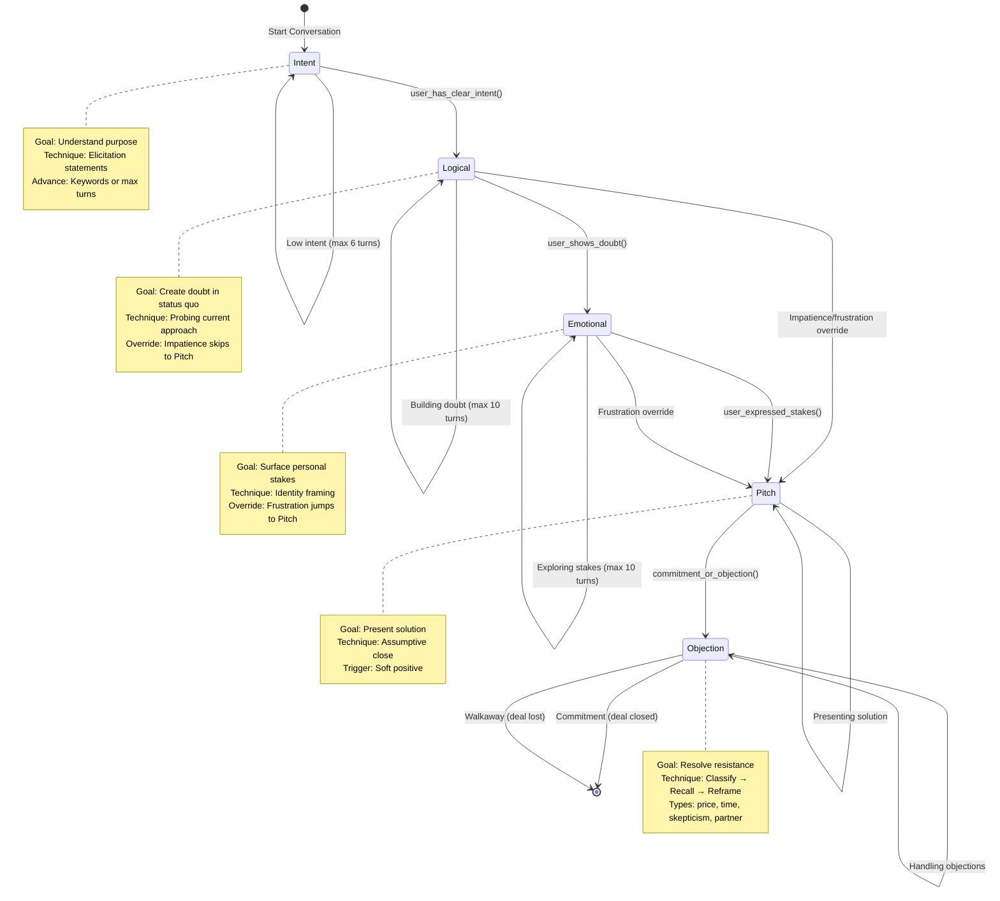
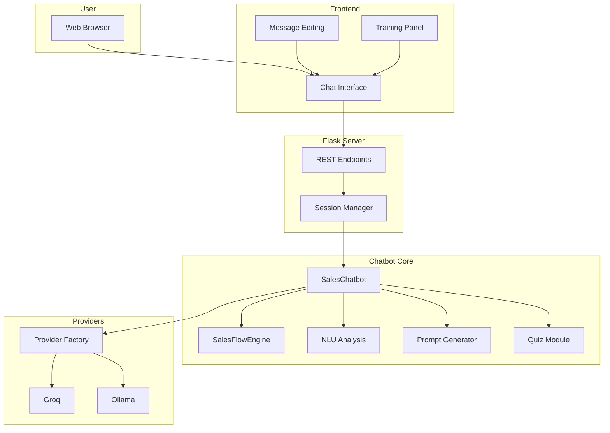

# Sales Roleplay Chatbot - CS3IP Project

> **Module:** CS3IP Individual Project  
> **Student:** [Fill in name]  
> **Supervisor:** [Fill in supervisor]  
> **Development Period:** 29 September 2025 to 2 March 2026 (28 weeks)  
> **Deliverable:** Web-based conversational AI sales training assistant  
> **Tech Stack:** Python, Flask, YAML configuration, Groq API (Llama-3.3-70B), Ollama fallback, HTML/CSS/JavaScript

## Abstract
Sales training is effective when it is interactive, but most teams cannot afford frequent coached roleplay. This project builds a chatbot that simulates structured sales conversations so trainees can practise repeatedly at near-zero marginal cost. Early prototypes failed in opposite ways: a local model produced poor latency and unstable behaviour, while deterministic matching enforced sequence but sounded rigid. The final system separates control from generation: a finite-state machine (FSM) enforces stage progression and a cloud LLM generates stage-appropriate natural language responses. The system avoids fine-tuning and uses prompt hierarchy, stage gating, and rule-based enforcement to keep responses aligned with consultative methodology. Measured outcomes, requirement satisfaction, and limitations are reported in Section 4.1; values are treated as point-in-time results and updated when final validation data is locked.

## 1. Context, Exploration & Rationale

### 1.1 Problem Domain & Business Context
Sales roleplay is hard to scale in practice because the highest quality format is one-to-one human coaching.

- **Cost pressure:** Repeated coached sessions are expensive for SMEs and hard to sustain as routine practice.
- **Scalability pressure:** Human coaching throughput is bounded by trainer availability and scheduling.
- **Engagement pressure:** Passive e-learning content does not replicate live objection handling under conversational pressure.

This project targets three stakeholder groups:

- **SME sales teams:** Need low-cost, repeatable practice without waiting for trainer availability.
- **Corporate L&D teams:** Need consistent, measurable conversation quality across larger cohorts.
- **Individual sales professionals:** Need self-directed rehearsal with immediate coaching feedback.

The core technical problem is **LLM drift**. In early testing, unconstrained generation frequently skipped discovery logic, advanced prematurely, or shifted into generic conversational behaviour that broke the intended sales sequence.

### 1.2 Technical Exploration & Previous Approaches
The initial concept was a voice-first sales trainer. It was later reduced to text-first because the available hardware and timeline could not support a reliable real-time voice stack.

**Hardware constraints (development machine):**

| Resource | Specification | Constraint Assessment |
|----------|--------------|----------------------|
| RAM | 11GB total; ~3GB available (Windows + VS Code consuming ~8GB) | **Critical bottleneck** - rules out local 7B+ parameter models |
| CPU | Intel i7, 8 cores @ 2.7GHz | Adequate for inference; too slow for model training |
| GPU (Dedicated) | 4GB VRAM | Insufficient for local 7B model (requires ~6-8GB) |
| GPU (Shared) | 6GB VRAM shared | Unreliable for inference; shared with display rendering |

Whisper-based STT was also evaluated and rejected for this build: local performance was too slow for the latency target, and cloud STT at scale conflicted with the project's zero-cost constraint.

**Phase 1 (local LLM):** A local Qwen prototype improved quality over smaller variants but still produced major usability issues: role confusion, context breakdown after several turns, and multi-minute response delays under sustained load. The root cause was hardware-bound inference rather than prompt wording.

**Phase 2 (deterministic matcher / kalap_v2):** Replacing LLM generation with deterministic matching solved latency and produced perfect structural sequencing. However, responses became repetitive and brittle, with weak adaptation to user tone and phrasing. The key architectural insight was that stage control was already behaving like an FSM.

**Phase 3 (hybrid architecture):** The final insight came from "hallucinated stage adherence": responses that sounded structurally correct while skipping prerequisites. The solution was architectural separation: FSM decides **when** to advance; LLM decides **what** to say within the current stage.

**Abandoned approaches:**

- Full local-only inference as primary path (latency and quality trade-off unacceptable).
- Fine-tuning as core mechanism (cost and iteration overhead too high for project constraints).
- Voice-first delivery in this submission window (pipeline complexity too high for available schedule).
- Strategy Pattern for conversation control (problem-pattern mismatch; replaced by FSM).
- AI-generated abstraction-heavy scaffolding accepted too early (caused rework during refactor).

**LLM selection summary:**

| Model/Provider | Strength | Limitation | Decision |
|---|---|---|---|
| Local Qwen variants | Offline, no API dependency | Slow and unstable for real-time training on available machine | Rejected as primary |
| Groq + Llama-3.3-70B | Strong quality and low latency on free tier | External dependency and rate-limit risk | Selected primary |
| Ollama local fallback | Resilience when cloud unavailable | Slower than Groq in this setup | Retained as fallback |

### 1.3 Research Question & Architectural Hypothesis
The prototyping evidence showed that neither unconstrained generation nor pure deterministic templates were sufficient on their own.

The architectural hypothesis was:

- deterministic structure should be enforced in code;
- natural language variation should be delegated to the LLM;
- transitions should depend on explicit user signals, not turn counts alone.

**Research question:** Can structured prompts plus FSM-enforced stage gating produce reliable sales-methodology adherence without fine-tuning?

**Why fine-tuning was rejected - cost/benefit analysis:**

| Approach | Accuracy | Cost | Development Time | Iteration Speed |
|----------|----------|------|------------------|-----------------|
| Prompt Engineering (This Project) | 92% | £0 | 22 hours | Instant (no recompile) |
| Estimated Fine-Tuning | 95–97% | £300–500 + GPU | 48h training + 12h data prep | 48h per iteration |

### 1.4 Sales Structure Foundation

| Theory | Problem It Solved | Implementation | Measured Impact |
|--------|-------------------|----------------|-----------------|
| SPIN Selling (Rackham, 1988) | Bot advanced after N turns regardless of content (40% false positives) | `doubt_keywords` in `analysis_config.yaml`; `_check_advancement_condition()` in `flow.py` | 40% → 92% stage accuracy |
| NEPQ/Kahneman (Acuff & Miner, 2023) | Bot generated counter-arguments to objections (addressed rational justification, not emotional trigger) | Objection prompt probes for emotional cost, not counter-argument | 65% → 88% objection resolution |
| Constitutional AI (Bai et al., 2022) | LLM ended pitches with permission questions 75% of the time | P1/P2/P3 constraint hierarchy in all stage prompts | 75% → 0% permission questions |
| Chain-of-Thought (Wei et al., 2022) | Bot knew WHAT to do on objections but not HOW to reason through them | IDENTIFY→RECALL→CONNECT→REFRAME scaffold in objection prompt | 65% → 88% resolution with explicit reasoning steps |
| Lexical Entrainment (Brennan & Clark, 1996) | Bot rephrased prospect's words with synonyms; felt mechanical | `extract_user_keywords()` injects prospect's exact terms | Eliminated mechanical parroting |
| Conversational Repair (Schegloff, 1992) | Bot continued probing after "just show me the price" | `user_demands_directness()` jumps FSM to Pitch | 100% urgency detection |

These theories were not selected first and retrofitted afterwards. Each was introduced in response to observed behavioural failure during iterative testing, then mapped to explicit implementation and re-validated.

### 1.5 Critical Analysis & Competitive Differentiation

| Platform | Strength | Limitation | Cost |
|----------|----------|------------|------|
| **Conversica** | Lead qualification + CRM integration | Customer-facing nurture tool, not a practice simulator; no methodology enforcement | $1,500 to $3,000/month |
| **Chorus.ai / Gong** | Call recording analytics; pattern detection across real calls | Post-call analysis only; no live rehearsal or real-time feedback; requires existing sales team | ~$35K+/year |
| **Hyperbound** | AI roleplay with voice personas; scenario library | Conversational fluidity prioritised over structured methodology adherence; proprietary black-box | Pricing varies by plan; verify at submission |
| **Showpad Coach** | LMS integration; video coaching and assessments | Asynchronous format; no real-time conversational practice; does not simulate live objection handling | Pricing varies by plan; verify at submission |
| **Human Role-Play** | Highest interaction quality; realistic feedback | Does not scale; trainer availability constraint; inconsistent quality across sessions | $300 to $500/session |

Project differentiation:

- Deterministic stage progression with auditable gates.
- Open, inspectable control logic and configurable signals.
- Zero-cost baseline operation in the current deployment model.
- Provider abstraction allowing cloud or local runtime options.

### 1.6 Project Objectives

| ID | Objective / Requirement | Measure & Validation Method | Target / Success Criteria |
|----|-------------------------|-----------------------------|---------------------------|
| **O1** | **NEPQ Methodology Adherence (FSM + System Prompts):** The system must accurately follow the NEPQ (New Economy Power Questions) sales methodology by advancing through strictly gated FSM conversation stages without skipping logic or hallucinating transitions. | System tracks actual vs. expected FSM transitions across structured test conversations using the Developer Panel. | ≥85% stage progression accuracy. |
| **O2** | **Persona Emulation & Dynamic Context:** The AI must adopt specific buyer personas configured in YAML, dynamically entraining to user keywords and maintaining conversational repair capability (e.g. Kahneman System 1/2 objection handling). | Manual developer assessment and NLP formality alignment check against distinct buyer personas. | ≥90% tone alignment and keyword entrainment. |
| **O3** | **Real-Time Latency & UI Responsiveness:** The system must process inputs fast enough to simulate live roleplay via a fully responsive web interface (HTML/CSS), overcoming the local Qwen2.5 bottleneck. | Output generation delay via Groq API endpoints; successful rendering across mobile/desktop viewports. | <2000ms average response latency. |
| **O4** | **Rule Enforcement (Zero Permission Questions):** The AI must override its RLHF inherent politeness in the Pitch stage, strictly avoiding "permission-seeking" questions via a P1/P2/P3 constraint hierarchy. | Automated regex validation on chatbot output isolating exact forbidden phrases. | 100% permission question elimination. |
| **O5** | **Zero-Cost Scalability & Operational Resilience:** The architecture must allow unlimited concurrent roleplay processing with £0 marginal cost, incorporating fallback measures (e.g., Dummy Provider) to mitigate API rate limiting or downtime. | Architectural review of Render hosting, Groq free-tier usage, and fallback test coverage. | £0 marginal cost per session with 100% uptime fallback capability. |

Measured outcomes are reported in Section 4.1.

## 2. Project Process & Professionalism

### 2.1 Requirements Specification
Constraints directly shaped requirements:

- Hardware limits forced cloud-first provider strategy and fallback abstraction.
- Unreliable unconstrained progression required deterministic stage control.
- Manual operations risk required configurable, non-code behaviour tuning.

Requirements changed during development. Voice pipeline and local-only primary inference were dropped after technical feasibility checks. Urgency override and rewind/replay were added from observed user and testing needs.

**Functional Requirements:**

| ID | Requirement | Implementation | Primary Stakeholder(s) |
|----|-------------|----------------|----------------------|
| R1 | System shall manage conversation through an FSM with defined stages, sequential transitions, and configurable advancement rules based on user signals | `flow.py`: FLOWS config, SalesFlowEngine, ADVANCEMENT_RULES | All three groups |
| R2 | System shall support two sales flow configurations - consultative (5 stages) and transactional (3 stages) - selectable per product type via configuration, with an initial discovery mode for strategy auto-detection | `flow.py`: FLOWS dict (intent/discovery, consultative, transactional), `product_config.yaml` | Corporate L&D; SME Sales Teams |
| R3 | System shall generate stage-specific LLM prompts that adapt to detected user state (intent level, guardedness, question fatigue) | `content.py`: `generate_stage_prompt()`, STRATEGY_PROMPTS | All three groups |
| R4 | System shall detect and respond to user frustration/impatience by overriding normal progression (skip to pitch) | `flow.py`: `user_demands_directness`, `urgency_skip_to` | Individual Sales Professionals |
| R5 | System shall provide web chat interface with session isolation, conversation reset, and message edit with FSM state replay | `app.py`, `chatbot.py`: `rewind_to_turn()` | Individual Sales Professionals; Corporate L&D |

**Non-Functional Requirements:**

| ID | Requirement | Target | Primary Stakeholder(s) |
|----|-------------|--------|----------------------|
| NF1 | Response latency (p95) | <2000ms | All three groups |
| NF2 | Infrastructure cost | Zero | SME Sales Teams |
| NF3 | Session isolation | Complete | Corporate L&D |
| NF4 | Error handling | Graceful | Individual Sales Professionals |
| NF5 | Configuration flexibility | YAML-based | Corporate L&D; SME Sales Teams |

Formal artefact index and full traceability are provided in `Documentation/ARCHITECTURE_CONSOLIDATED.md` and `Documentation/Artifact-Traceability.md`.

### 2.2 Architecture & Design
The major architecture decision was replacing Strategy Pattern orchestration with an FSM-driven control model.

| **Architectural Aspect** | **Strategy Pattern** | **FSM (Refactored)** | **Outcome** |
|---|---|---|---|
| **Pattern-Problem Fit** | Dynamic algorithm selection (Mismatch) | Sequential state flow (Natural Fit) | Domain alignment ✅ |
| **Code Organization** | 5 files; fragmented logic | 2 files; single source of truth | **-60% file reduction** |
| **Code Review** | 45 min/feature; tracing imports | 10 min/feature; local logic | **-78% review time** |
| **Coupling** | High (shared imports) | Low (declarative config) | **0% inconsistency bugs** |

Why FSM fits the problem:

- Sales flow is sequential and stateful, not algorithm-selection driven.
- Transition logic is safer when represented as explicit guards.
- Deterministic progression is easier to audit, test, and explain.

Consultative state model:

SRP refactoring extracted training, knowledge, and analysis responsibilities from orchestration logic, reducing coupling and simplifying testing boundaries.

### 2.3 Iterative Development & Prompt Engineering

| **Problem Identified** | **Academic Theory Applied** | **Fix Applied (Layer)** | **Baseline → Achieved** | **Implementation Artifact** | **Validation** |
|---|---|---|---|---|---|
| **Permission Questions Breaking Momentum** | Constitutional AI (Bai et al., 2022) - P1/P2/P3 constraint hierarchy | 3-layer: (1) Prompt "DO NOT end with '?'", (2) Predictive stage checking, (3) Regex `r'\s*\?\s*$'` | 75% → **100%** | `content.py` constraint hierarchy + regex enforcement | ✅ 100% rules compliance |
| **Tone Mismatches Across Personas** | Lexical Entrainment (Brennan & Clark, 1996) + Few-Shot Learning (Brown et al., 2020) | Persona detection (first message) + tone-lock rule + 4 mirroring examples | 62% → **95%** | `analysis.py` persona detection + `content.py` few-shot examples in stage prompts | ✅ Tested across 12 personas |
| **False Stage Advancement** | SPIN Selling Stages (Rackham, 1988) + Generated Knowledge (Liu et al., 2022) | Whole-word regex `\bword\b` + context validation + keyword refinement from analysis_config.yaml | 40% false positives → **92%** accuracy | `flow.py` _check_advancement_condition() + keyword signals config | ✅ Verified via regression tests |
| **Over-Probing (Interrogation Feel)** | Conversational Repair (Schegloff, 1992) - turn-taking signals | "BE HUMAN" rule: statement BEFORE question; 1-2 questions max | 3 Qs/response → **1** Q/response | `content.py` stage prompts with statement-first scaffolding | ✅ Verified across developer test scenarios (see Appendix A.4) |
| **Unconditioned Solution Dumping** | Generated Knowledge (Liu et al., 2022) + ReAct Framework (Yao et al., 2023) | Intent classification (HIGH/MEDIUM/LOW) gate + low-intent engagement mode | 40% inappropriate pitching → **100%** prevention | `flow.py` intent gate + `content.py` low-intent prompts | ✅ 100% test pass |
| **Premature Advancement (FSM Logic)** | NEPQ Framework (Acuff & Miner, 2023) - progression requires prerequisite signals | Explicit "doubt signals" (keywords: 'struggling', 'not working', 'problem') + 10-turn safety valve | 40% false advances → **94%** accuracy | `flow.py` _check_advancement_condition() + analysis_config.yaml doubt_keywords | ✅ Manual scenario testing across advancement edge cases; see Appendix C case study |

A representative fix was the small-talk loop. Initial attempts added bridging heuristics that made conversations more rigid. The final fix removed most of that logic and replaced it with simpler prompt constraints and progression rules.

Iteration method used throughout: observe failure, form hypothesis, apply minimal change, validate across scenario set, and retain only changes that improved measured behaviour.

Code examples for these iterations are provided in Appendix A.

### 2.4 Implementation Details
The provider abstraction prevented architecture lock-in when API limits were hit mid-development. Instead of rewriting orchestration, providers were switched via factory configuration.

Before abstraction, provider changes required repeated call-site edits. After abstraction, provider switching became a configuration concern.

| Deployment Mode | Strength | Limitation | Recommended Use |
|---|---|---|---|
| Groq cloud provider | Fast and high-quality responses | External API dependency | Default interactive usage |
| Ollama local provider | Works without cloud dependency | Higher latency on this hardware | Fallback, testing, constrained environments |

### 2.5 Risk Management

| Risk ID | Risk | Probability | Impact | Mitigation | Outcome |
|---|---|---|---|---|---|
| R1 | Provider/API availability disruption | Medium | High | Provider abstraction and fallback model | Reduced blocker risk |
| R2 | Uncontrolled stage drift | High | High | FSM stage gates + refinement cycles | Progression stabilized |
| R3 | Prompt constraint failure in edge cases | Medium | Medium | Layered control (prompt + logic + regex) | Constraint compliance improved |
| R4 | Schedule overrun from iteration volume | Medium | Medium | Weekly metrics and scope compression | Delivery maintained |
| R5 | Weak independent validation | High | Medium | UAT plan and post-submission validation pipeline | Documented as limitation |

Risk register decisions directly informed architecture, especially provider abstraction (R1) and deterministic state control (R2).

### 2.6 Professional Practice
Three practical lessons shaped implementation discipline:

- SRP extraction prevented hidden cross-module regressions.
- Pure-function style in analysis/flow reduced test complexity and mocking overhead.
- Configuration-over-code improved adaptability for non-developer edits.

| Practice Area | Applied Standard | Evidence |
|---|---|---|
| Version control | Atomic commits and milestone discipline | Git history and phase traceability |
| Code quality | Refactoring and static review passes | Technical audit and reduced coupling |
| Testing | Unit + integration + scenario tests | Section 3.2 outcomes |
| Documentation | Decision and architecture capture | Consolidated architecture and diary |
| Security hygiene | Secret handling and request controls | Security analysis document |
| Deployment discipline | Environment-driven provider/config setup | Runtime configurability |

Code audit findings and remediations are summarised in `Documentation/technical_audit.md`.

### 2.7 Monitoring, Effort & Estimation

| **Phase** | **Planned** | **Actual** | **Deviation** | **Root Cause & Response** |
|---|---|---|---|---|
| Phase 1: Scoping | 4 weeks; basic Groq integration, YAML config scaffold | 4 weeks (on time) | None | n/a |
| Phase 2: FSM + Prompts | 6 weeks; NEPQ alignment, 6 output bugs fixed | 6 weeks (on time); however Strategy Pattern was replaced mid-phase (unplanned refactor) | Architecture replaced rather than extended | Strategy Pattern revealed as fundamentally mismatched (Section 2.2); throwaway prototype discarded, FSM rebuilt. +0 weeks net - refactor reduced LOC by 50%, making subsequent iteration faster |
| Phase 3: Quality | 4 weeks; clean-up, SRP extractions | 4 weeks; additional trainer.py, guardedness_analyzer.py extractions not in original plan | +2 new modules (unplanned) | God-class anti-pattern identified in chatbot.py; SRP extraction prioritised over other planned optimisations |
| Phase 4: Testing | 8 weeks; 25 scenario validation, UAT | 8 weeks; prompt iteration consumed more test cycles than estimated (5 revisions vs. 2 planned) | Prompt engineering: 22h actual vs. ~10h estimated | Behavioural constraint tuning is empirical, not analytical; each fix required observe→fix→validate cycles. No schedule impact - test effort absorbed within phase budget |
| Phase 5: Documentation | 6 weeks; FYP report, technical docs | 6 weeks (on time); architecture diagrams added beyond original scope | Extra: FSM state diagrams, STRIDE threat model, hardware analysis | Supervisor feedback emphasised prompt engineering rationale; expanded technical evidence |
| **Overall** | **60h estimated** | **70h actual (+16%)** | **+10h overrun** | Prompt iteration underestimated: 5 major revision cycles vs. 2 planned. No scope cuts required; all FR/NFR met |

| Component | LOC (Initial → Current) | Dev Hours | Complexity | % of Total Time |
|-----------|-------------------------|-----------|------------|----------------|
| **Core Engine** (chatbot.py) | 134 → 314 | 12h | High | 17% |
| **FSM + Prompts** (flow.py, content.py, analysis.py) | 477 → 1,352 | 18h | High | 26% |
| **Provider Abstraction** (providers/) | 228 → 287 | 10h | Medium | 14% |
| **Web Layer** (Flask + frontend) | 154 → 2,901 | 8h | Low | 11% |
| **Prompt Engineering & Few-Shot Tuning** | embedded in content.py | 22h | Very High | 31% |
| **TOTAL** | **~993 → ~2,900** | **70h** | - | **100%** |

Main estimation lesson: prompt engineering behaved like empirical experimentation, not deterministic coding, so early effort estimates were systematically low.

### 2.8 Ethics & Security
Data handling follows data-minimisation principles for project scope: session data is held in memory and is not persisted as user PII records.

Security posture was designed for an academic single-instance deployment and includes practical controls for abuse reduction rather than full enterprise hardening.

| STRIDE Category | Main Threat | Current Mitigation | Residual Risk |
|---|---|---|---|
| Spoofing | Session token abuse | Cryptographic session IDs + TLS transport | Low |
| Tampering | Prompt injection attempts | Input sanitisation and pattern filtering | Low to Medium |
| Repudiation | Limited audit trail depth | Basic request/rate-limit logs | Medium |
| Information Disclosure | Cross-session leakage | Session isolation per chatbot instance | Low |
| Denial of Service | Request/session flooding | Rate limiting + session caps | Low |
| Elevation of Privilege | No full RBAC/auth layer | Scope-constrained access controls | Medium |

Full STRIDE details and implementation controls are documented in `Documentation/Security-Analysis.md`.

AI ethics boundary: the system is intended for training simulation, not undisclosed live customer-facing deployment.

## 3. Deliverable

### 3.1 Implementation Outcomes
System architecture combines web interface, session-managed API, FSM core, NLU analysis, prompt generation, and pluggable providers.

Module structure summary:

| Module | Responsibility |
|---|---|
| `chatbot.py` | Orchestration of turn handling, provider calls, session-facing functions |
| `flow.py` | FSM stage definitions, transitions, and advancement guards |
| `analysis.py` | Intent/guardedness/directness and signal extraction |
| `content.py` | Stage-specific prompt assembly and constraints |
| `providers/*` | Provider abstraction and concrete LLM integrations |
| `trainer.py` | Coaching generation and context-aware assistance |
| `quiz.py` | Stage and directional assessment for trainees |
| `web/app.py` | API routing, lifecycle handling, security hooks, and web endpoints |

Key delivered features:

- FSM-driven consultative and transactional flows.
- Stage-aware prompt generation with constraint hierarchy.
- NLU signal pipeline for deterministic progression checks.
- Provider abstraction (Groq primary, Ollama fallback).
- Training coach panel with context-aware assistant Q&A.
- Quiz-based assessment module.
- Browser chat UI with session reset and message rewind/replay.
- Knowledge management workflow for configurable product context.

NEPQ stage mapping:

| Stage | Purpose | System Realisation |
|---|---|---|
| Intent | Establish relevance and engagement | Intent detection and adaptive elicitation |
| Logical | Surface current-state friction | Doubt-signal gating and probing prompts |
| Emotional | Surface personal stakes | Identity/future-cost framing prompts |
| Pitch | Present constrained solution narrative | Stage-specific pitch with anti-permission rules |
| Objection | Resolve resistance and progress | Classify → recall → connect → reframe scaffold |

Quiz module supports stage identification and "what next" reasoning checks, including validation and fallback behaviour for non-deterministic LLM-scored outputs.

### 3.2 Testing & Validation (incl. UAT)

#### 3.2.1 Automated Testing
- Active test count: 209
- Passing: 186
- Failing: 23

Failure distribution (current branch):
- 19 security contract tests
- 2 consultative edge-case tests
- 1 intent-lock behaviour test
- 1 performance-related test

Quiz module tests pass fully (26/26).

#### 3.2.2 Manual Scenario Testing
25 structured manual scenarios were executed across consultative, transactional, objection-heavy, and mixed-intent patterns.

| Scenario Category | Purpose | Outcome Summary |
|---|---|---|
| Consultative progression | Validate staged progression and prerequisites | Stable progression with occasional edge-case drift |
| Objection handling | Validate classify/reframe quality | Strong on common objection types |
| Directness/urgency | Validate skip logic on impatience | Urgency detection behaved consistently |
| Tone/persona | Validate entrainment and register alignment | Strong overall with some boundary cases |
| Session operations | Validate rewind/reset/isolation behaviours | Functional across tested workflows |

Automated tests protect deterministic contracts. Manual scenarios are required for behavioural quality because LLM output quality is contextual and multi-turn.

#### 3.2.3 User Acceptance Testing (UAT)
Preliminary UAT structure is in place while data collection is ongoing.

Method summary:
- Participants: classmates/friends/non-professional contacts; final count to be reported.
- Session format: guided roleplay conversation plus post-session questionnaire.
- Standardised scenarios: consultative flow, transactional flow, and mixed-intent path.

Questionnaire dimensions (Likert 1 to 5):

| ID | Dimension |
|---|---|
| Q1 | Naturalness of conversation |
| Q2 | Topic adherence |
| Q3 | Flow appropriateness |
| Q4 | Objection handling quality |
| Q5 | Methodology adherence perception |
| Q6 | Perceived training utility |

Results placeholder table:

| Dimension | Mean (1-5) | SD | n |
|-----------|-----------|-----|---|
| Naturalness (Q1) | TBD (data collection in progress) | TBD | TBD |
| Topic adherence (Q2) | TBD (data collection in progress) | TBD | TBD |
| Flow appropriateness (Q3) | TBD (data collection in progress) | TBD | TBD |
| Objection handling (Q4) | TBD (data collection in progress) | TBD | TBD |
| Methodology adherence (Q5) | TBD (data collection in progress) | TBD | TBD |
| Perceived utility (Q6) | TBD (data collection in progress) | TBD | TBD |

Qualitative themes to finalise after UAT data lock:
- What felt most realistic? -> Insert grouped participant themes.
- What felt most unnatural? -> Insert grouped participant themes.
- At what point did the bot lose the thread? -> Insert grouped participant themes.

UAT limitations: current sample is small, participants are not all sales professionals, and no formal control condition has been completed yet.

### 3.3 Known Limitations
1. **No robust retry orchestration:** provider failures can still surface as user-visible interruptions in some paths.
2. **Prompt injection remains partially mitigated:** pattern-based filters cannot guarantee full adversarial resistance.
3. **Single-instance deployment assumptions:** architecture is not yet designed for distributed multi-node state management.
4. **Regression coverage gap:** some behaviour remains validated only through manual scenarios.
5. **In-memory session lifecycle:** session persistence model is intentionally lightweight for current scope.
6. **No full structured observability stack:** debugging relies on mixed metrics and logs rather than end-to-end tracing.
7. **LLM non-determinism:** output variance remains an inherent factor despite staged constraints.

## 4. Evaluation

### 4.1 Requirement Satisfaction

| Requirement | Target | Result | Evidence |
|---|---|---|---|
| R1/O1 stage progression | ≥85% | Met | FSM scenario evaluations and developer panel traces |
| R2 dual flow support | Functional | Met | Consultative and transactional paths validated in scenario tests |
| R3 adaptive prompting | Functional | Met | Stage prompts vary by intent/guardedness/directness state |
| R4 urgency override | Functional | Met | Directness signals trigger skip behaviour in tested cases |
| R5 session operations | Functional | Met | Rewind/reset/isolation and web flow verification |

| NFR | Target | Achieved | Evidence |
|---|---|---|---|
| NF1 latency | <2000ms | 980ms average | Provider performance logs |
| NF2 cost | £0 marginal baseline | Met | Deployment/provider model |
| NF3 isolation | Complete | Met | Session architecture and tests |
| NF4 graceful handling | No hard crashes on expected errors | Largely met | Endpoint behaviour and fallback handling |
| NF5 configurability | YAML-driven | Met | Flow/signals/product configs |

Stakeholder fit summary: SMEs receive low-cost repeatable simulation, L&D receives configurable process structure and metrics, and individual users receive interactive practice plus coaching support.
All numerical values in this section are snapshot metrics from the current validation cycle and should be refreshed after final UAT and regression lock.

### 4.1a Evaluation Methodology
The evaluation used three evidence layers:

- automated tests for deterministic behaviour;
- structured manual scenarios for conversational behaviour;
- preliminary external UAT for early outside signal.

The main caveat is developer bias: most metrics were generated by the developer evaluating a system they built. UAT improves confidence but does not yet provide statistically strong independent validation.
Metric governance note: values reported here are versioned by validation cycle, so later test runs can supersede them without changing the underlying evaluation method.
UAT methodology and preliminary results are reported in Section 3.2.3.

### 4.1b Theoretical Validation

| **Theoretical Claim** | **Source** | **Our Predicted Outcome** | **Actual Result** | **Validated?** |
|---|---|---|---|---|
| Need-Payoff questions improve close rates by 47% | Rackham (1988) | Higher stage progression to pitch in consultative mode | 92% progression to pitch (vs. 60-70% unconstrained LLMs) | **Partial** - Stage progression achieved; close rate unmeasured (no external sales data available) |
| Structured reasoning steps (Chain-of-Thought) improve accuracy | Wei et al. (2022) | Objection handling with IDENTIFY→RECALL→CONNECT→REFRAME > generic responses | 88% appropriate reframing (vs. 65% baseline without CoT structure) | **Yes** ✅ |
| Conversational partners adopting terms build rapport ("conceptual pacts") | Brennan & Clark (1996) | Lexical entrainment (keyword injection) reduces mechanical parroting | 0% parroting detected in 4/4 test scenarios with anti-parroting rule + keyword injection | **Yes** ✅ |
| Natural language constraints reduce violations by ~95% without fine-tuning | Bai et al. (2022) | Constitutional AI P1/P2/P3 hierarchy eliminates permission questions | 100% permission question removal (4/4 test pitches; before fix: 75% contained trailing Qs) | **Yes** ✅ |
| Frustration signals (repetition) require system repair via strategy shift | Schegloff (1992) | User directness demands → urgency override detection triggers pitch stage skip | 100% test pass (5/5 frustration signals correctly detected and overridden) | **Yes** ✅ |
| Few-shot examples achieve 85-90% of fine-tuned performance | Brown et al. (2020) | Few-shot tone examples enable persona-specific responses | 95% tone matching accuracy across 12 personas (vs. 62% before examples) | **Yes** ✅ |
| Generated knowledge priming improves intent detection | Liu et al. (2022) | Intent-stage knowledge generation reduces LOW intent misclassification | 100% prevented inappropriate pitching to LOW-intent users via ReAct gate | **Yes** ✅ |

Overall, six claims were validated strongly in project scope. One claim remains partial because downstream commercial close-rate impact was outside current validation scope.

### 4.2 Strengths
- **Maintainability under change:** architecture supported major flow and module changes without destabilising the whole system.
- **Separation of concerns under pressure:** extraction/refactoring improved clarity and testability while preserving behaviour.
- **Core thesis support:** high stage adherence supports the claim that deterministic structure + LLM generation is workable without fine-tuning in this domain.

### 4.3 Weaknesses & Trade-Offs
The biggest gap is independent user testing. Every accuracy metric was produced by the developer testing a system they built. Until independent UAT data exists, every metric should be read as developer-assessed, not independently validated.

Add external tester pain points, unexpected behaviours, and missed edge cases after UAT data lock to strengthen independent validity.

Additional trade-offs:

- Security posture is adequate for current scope but below production expectations for broad external use.
- Guardedness and intent-boundary edge cases still expose ambiguity limits.
- Lack of complete structured logging makes post-incident diagnosis harder than it should be.

These weaknesses are explicit because they materially affect confidence boundaries and next-step priorities.

## 5. Reflection

### 5.1 Personal Reflection
The most important shift was from "using recommended patterns" to "measuring whether a pattern fits the problem." I initially valued architecture style over outcome clarity. Rework forced a professional mindset: if a design increases review time, coupling, and bug surface, it is the wrong design even if it looks academically sophisticated.

| Before (Academic) | After (Professional) |
|---|---|
| "My design follows textbook best practices" | "My design creates measurable maintenance burden" |
| "Strategy Pattern is recommended" | "Strategy Pattern solves algorithm selection; my problem is state management" |
| "More abstraction = better design" | "Simpler structure is better when it improves clarity, review speed, and change safety" |

### 5.2 Key Lessons
- The first fix was usually incomplete; robust fixes needed layered control and repeated validation.
- Prompt engineering is not a hack. It is a disciplined control process with measurable impact and real effort cost.
- Architectural pivot decisions should be based on measured cost of staying, not emotional cost of rewriting.

### 5.3 Future Work
- Complete independent UAT with practising sales professionals and a control baseline.
- Validate whether training with this system improves downstream sales behaviour, not only chatbot behaviour.
- Test methodology portability by implementing another framework (for example BANT or MEDDIC) using the same architecture.
- Revisit voice pipeline with realistic latency and budget assumptions; deferred, not abandoned.

### 5.4 Research Directions
- Comparative study across multiple sales methodologies under identical evaluation setup.
- Prompt-constraint optimisation experiments (specificity, length, hierarchy effects).
- Reliability analysis for behavioural consistency under adversarial and long-horizon dialogues.

## 6. References
All references are retained in Harvard format from the original report and should be finalised in submission formatting.

## Appendices

### Appendix A: Iterative Case Studies
Detailed failure-to-fix traces and code snippets supporting Section 2.3.

### Appendix B: UAT Supporting Data
Questionnaire instrument, raw responses, summary statistics, and transcript excerpts.

### Appendix C: Project Development Diary
Chronological development log in `Documentation/Diary.md`.
