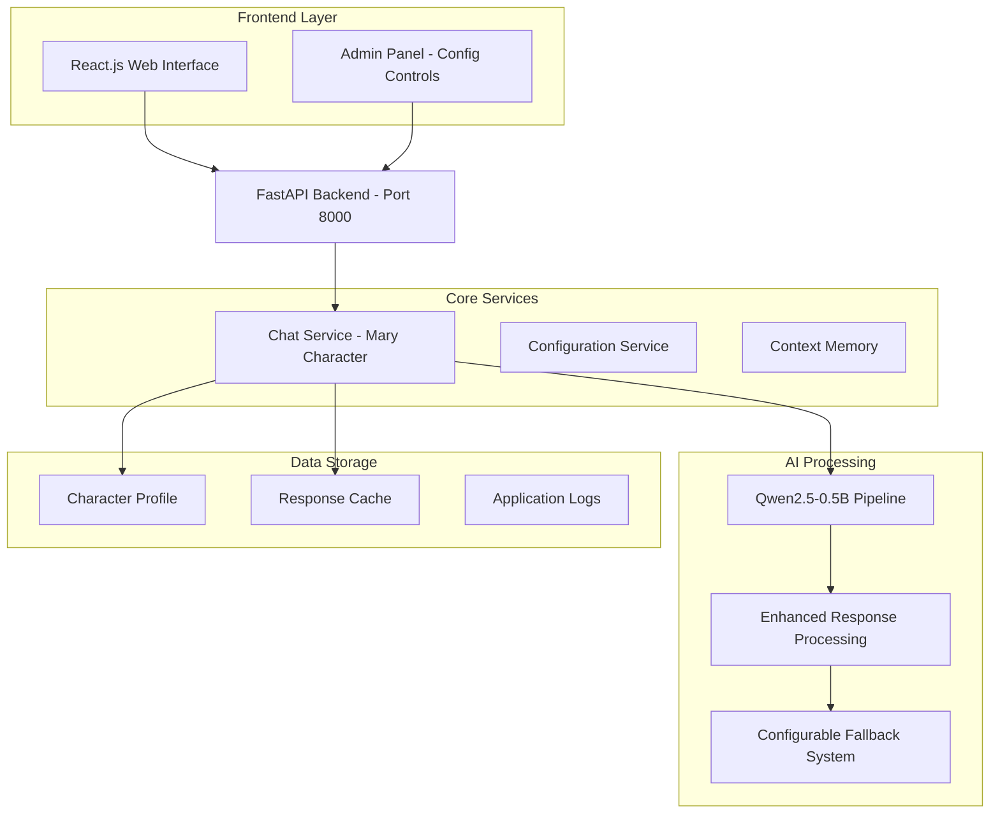

# Sales Training Roleplay Chatbot

AI-powered sales training tool featuring conversational roleplay with Mary, a 65-year-old fitness client persona. Built for sales professionals to practice client interactions with realistic scenarios.

## 🎯 Project Overview

**Final Year Project - Sales Training Tool**  
An intelligent chatbot system that mimics real client conversations to help sales professionals practice and improve their communication skills through realistic roleplay scenarios.

## 🚀 Quick Start

**Windows (Recommended):**
```bash
start_full_stack.bat  # Starts both backend (port 8000) and frontend (port 3000)
```

**Manual Setup:**
```bash
pip install -r requirements.txt
python scripts/download_model.py  # First time only
python src/fitness_chatbot.py     # Backend only
```

**Admin Panel:**
```bash
# Access configuration controls at:
http://localhost:8000/admin
```

## 🏗️ Architecture

- **Backend**: FastAPI + Qwen2.5-0.5B-Instruct model with CPU optimizations
- **Frontend**: React.js with responsive design  
- **AI Engine**: Local transformer model with configurable fallback responses
- **Features**: Real-time chat, context memory, performance analytics, admin controls

## Requirements

- Python 3.8+
- Node.js 16+ (for React frontend)
- ~1GB disk space for AI model
- Optional: GPU for faster inference

## Project Structure

```
├── src/fitness_chatbot.py    # Main FastAPI application
├── scripts/                  # Helper scripts
├── frontend/                 # React.js application  
├── model_cache/             # AI model files (~1GB)
├── templates/               # HTML templates
├── requirements.txt         # Dependencies
└── start_*.bat             # Windows startup scripts
```

## 📊 Architecture Diagram



## 🔌 API Endpoints

**Core Functionality:**
- `POST /api/chat` - Main conversational endpoint
- `GET /api/greeting` - Character's initial greeting
- `POST /api/reset-conversation` - Clear conversation history

**Administration:**
- `GET /admin` - Admin panel interface
- `GET /api/config` - Get current configuration
- `POST /api/config` - Update system configuration
- `POST /api/config/fallback-responses` - Toggle fallback responses

**Monitoring:**
- `GET /health` - Comprehensive health check with performance metrics
- `GET /api/conversation-stats` - Conversation analytics
- `POST /api/clear-cache` - Clear response cache

## 👤 Character Profile - Mary

**Roleplay Scenario:** 65-year-old retired teacher seeking fitness guidance
- **Goals:** Lose weight, gain strength safely, manage arthritis
- **Health Concerns:** Mild knee arthritis, occasional lower back pain
- **Background:** Recently retired, used to walk regularly, no structured exercise experience
- **Personality:** Friendly, cautious about injury, eager to learn
- **Communication Style:** Warm, slightly formal, asks safety-focused questions

**Training Value:** Provides realistic client interaction scenarios for sales professionals to practice consultative selling, needs assessment, and building rapport with health-conscious seniors.

## 🎛️ Configuration Options

**Fallback Response Control:**
- **Enabled**: Uses predefined responses when AI fails (default)
- **Disabled**: Forces pure AI generation or shows technical error
- **AI-Only Mode**: Tries harder with simplified prompts when fallbacks disabled

**Access via Admin Panel:** `http://localhost:8000/admin`

## 📈 Performance Monitoring

**Real-time Metrics:**
- Response times and failure rates
- AI generation vs fallback usage statistics  
- Conversation context tracking
- Cache efficiency monitoring

**Health Check:** `http://localhost:8000/health`

## 🎯 Sales Training Applications

**Key Use Cases:**
1. **Client Consultation Practice** - Realistic health/fitness client interactions
2. **Needs Assessment Training** - Learning to identify client concerns and goals
3. **Objection Handling** - Practice addressing health/safety concerns
4. **Rapport Building** - Develop communication skills with senior clients
5. **Consultative Selling** - Focus on client needs rather than product features

**Training Scenarios:**
- Initial client consultations
- Safety concern discussions  
- Goal setting conversations
- Follow-up check-ins
- Addressing client hesitation

## 🔧 Troubleshooting

**Common Issues:**
- **Model not found**: Run `python scripts/download_model.py`
- **Dependencies**: Run `pip install -r requirements.txt` 
- **Web UI**: Navigate to http://localhost:8000
- **Admin Panel**: Access http://localhost:8000/admin
- **Logs**: Check `logs/chatbot.log` for errors
- **Performance**: Monitor `/health` endpoint for system metrics

**Advanced Configuration:**
```bash
python utils/cleanup_models.py  # Free disk space
# Configure fallback responses via admin panel
# Adjust AI generation settings in real-time
```

## 🚀 Future Enhancements

**Planned Extensions:**
- **Multi-Character Support** - Additional client personas
- **Tonality Analysis** - Speech pattern and sentiment analysis  
- **Call Review System** - Upload and analyze practice sessions
- **Decision Tree Integration** - Structured sales methodology guidance
- **Performance Analytics** - Track improvement over time
