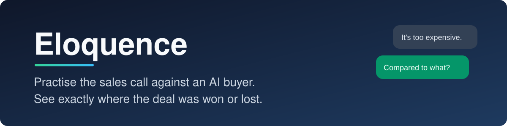
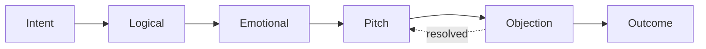

<p align="center">
  
</p>

<p align="center">
  
  
  
  
</p>

<p align="center"><b>Practise real sales conversations against an AI buyer, then see exactly where the deal was won or lost.</b><br>
Final-year project · Flask backend · Next.js frontend · deterministic scoring</p>

---

## ✨ What it does

| Mode | You are | The AI is |
|---|---|---|
| 🤝 **Seller bot** | the customer | a salesperson following a staged sales flow |
| 🎯 **Prospect mode** | the salesperson | a buyer with its own needs, objections and patience |

After a prospect session you get:

- 🔍 **Turn-by-turn review**: every line rated, with the reason and how buyer readiness moved
- ⚡ **Pivotal moments**: the turns that decided the outcome
- 🧠 **Script drills**: strong lines with the key move blanked out, for recall practice
- ✅ **Quiz**: name the stage, the next move and where the conversation is heading

## 🧭 How a conversation flows


```mermaid
flowchart LR
    I[Intent] --> L[Logical] --> E[Emotional] --> P[Pitch] --> O[Objection] --> X[Outcome]
    O -. resolved .-> P
```

A stage only advances when the buyer's signals earn it.

## ⚙️ How it works

- **Buyer profiles**: Easy, Medium and Hard buyers, grounded in published buyer typology research. Difficulty sets readiness, disclosure, objections and patience.
- **Deterministic judge**: scoring does not depend on the LLM, so any saved session reviews the same way every time.
- **Rules first**: stage moves, objections, scores, coach notes and tips come from `config/*.yaml`; the AI (Groq, free tier) only words the replies.
- **Config driven**: products, objections, signals and drills live in `config/*.yaml`. Adding a product needs no code change.

## 🚀 Run it

```bash
pip install -r requirements.txt
echo "GROQ_API_KEY=your_key" > .env    # free key: https://console.groq.com/keys
python backend/app.py                  # http://localhost:5000
```

Changing the UI? Edit `web/`, then `cd web && npm run build` and commit `web/out` too (the server ships the built app).

## 🧪 Tests

```bash
pytest
```

## 🗂️ Layout

Start with [`CORE-FLOW.md`](CORE-FLOW.md): the one core flow, file by file, and the glossary.

| Folder | Holds |
|---|---|
| `backend/` | Flask app, routes, settings, security (rate limits, input checks, sessions) |
| `core/` | conversation engine, stage machine, prompts, buyer, judge, quiz, drills |
| `config/` | products, buyer profiles, objections, signals, drills |
| `web/` | Next.js + React app; built copy in `web/out` is what Flask serves (see `web/CORE-FLOW.md`) |
| `tests/` | unit and route tests |
