# Sales Chatbot Architecture Diagrams

## Diagram 1: Overall System Architecture (High-Level)

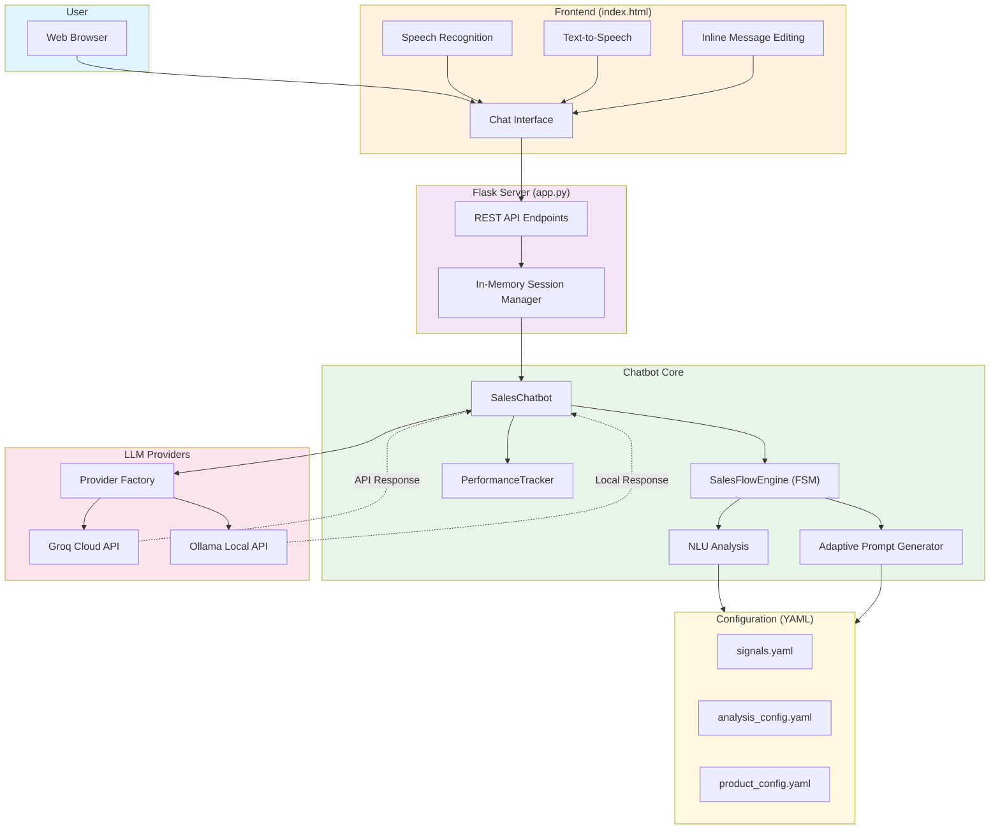
```mermaid
flowchart TB
    subgraph USER["User"]
        Browser["Web Browser"]
    end

    subgraph FRONTEND["Frontend (index.html)"]
        UI["Chat Interface"]
        Speech["Speech Recognition"]
        TTS["Text-to-Speech"]
        Edit["Inline Message Editing"]
    end

    subgraph BACKEND["Flask Server (app.py)"]
        API["REST API Endpoints"]
        Sessions["In-Memory Session Manager"]
    end

    subgraph CORE["Chatbot Core"]
        Chatbot["SalesChatbot"]
        FSM["SalesFlowEngine (FSM)"]
        Analysis["NLU Analysis"]
        Prompts["Adaptive Prompt Generator"]
        Perf["PerformanceTracker"]
    end

    subgraph LLM["LLM Providers"]
        Factory["Provider Factory"]
        Groq["Groq Cloud API"]
        Ollama["Ollama Local API"]
    end

    subgraph CONFIG["Configuration (YAML)"]
        YAML1["signals.yaml"]
        YAML2["analysis_config.yaml"]
        YAML3["product_config.yaml"]
    end

    Browser --> UI
    UI --> API
    Speech --> UI
    TTS --> UI
    Edit --> UI

    API --> Sessions
    Sessions --> Chatbot

    Chatbot --> FSM
    Chatbot --> Factory
    Chatbot --> Perf
    FSM --> Analysis
    FSM --> Prompts
    Analysis --> CONFIG
    Prompts --> CONFIG

    Factory --> Groq
    Factory --> Ollama

    Groq -.->|"API Response"| Chatbot
    Ollama -.->|"Local Response"| Chatbot

    style USER fill:#e1f5fe
    style FRONTEND fill:#fff3e0
    style BACKEND fill:#f3e5f5
    style CORE fill:#e8f5e9
    style LLM fill:#fce4ec
    style CONFIG fill:#fff8e1
```

---

## Diagram 2: Chat Message Sequence Diagram

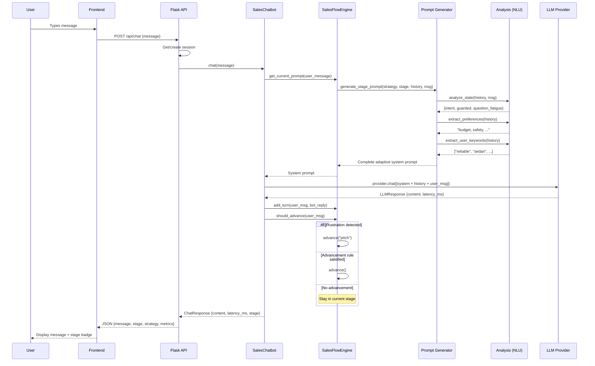
```mermaid
sequenceDiagram
    participant U as User
    participant F as Frontend
    participant A as Flask API
    participant C as SalesChatbot
    participant E as SalesFlowEngine
    participant P as Prompt Generator
    participant NLU as Analysis (NLU)
    participant L as LLM Provider

    U->>F: Types message
    F->>A: POST /api/chat {message}
    A->>A: Get/create session
    A->>C: chat(message)

    C->>E: get_current_prompt(user_message)
    E->>P: generate_stage_prompt(strategy, stage, history, msg)
    P->>NLU: analyze_state(history, msg)
    NLU-->>P: {intent, guarded, question_fatigue}
    P->>NLU: extract_preferences(history)
    NLU-->>P: "budget, safety, ..."
    P->>NLU: extract_user_keywords(history)
    NLU-->>P: ["reliable", "sedan", ...]
    P-->>E: Complete adaptive system prompt
    E-->>C: System prompt

    C->>L: provider.chat([system + history + user_msg])
    L-->>C: LLMResponse {content, latency_ms}

    C->>E: add_turn(user_msg, bot_reply)
    C->>E: should_advance(user_msg)

    alt Frustration detected
        E->>E: advance("pitch")
    else Advancement rule satisfied
        E->>E: advance()
    else No advancement
        Note over E: Stay in current stage
    end

    C-->>A: ChatResponse {content, latency_ms, stage}
    A-->>F: JSON {message, stage, strategy, metrics}
    F-->>U: Display message + stage badge
```

---

## Diagram 3a: Consultative FSM (5 Stages)

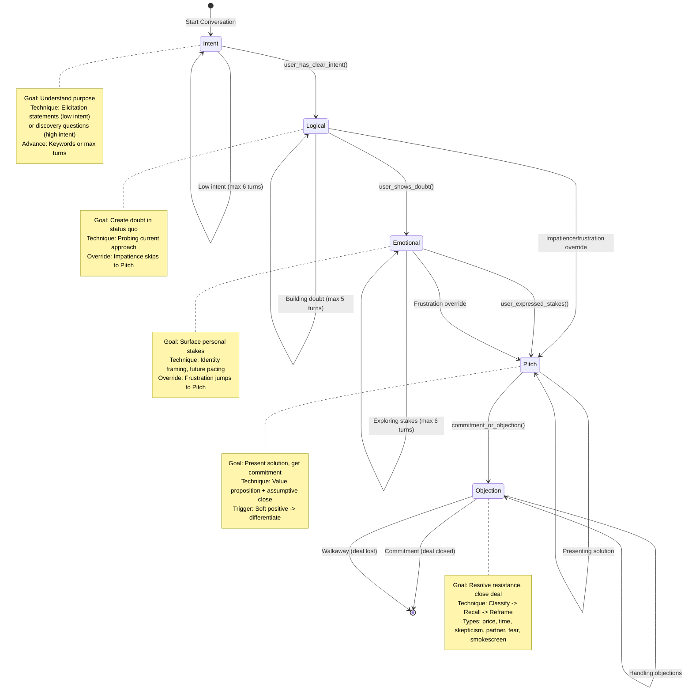
```mermaid
stateDiagram-v2
    [*] --> Intent: Start Conversation

    Intent --> Logical: user_has_clear_intent()
    Intent --> Intent: Low intent (max 6 turns)

    Logical --> Emotional: user_shows_doubt()
    Logical --> Pitch: Impatience/frustration override
    Logical --> Logical: Building doubt (max 5 turns)

    Emotional --> Pitch: user_expressed_stakes()
    Emotional --> Pitch: Frustration override
    Emotional --> Emotional: Exploring stakes (max 6 turns)

    Pitch --> Objection: commitment_or_objection()
    Pitch --> Pitch: Presenting solution

    Objection --> [*]: Commitment (deal closed)
    Objection --> [*]: Walkaway (deal lost)
    Objection --> Objection: Handling objections

    note right of Intent
        Goal: Understand purpose
        Technique: Elicitation statements (low intent)
        or discovery questions (high intent)
        Advance: Keywords or max turns
    end note

    note right of Logical
        Goal: Create doubt in status quo
        Technique: Probing current approach
        Override: Impatience skips to Pitch
    end note

    note right of Emotional
        Goal: Surface personal stakes
        Technique: Identity framing, future pacing
        Override: Frustration jumps to Pitch
    end note

    note right of Pitch
        Goal: Present solution, get commitment
        Technique: Value proposition + assumptive close
        Trigger: Soft positive -> differentiate
    end note

    note right of Objection
        Goal: Resolve resistance, close deal
        Technique: Classify -> Recall -> Reframe
        Types: price, time, skepticism, partner, fear, smokescreen
    end note
```

---

## Diagram 3b: Transactional FSM (3 Stages)

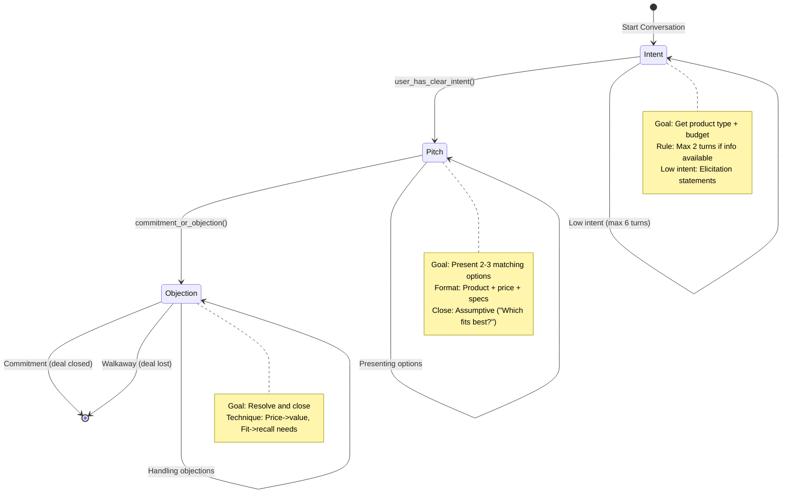
```mermaid
stateDiagram-v2
    [*] --> Intent: Start Conversation

    Intent --> Pitch: user_has_clear_intent()
    Intent --> Intent: Low intent (max 6 turns)

    Pitch --> Objection: commitment_or_objection()
    Pitch --> Pitch: Presenting options

    Objection --> [*]: Commitment (deal closed)
    Objection --> [*]: Walkaway (deal lost)
    Objection --> Objection: Handling objections

    note right of Intent
        Goal: Get product type + budget
        Rule: Max 2 turns if info available
        Low intent: Elicitation statements
    end note

    note right of Pitch
        Goal: Present 2-3 matching options
        Format: Product + price + specs
        Close: Assumptive ("Which fits best?")
    end note

    note right of Objection
        Goal: Resolve and close
        Technique: Price->value, Fit->recall needs
    end note
```

---

## Diagram 4: Provider Architecture (Factory + Strategy Pattern)

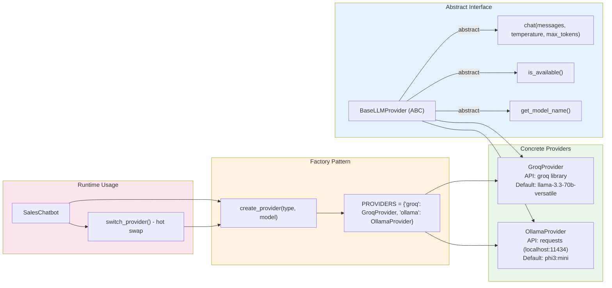
```mermaid
flowchart LR
    subgraph INTERFACE["Abstract Interface"]
        Base["BaseLLMProvider (ABC)"]
        Base --> |"abstract"| M1["chat(messages, temperature, max_tokens)"]
        Base --> |"abstract"| M2["is_available()"]
        Base --> |"abstract"| M3["get_model_name()"]
    end

    subgraph FACTORY["Factory Pattern"]
        Create["create_provider(type, model)"]
        Registry["PROVIDERS = {'groq': GroqProvider, 'ollama': OllamaProvider}"]
    end

    subgraph PROVIDERS["Concrete Providers"]
        Groq["GroqProvider<br/>API: groq library<br/>Default: llama-3.3-70b-versatile"]
        Ollama["OllamaProvider<br/>API: requests (localhost:11434)<br/>Default: phi3:mini"]
    end

    subgraph USAGE["Runtime Usage"]
        Chatbot["SalesChatbot"]
        Switch["switch_provider() - hot swap"]
    end

    Base --> Groq
    Base --> Ollama

    Create --> Registry
    Registry --> Groq
    Registry --> Ollama

    Chatbot --> Create
    Chatbot --> Switch
    Switch --> Create

    style INTERFACE fill:#e3f2fd
    style FACTORY fill:#fff3e0
    style PROVIDERS fill:#e8f5e9
    style USAGE fill:#fce4ec
```

---

## Diagram 5: Edit/Rewind Flow

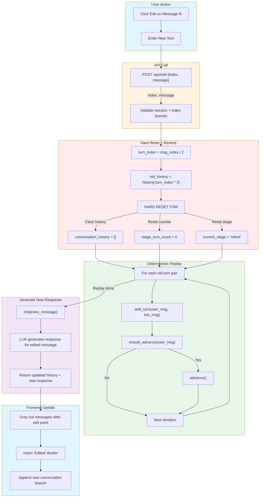
```mermaid
flowchart TD
    subgraph TRIGGER["User Action"]
        Click["Click Edit on Message N"]
        Click --> Modal["Enter New Text"]
    end

    subgraph API["API Call"]
        Modal --> Post["POST /api/edit {index, message}"]
        Post --> |"index, message"| Validate["Validate session + index bounds"]
    end

    subgraph REWIND["Hard Reset + Rewind"]
        Validate --> CalcTurn["turn_index = msg_index / 2"]
        CalcTurn --> Slice["old_history = history[:turn_index * 2]"]
        Slice --> Reset["HARD RESET FSM"]
        Reset --> |"Clear history"| R1["conversation_history = []"]
        Reset --> |"Reset counter"| R2["stage_turn_count = 0"]
        Reset --> |"Reset stage"| R3["current_stage = 'intent'"]
    end

    subgraph REPLAY["Deterministic Replay"]
        R1 & R2 & R3 --> Loop["For each old turn pair"]
        Loop --> AddTurn["add_turn(user_msg, bot_msg)"]
        AddTurn --> CheckAdv["should_advance(user_msg)"]
        CheckAdv --> |"Yes"| Advance["advance()"]
        CheckAdv --> |"No"| NextTurn["Next iteration"]
        Advance --> NextTurn
        NextTurn --> Loop
    end

    subgraph NEWMSG["Generate New Response"]
        Loop --> |"Replay done"| Chat["chat(new_message)"]
        Chat --> NewResponse["LLM generates response for edited message"]
        NewResponse --> Return["Return updated history + new response"]
    end

    subgraph RENDER["Frontend Update"]
        Return --> Grey["Grey out messages after edit point"]
        Grey --> Divider["Insert 'Edited' divider"]
        Divider --> Branch["Append new conversation branch"]
    end

    style TRIGGER fill:#e1f5fe
    style API fill:#fff3e0
    style REWIND fill:#ffebee
    style REPLAY fill:#e8f5e9
    style NEWMSG fill:#f3e5f5
    style RENDER fill:#e1f5fe
```

---

## Diagram 6: Adaptive Prompt Generation Pipeline

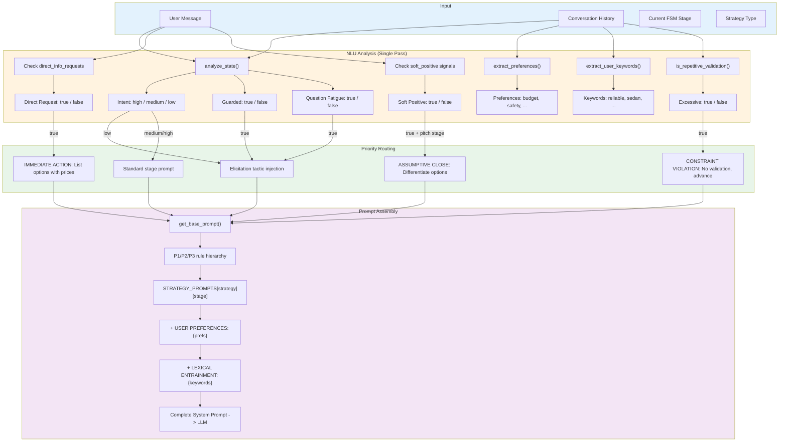
```mermaid
flowchart TB
    subgraph INPUT["Input"]
        UserMsg["User Message"]
        History["Conversation History"]
        Stage["Current FSM Stage"]
        Strategy["Strategy Type"]
    end

    subgraph ANALYSIS["NLU Analysis (Single Pass)"]
        UserMsg & History --> AnalyzeState["analyze_state()"]
        AnalyzeState --> IntentLevel["Intent: high / medium / low"]
        AnalyzeState --> Guarded["Guarded: true / false"]
        AnalyzeState --> Fatigue["Question Fatigue: true / false"]

        History --> ExtractPrefs["extract_preferences()"]
        ExtractPrefs --> Prefs["Preferences: budget, safety, ..."]

        History --> ExtractKW["extract_user_keywords()"]
        ExtractKW --> Keywords["Keywords: reliable, sedan, ..."]

        History --> ValLoop["is_repetitive_validation()"]
        ValLoop --> Excessive["Excessive: true / false"]

        UserMsg --> DirectReq["Check direct_info_requests"]
        DirectReq --> IsDirectReq["Direct Request: true / false"]

        UserMsg --> SoftPos["Check soft_positive signals"]
        SoftPos --> IsSoftPos["Soft Positive: true / false"]
    end

    subgraph ROUTING["Priority Routing"]
        IsDirectReq --> |"true"| InfoPrompt["IMMEDIATE ACTION: List options with prices"]
        IsSoftPos --> |"true + pitch stage"| ClosePrompt["ASSUMPTIVE CLOSE: Differentiate options"]
        Excessive --> |"true"| CorrPrompt["CONSTRAINT VIOLATION: No validation, advance"]

        IntentLevel --> |"low"| ElicitPrompt["Elicitation tactic injection"]
        Guarded --> |"true"| ElicitPrompt
        Fatigue --> |"true"| ElicitPrompt

        IntentLevel --> |"medium/high"| StandardPrompt["Standard stage prompt"]
    end

    subgraph ASSEMBLY["Prompt Assembly"]
        InfoPrompt & ClosePrompt & CorrPrompt & ElicitPrompt & StandardPrompt --> Base["get_base_prompt()"]
        Base --> Rules["P1/P2/P3 rule hierarchy"]
        Rules --> StagePrompt["STRATEGY_PROMPTS[strategy][stage]"]
        StagePrompt --> PrefCtx["+ USER PREFERENCES: {prefs}"]
        PrefCtx --> KWCtx["+ LEXICAL ENTRAINMENT: {keywords}"]
        KWCtx --> Final["Complete System Prompt -> LLM"]
    end

    style INPUT fill:#e3f2fd
    style ANALYSIS fill:#fff3e0
    style ROUTING fill:#e8f5e9
    style ASSEMBLY fill:#f3e5f5
```

---

## Diagram 7: Configuration & Signal Detection Flow

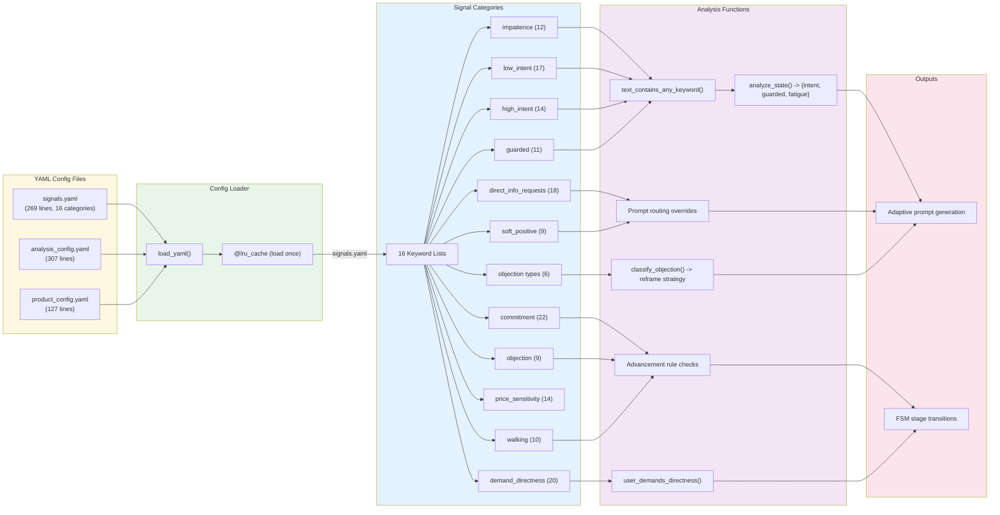
```mermaid
flowchart LR
    subgraph YAML["YAML Config Files"]
        S["signals.yaml<br/>(269 lines, 16 categories)"]
        A["analysis_config.yaml<br/>(307 lines)"]
        P["product_config.yaml<br/>(127 lines)"]
    end

    subgraph LOADER["Config Loader"]
        Load["load_yaml()"]
        Cache["@lru_cache (load once)"]
        S --> Load
        A --> Load
        P --> Load
        Load --> Cache
    end

    subgraph SIGNALS["Signal Categories"]
        Cache --> |"signals.yaml"| Keywords["16 Keyword Lists"]
        Keywords --> Imp["impatience (12)"]
        Keywords --> Comm["commitment (22)"]
        Keywords --> Obj["objection (9)"]
        Keywords --> Walk["walking (10)"]
        Keywords --> Low["low_intent (17)"]
        Keywords --> High["high_intent (14)"]
        Keywords --> Guard["guarded (11)"]
        Keywords --> Demand["demand_directness (20)"]
        Keywords --> DirReq["direct_info_requests (18)"]
        Keywords --> Price["price_sensitivity (14)"]
        Keywords --> Soft["soft_positive (9)"]
        Keywords --> ObjTypes["objection types (6)"]
    end

    subgraph ANALYSIS["Analysis Functions"]
        Imp & Low & High & Guard --> Match["text_contains_any_keyword()"]
        Match --> State["analyze_state() -> {intent, guarded, fatigue}"]
        Comm & Obj & Walk --> Advance["Advancement rule checks"]
        Demand --> Frust["user_demands_directness()"]
        DirReq & Soft --> Prompt["Prompt routing overrides"]
        ObjTypes --> Reframe["classify_objection() -> reframe strategy"]
    end

    subgraph OUTPUT["Outputs"]
        State --> PromptGen["Adaptive prompt generation"]
        Advance --> FSM["FSM stage transitions"]
        Frust --> FSM
        Prompt --> PromptGen
        Reframe --> PromptGen
    end

    style YAML fill:#fff8e1
    style LOADER fill:#e8f5e9
    style SIGNALS fill:#e3f2fd
    style ANALYSIS fill:#f3e5f5
    style OUTPUT fill:#fce4ec
```

---

## Diagram 8: Module Dependency Map

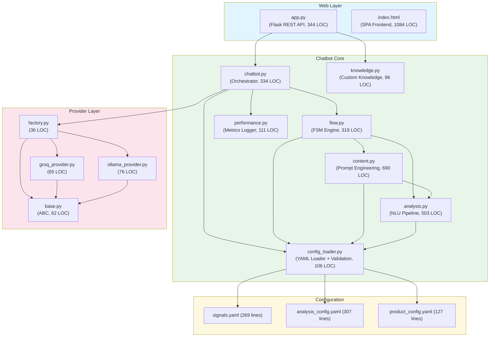
```mermaid
flowchart TD
    subgraph WEB["Web Layer"]
        app["app.py<br/>(Flask REST API, 344 LOC)"]
        html["index.html<br/>(SPA Frontend, 1084 LOC)"]
    end

    subgraph CHATBOT["Chatbot Core"]
        chatbot["chatbot.py<br/>(Orchestrator, 334 LOC)"]
        flow["flow.py<br/>(FSM Engine, 319 LOC)"]
        content["content.py<br/>(Prompt Engineering, 690 LOC)"]
        analysis["analysis.py<br/>(NLU Pipeline, 503 LOC)"]
        perf["performance.py<br/>(Metrics Logger, 111 LOC)"]
        knowledge["knowledge.py<br/>(Custom Knowledge, 96 LOC)"]
        loader["config_loader.py<br/>(YAML Loader + Validation, 106 LOC)"]
    end

    subgraph PROVIDERS["Provider Layer"]
        factory["factory.py<br/>(36 LOC)"]
        base["base.py<br/>(ABC, 62 LOC)"]
        groq["groq_provider.py<br/>(65 LOC)"]
        ollama["ollama_provider.py<br/>(76 LOC)"]
    end

    subgraph CONFIG["Configuration"]
        signals["signals.yaml (269 lines)"]
        analysiscfg["analysis_config.yaml (307 lines)"]
        productcfg["product_config.yaml (127 lines)"]
    end

    app --> chatbot
    app --> knowledge
    chatbot --> flow
    chatbot --> loader
    chatbot --> perf
    chatbot --> factory

    flow --> content
    flow --> analysis
    flow --> loader

    content --> analysis
    content --> loader

    analysis --> loader

    factory --> base
    factory --> groq
    factory --> ollama
    groq --> base
    ollama --> base

    loader --> signals
    loader --> analysiscfg
    loader --> productcfg

    style WEB fill:#e1f5fe
    style CHATBOT fill:#e8f5e9
    style PROVIDERS fill:#fce4ec
    style CONFIG fill:#fff8e1
```

---

## Diagram 9: FSM Engine — Granular Internal Logic

### 9a: Complete System — All Classes, Functions & Cross-Module Relationships

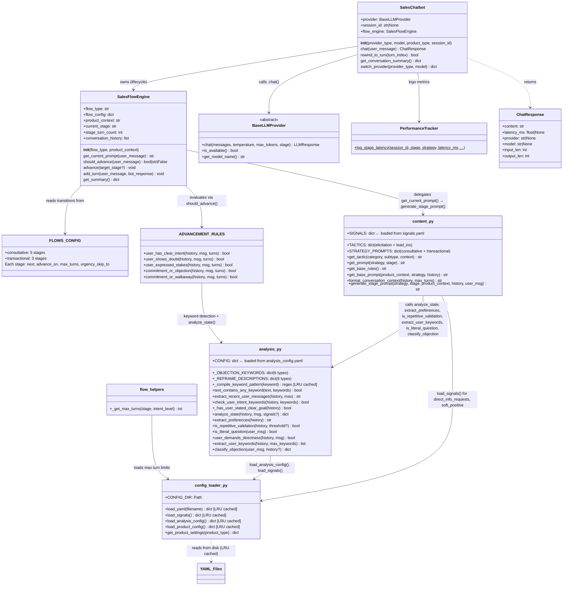
```mermaid
classDiagram
    class SalesChatbot {
        +provider: BaseLLMProvider
        +session_id: str|None
        +flow_engine: SalesFlowEngine
        __init__(provider_type, model, product_type, session_id)
        chat(user_message) ChatResponse
        rewind_to_turn(turn_index) bool
        get_conversation_summary() dict
        switch_provider(provider_type, model) dict
    }

    class ChatResponse {
        +content: str
        +latency_ms: float|None
        +provider: str|None
        +model: str|None
        +input_len: int
        +output_len: int
    }

    class SalesFlowEngine {
        +flow_type: str
        +flow_config: dict
        +product_context: str
        +current_stage: str
        +stage_turn_count: int
        +conversation_history: list
        __init__(flow_type, product_context)
        get_current_prompt(user_message) str
        should_advance(user_message) bool|str|False
        advance(target_stage?) void
        add_turn(user_message, bot_response) void
        get_summary() dict
    }

    class FLOWS_CONFIG {
        +consultative: 5 stages
        +transactional: 3 stages
        Each stage: next, advance_on, max_turns, urgency_skip_to
    }

    class ADVANCEMENT_RULES {
        +user_has_clear_intent(history, msg, turns) bool
        +user_shows_doubt(history, msg, turns) bool
        +user_expressed_stakes(history, msg, turns) bool
        +commitment_or_objection(history, msg, turns) bool
        +commitment_or_walkaway(history, msg, turns) bool
    }

    class flow_helpers {
        +_get_max_turns(stage, intent_level) int
    }

    class content_py {
        +SIGNALS: dict ← loaded from signals.yaml
        +TACTICS: dict (elicitation + lead_ins)
        +STRATEGY_PROMPTS: dict (consultative + transactional)
        +get_tactic(category, subtype, context) str
        +get_prompt(strategy, stage) str
        +get_base_rules() str
        +get_base_prompt(product_context, strategy, history) str
        +format_conversation_context(history, max_turns) str
        +generate_stage_prompt(strategy, stage, product_context, history, user_msg) str
    }

    class analysis_py {
        +CONFIG: dict ← loaded from analysis_config.yaml
        +_OBJECTION_KEYWORDS: dict (6 types)
        +_REFRAME_DESCRIPTIONS: dict (6 types)
        +_compile_keyword_pattern(keyword) regex [LRU cached]
        +text_contains_any_keyword(text, keywords) bool
        +extract_recent_user_messages(history, max) str
        +check_user_intent_keywords(history, keywords) bool
        +_has_user_stated_clear_goal(history) bool
        +analyze_state(history, msg, signals?) dict
        +extract_preferences(history) str
        +is_repetitive_validation(history, threshold?) bool
        +is_literal_question(user_msg) bool
        +user_demands_directness(history, msg) bool
        +extract_user_keywords(history, max_keywords) list
        +classify_objection(user_msg, history?) dict
    }

    class config_loader_py {
        +CONFIG_DIR: Path
        +load_yaml(filename) dict [LRU cached]
        +load_signals() dict [LRU cached]
        +load_analysis_config() dict [LRU cached]
        +load_product_config() dict [LRU cached]
        +get_product_settings(product_type) dict
    }

    class BaseLLMProvider {
        <<abstract>>
        +chat(messages, temperature, max_tokens, stage) LLMResponse
        +is_available() bool
        +get_model_name() str
    }

    class PerformanceTracker {
        +log_stage_latency(session_id, stage, strategy, latency_ms, ...)$
    }

    SalesChatbot --> SalesFlowEngine : owns (lifecycle)
    SalesChatbot --> BaseLLMProvider : calls .chat()
    SalesChatbot --> PerformanceTracker : logs metrics
    SalesChatbot ..> ChatResponse : returns

    SalesFlowEngine --> FLOWS_CONFIG : reads transitions from
    SalesFlowEngine --> ADVANCEMENT_RULES : evaluates via should_advance()
    SalesFlowEngine --> content_py : delegates get_current_prompt() → generate_stage_prompt()
    ADVANCEMENT_RULES --> analysis_py : keyword detection + analyze_state()
    flow_helpers --> config_loader_py : loads max turn limits

    content_py --> analysis_py : calls analyze_state, extract_preferences, is_repetitive_validation, extract_user_keywords, is_literal_question, classify_objection
    content_py --> config_loader_py : load_signals() for direct_info_requests, soft_positive

    analysis_py --> config_loader_py : load_analysis_config(), load_signals()
    config_loader_py ..> YAML_Files : reads from disk (LRU cached)
```

---

### 9b: `__init__()` — Engine Initialisation

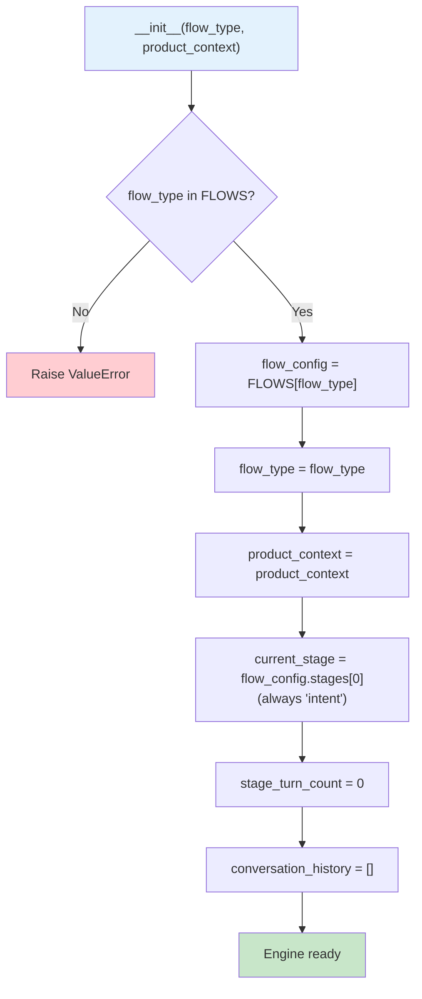
```mermaid
flowchart TD
    Start["__init__(flow_type, product_context)"] --> Validate{"flow_type in FLOWS?"}
    Validate -->|No| Error["Raise ValueError"]
    Validate -->|Yes| SetConfig["flow_config = FLOWS[flow_type]"]
    SetConfig --> SetType["flow_type = flow_type"]
    SetType --> SetProduct["product_context = product_context"]
    SetProduct --> SetStage["current_stage = flow_config.stages[0]<br/>(always 'intent')"]
    SetStage --> SetTurns["stage_turn_count = 0"]
    SetTurns --> SetHistory["conversation_history = []"]
    SetHistory --> Ready["Engine ready"]

    style Start fill:#e3f2fd
    style Ready fill:#c8e6c9
    style Error fill:#ffcdd2
```

---

### 9c: `get_current_prompt()` → `generate_stage_prompt()` — Full Adaptive Routing

The FSM delegates prompt generation to `content.py:generate_stage_prompt()`. This is the most complex function in the system — it runs 6 analyses and routes to 1 of 6 different prompt assembly paths.

**Step 1: FSM determines strategy and delegates**

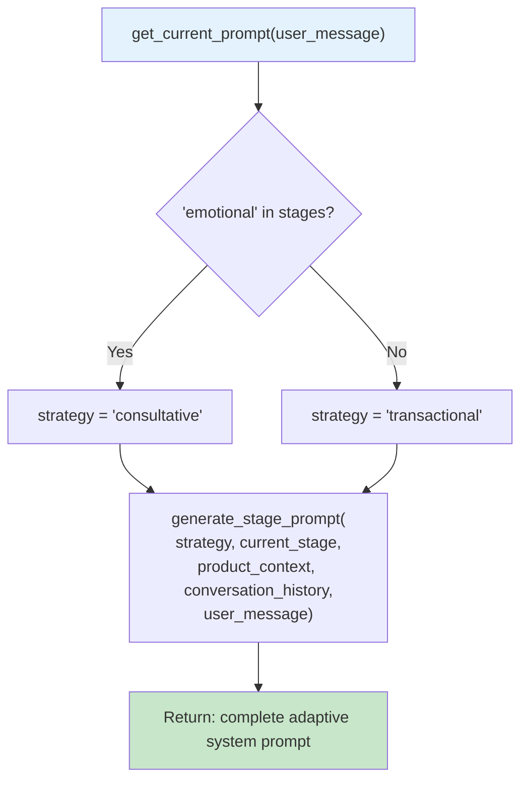
```mermaid
flowchart TD
    Start["get_current_prompt(user_message)"] --> DetectStrategy{"'emotional' in stages?"}
    DetectStrategy -->|Yes| Consult["strategy = 'consultative'"]
    DetectStrategy -->|No| Trans["strategy = 'transactional'"]
    Consult --> Call["generate_stage_prompt(<br/>strategy, current_stage,<br/>product_context, conversation_history,<br/>user_message)"]
    Trans --> Call
    Call --> Return["Return: complete adaptive system prompt"]

    style Start fill:#e3f2fd
    style Return fill:#c8e6c9
```

**Step 2: `generate_stage_prompt()` — 6 Analyses, 6 Output Paths**

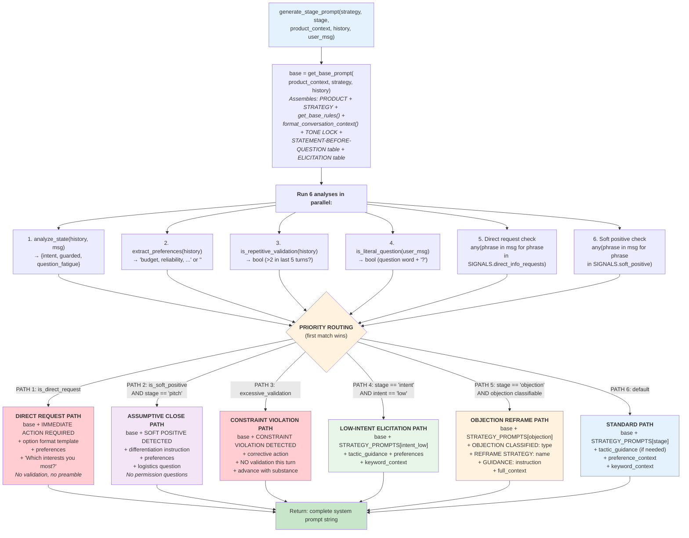
```mermaid
flowchart TD
    Entry["generate_stage_prompt(strategy, stage,<br/>product_context, history, user_msg)"]

    Entry --> BuildBase["base = get_base_prompt(<br/>product_context, strategy, history)<br/><i>Assembles: PRODUCT + STRATEGY + get_base_rules() +<br/>format_conversation_context() + TONE LOCK +<br/>STATEMENT-BEFORE-QUESTION table + ELICITATION table</i>"]

    BuildBase --> RunAnalyses["<b>Run 6 analyses in parallel:</b>"]

    RunAnalyses --> A1["1. analyze_state(history, msg)<br/>→ {intent, guarded, question_fatigue}"]
    RunAnalyses --> A2["2. extract_preferences(history)<br/>→ 'budget, reliability, ...' or ''"]
    RunAnalyses --> A3["3. is_repetitive_validation(history)<br/>→ bool (>2 in last 5 turns?)"]
    RunAnalyses --> A4["4. is_literal_question(user_msg)<br/>→ bool (question word + '?')"]
    RunAnalyses --> A5["5. Direct request check<br/>any(phrase in msg for phrase<br/>in SIGNALS.direct_info_requests)"]
    RunAnalyses --> A6["6. Soft positive check<br/>any(phrase in msg for phrase<br/>in SIGNALS.soft_positive)"]

    A1 & A2 & A3 & A4 & A5 & A6 --> Route{"<b>PRIORITY ROUTING</b><br/>(first match wins)"}

    Route -->|"PATH 1: is_direct_request"| P1["<b>DIRECT REQUEST PATH</b><br/>base + IMMEDIATE ACTION REQUIRED<br/>+ option format template<br/>+ preferences<br/>+ 'Which interests you most?'<br/><i>No validation, no preamble</i>"]

    Route -->|"PATH 2: is_soft_positive<br/>AND stage == 'pitch'"| P2["<b>ASSUMPTIVE CLOSE PATH</b><br/>base + SOFT POSITIVE DETECTED<br/>+ differentiation instruction<br/>+ preferences<br/>+ logistics question<br/><i>No permission questions</i>"]

    Route -->|"PATH 3: excessive_validation"| P3["<b>CONSTRAINT VIOLATION PATH</b><br/>base + CONSTRAINT VIOLATION DETECTED<br/>+ corrective action<br/>+ NO validation this turn<br/>+ advance with substance"]

    Route -->|"PATH 4: stage == 'intent'<br/>AND intent == 'low'"| P4["<b>LOW-INTENT ELICITATION PATH</b><br/>base + STRATEGY_PROMPTS[intent_low]<br/>+ tactic_guidance + preferences<br/>+ keyword_context"]

    Route -->|"PATH 5: stage == 'objection'<br/>AND objection classifiable"| P5["<b>OBJECTION REFRAME PATH</b><br/>base + STRATEGY_PROMPTS[objection]<br/>+ OBJECTION CLASSIFIED: type<br/>+ REFRAME STRATEGY: name<br/>+ GUIDANCE: instruction<br/>+ full_context"]

    Route -->|"PATH 6: default"| P6["<b>STANDARD PATH</b><br/>base + STRATEGY_PROMPTS[stage]<br/>+ tactic_guidance (if needed)<br/>+ preference_context<br/>+ keyword_context"]

    P1 & P2 & P3 & P4 & P5 & P6 --> Final["Return: complete system prompt string"]

    style Entry fill:#e3f2fd
    style Route fill:#fff3e0
    style P1 fill:#ffcdd2
    style P2 fill:#f3e5f5
    style P3 fill:#ffcdd2
    style P4 fill:#e8f5e9
    style P5 fill:#fff3e0
    style P6 fill:#e3f2fd
    style Final fill:#c8e6c9
```

**Step 2b: Tactic Guidance Sub-Decision (within PATH 4 and PATH 6)**

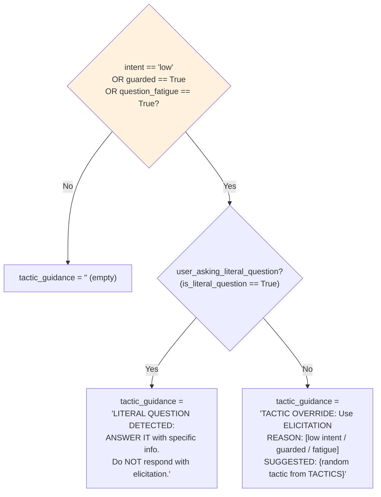
```mermaid
flowchart TD
    Check{"intent == 'low'<br/>OR guarded == True<br/>OR question_fatigue == True?"}
    Check -->|No| NoTactic["tactic_guidance = '' (empty)"]
    Check -->|Yes| LiteralQ{"user_asking_literal_question?<br/>(is_literal_question == True)"}
    LiteralQ -->|Yes| AnswerIt["tactic_guidance =<br/>'LITERAL QUESTION DETECTED:<br/>ANSWER IT with specific info.<br/>Do NOT respond with elicitation.'"]
    LiteralQ -->|No| Elicit["tactic_guidance =<br/>'TACTIC OVERRIDE: Use ELICITATION<br/>REASON: [low intent / guarded / fatigue]<br/>SUGGESTED: {random tactic from TACTICS}'"]

    style Check fill:#fff3e0
```

---

### 9d: `should_advance()` — Full Decision Tree (Priority Order)

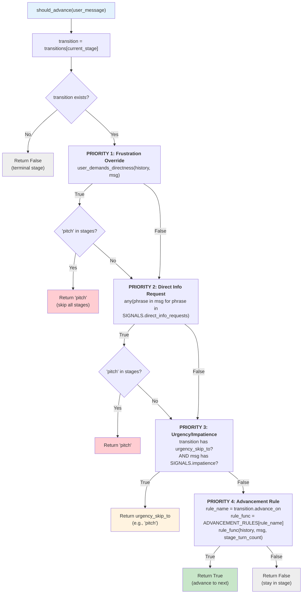
```mermaid
flowchart TD
    Start["should_advance(user_message)"] --> GetTransition["transition = transitions[current_stage]"]
    GetTransition --> HasTransition{"transition exists?"}
    HasTransition -->|No| Stay["Return False<br/>(terminal stage)"]

    HasTransition -->|Yes| CheckFrustration["<b>PRIORITY 1: Frustration Override</b><br/>user_demands_directness(history, msg)"]
    CheckFrustration -->|True| HasPitch1{"'pitch' in stages?"}
    HasPitch1 -->|Yes| JumpPitch1["Return 'pitch'<br/>(skip all stages)"]
    HasPitch1 -->|No| CheckDirect

    CheckFrustration -->|False| CheckDirect["<b>PRIORITY 2: Direct Info Request</b><br/>any(phrase in msg for phrase in<br/>SIGNALS.direct_info_requests)"]
    CheckDirect -->|True| HasPitch2{"'pitch' in stages?"}
    HasPitch2 -->|Yes| JumpPitch2["Return 'pitch'"]
    HasPitch2 -->|No| CheckUrgency

    CheckDirect -->|False| CheckUrgency["<b>PRIORITY 3: Urgency/Impatience</b><br/>transition has urgency_skip_to?<br/>AND msg has SIGNALS.impatience?"]
    CheckUrgency -->|True| JumpUrgency["Return urgency_skip_to<br/>(e.g., 'pitch')"]

    CheckUrgency -->|False| CheckRule["<b>PRIORITY 4: Advancement Rule</b><br/>rule_name = transition.advance_on<br/>rule_func = ADVANCEMENT_RULES[rule_name]<br/>rule_func(history, msg, stage_turn_count)"]
    CheckRule -->|True| Advance["Return True<br/>(advance to next)"]
    CheckRule -->|False| Stay2["Return False<br/>(stay in stage)"]

    style Start fill:#e3f2fd
    style JumpPitch1 fill:#ffcdd2
    style JumpPitch2 fill:#ffcdd2
    style JumpUrgency fill:#fff3e0
    style Advance fill:#c8e6c9
    style Stay fill:#eeeeee
    style Stay2 fill:#eeeeee
```

---

### 9e: `advance()` — Stage Transition Execution

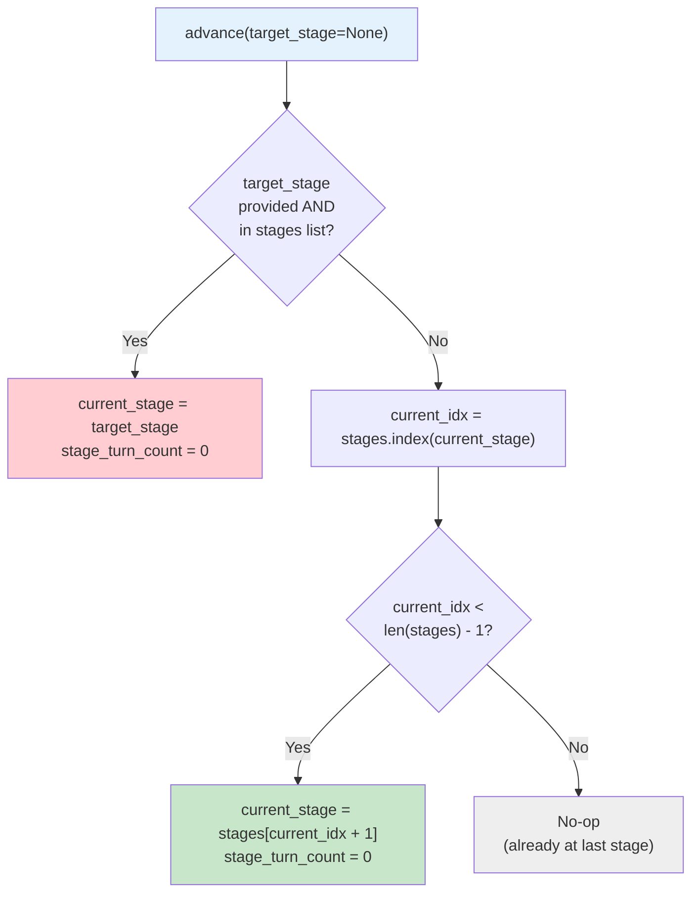
```mermaid
flowchart TD
    Start["advance(target_stage=None)"] --> HasTarget{"target_stage<br/>provided AND<br/>in stages list?"}
    HasTarget -->|Yes| DirectJump["current_stage = target_stage<br/>stage_turn_count = 0"]
    HasTarget -->|No| Sequential["current_idx = stages.index(current_stage)"]
    Sequential --> NotLast{"current_idx <<br/>len(stages) - 1?"}
    NotLast -->|Yes| NextStage["current_stage = stages[current_idx + 1]<br/>stage_turn_count = 0"]
    NotLast -->|No| NoOp["No-op<br/>(already at last stage)"]

    style Start fill:#e3f2fd
    style DirectJump fill:#ffcdd2
    style NextStage fill:#c8e6c9
    style NoOp fill:#eeeeee
```

---

### 9f: `add_turn()` — State Recording

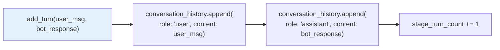
```mermaid
flowchart LR
    Start["add_turn(user_msg, bot_response)"] --> AppendUser["conversation_history.append(<br/>role: 'user', content: user_msg)"]
    AppendUser --> AppendBot["conversation_history.append(<br/>role: 'assistant', content: bot_response)"]
    AppendBot --> Increment["stage_turn_count += 1"]

    style Start fill:#e3f2fd
```

---

### 9g: Advancement Rule Functions — Internal Logic

```mermaid
flowchart TD
    subgraph INTENT["user_has_clear_intent(history, msg, turns)"]
        I1["msg has 'buy' / 'purchase'?"] -->|Yes| ITrue1["Return True"]
        I1 -->|No| I2["msg has intent keywords?<br/>(want, need, looking for,<br/>help with, interested in, price, problem)"]
        I2 -->|Yes| ITrue2["Return True"]
        I2 -->|No| I3["history has intent keywords?<br/>check_user_intent_keywords()"]
        I3 -->|Yes| ITrue3["Return True"]
        I3 -->|No| I4["analyze_state() -> intent level<br/>max_turns = _get_max_turns('intent', level)<br/>turns >= max_turns?"]
        I4 -->|Yes| ITrue4["Return True<br/>(forced advance)"]
        I4 -->|No| IFalse["Return False"]
    end

    subgraph DOUBT["user_shows_doubt(history, msg, turns)"]
        D1{"len(history) < 4?"} -->|Yes| D2["turns >= 5?"]
        D1 -->|No| D3["history has doubt keywords?<br/>(not working, struggling, problem,<br/>difficult, frustrated, true, right)"]
        D3 -->|Yes| DTrue["Return True"]
        D3 -->|No| D4["turns >= 5?"]
        D2 & D4 -->|Yes| DTrue2["Return True<br/>(max turns forced)"]
        D2 & D4 -->|No| DFalse["Return False"]
    end

    subgraph STAKES["user_expressed_stakes(history, msg, turns)"]
        S1{"len(history) < 6?"} -->|Yes| S2["turns >= 6?"]
        S1 -->|No| S3["history has emotional keywords?<br/>(feel, worried, excited, scared,<br/>hope, fear, impact, change)"]
        S3 -->|Yes| STrue["Return True"]
        S3 -->|No| S4["turns >= 6?"]
        S2 & S4 -->|Yes| STrue2["Return True<br/>(max turns forced)"]
        S2 & S4 -->|No| SFalse["Return False"]
    end

    subgraph PITCH["commitment_or_objection(history, msg, turns)"]
        P1["msg has SIGNALS.commitment?<br/>(yes, let's do it, sold, ...)"] -->|Yes| PTrue1["Return True"]
        P1 -->|No| P2["msg has SIGNALS.objection?<br/>(but, think about, too much, ...)"]
        P2 -->|Yes| PTrue2["Return True"]
        P2 -->|No| PFalse["Return False"]
    end

    subgraph FINAL["commitment_or_walkaway(history, msg, turns)"]
        F1["msg has SIGNALS.commitment?"] -->|Yes| FTrue1["Return True<br/>(deal closed)"]
        F1 -->|No| F2["msg has SIGNALS.walking?<br/>(no thanks, not interested, pass, ...)"]
        F2 -->|Yes| FTrue2["Return True<br/>(deal lost)"]
        F2 -->|No| FFalse["Return False<br/>(keep handling)"]
    end

    style INTENT fill:#e3f2fd
    style DOUBT fill:#fff3e0
    style STAKES fill:#fce4ec
    style PITCH fill:#e8f5e9
    style FINAL fill:#f3e5f5
```

---

### 9h: `user_demands_directness()` — Frustration Detection

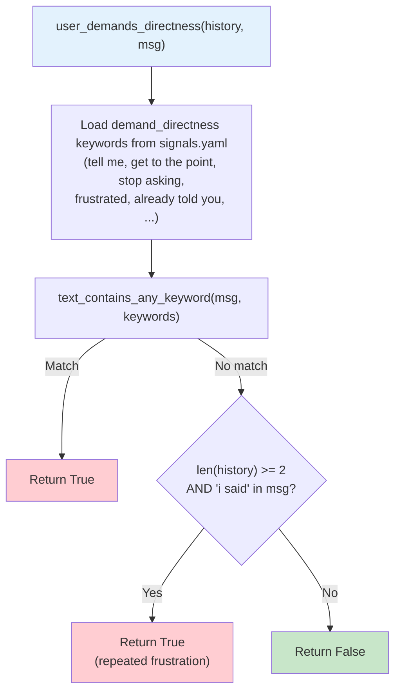
```mermaid
flowchart TD
    Start["user_demands_directness(history, msg)"] --> LoadSignals["Load demand_directness keywords from signals.yaml<br/>(tell me, get to the point, stop asking,<br/>frustrated, already told you, ...)"]
    LoadSignals --> CheckDemand["text_contains_any_keyword(msg, keywords)"]
    CheckDemand -->|Match| ReturnTrue["Return True"]
    CheckDemand -->|No match| CheckRepeat{"len(history) >= 2<br/>AND 'i said' in msg?"}
    CheckRepeat -->|Yes| ReturnTrue2["Return True<br/>(repeated frustration)"]
    CheckRepeat -->|No| ReturnFalse["Return False"]

    style Start fill:#e3f2fd
    style ReturnTrue fill:#ffcdd2
    style ReturnTrue2 fill:#ffcdd2
    style ReturnFalse fill:#c8e6c9
```

---

### 9i: `_get_max_turns()` — Config-Driven Turn Limits

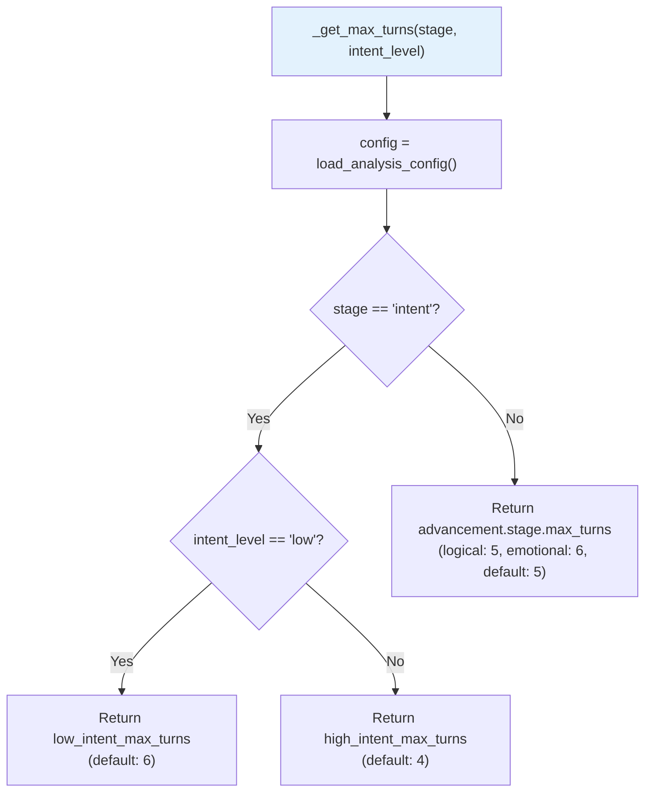
```mermaid
flowchart TD
    Start["_get_max_turns(stage, intent_level)"] --> LoadConfig["config = load_analysis_config()"]
    LoadConfig --> IsIntent{"stage == 'intent'?"}
    IsIntent -->|Yes| CheckLevel{"intent_level == 'low'?"}
    CheckLevel -->|Yes| Low["Return low_intent_max_turns<br/>(default: 6)"]
    CheckLevel -->|No| High["Return high_intent_max_turns<br/>(default: 4)"]
    IsIntent -->|No| Other["Return advancement.stage.max_turns<br/>(logical: 5, emotional: 6, default: 5)"]

    style Start fill:#e3f2fd
```

---

### 9j: Full Turn Lifecycle — Chatbot + FSM Interaction

```mermaid
sequenceDiagram
    participant C as SalesChatbot.chat()
    participant E as SalesFlowEngine
    participant P as generate_stage_prompt()
    participant NLU as analysis.py
    participant L as LLM Provider

    Note over C: Step 1: Build LLM context
    C->>E: get_current_prompt(user_msg)
    E->>P: generate_stage_prompt(strategy, stage, history, msg)
    P->>NLU: analyze_state(history, msg)
    NLU-->>P: {intent, guarded, question_fatigue}
    P->>NLU: is_repetitive_validation(history)
    NLU-->>P: bool (excessive?)
    P->>NLU: extract_preferences(history)
    P->>NLU: extract_user_keywords(history)
    P-->>E: Complete system prompt
    E-->>C: system prompt string

    Note over C: Step 2: Call LLM
    C->>L: provider.chat([system_prompt, ...history[-10:], user_msg])
    L-->>C: LLMResponse {content, latency_ms}

    Note over C: Step 3: Record turn
    C->>E: add_turn(user_msg, bot_reply)
    E->>E: history.append(user) + history.append(bot)
    E->>E: stage_turn_count += 1

    Note over C: Step 4: Check advancement
    C->>E: should_advance(user_msg)

    alt Frustration override
        E->>NLU: user_demands_directness(history, msg)
        NLU-->>E: True
        E-->>C: "pitch" (jump)
        C->>E: advance(target_stage="pitch")
        E->>E: current_stage = "pitch", turn_count = 0
    else Direct info request
        E-->>C: "pitch" (jump)
        C->>E: advance(target_stage="pitch")
    else Urgency/impatience
        E-->>C: urgency_skip_to stage
        C->>E: advance(target_stage=...)
    else Normal advancement rule passes
        E-->>C: True
        C->>E: advance()
        E->>E: current_stage = stages[idx+1], turn_count = 0
    else No advancement
        E-->>C: False
        Note over C: Stay in current stage
    end

    C-->>C: Return ChatResponse
```

---

### 9k: Rewind & Replay — `rewind_to_turn()` State Machine Reset

```mermaid
flowchart TD
    Start["rewind_to_turn(turn_index)"] --> Validate{"0 <= turn_index<br/><= max_turns?"}
    Validate -->|No| Fail["Return False"]
    Validate -->|Yes| Slice["old_history = history[:turn_index * 2]"]
    Slice --> CheckEven{"history_length % 2 == 0?"}
    CheckEven -->|No| Fail
    CheckEven -->|Yes| Reset["HARD RESET"]

    Reset --> R1["conversation_history = []"]
    Reset --> R2["stage_turn_count = 0"]
    Reset --> R3["current_stage = stages[0]"]

    R1 & R2 & R3 --> Loop{"More turn pairs<br/>in old_history?"}
    Loop -->|Yes| Replay["add_turn(user_msg, bot_msg)"]
    Replay --> CheckAdv["should_advance(user_msg)"]
    CheckAdv -->|str| JumpStage["advance(target_stage=str)"]
    CheckAdv -->|True| SeqAdv["advance()"]
    CheckAdv -->|False| NextPair["Next iteration"]
    JumpStage --> NextPair
    SeqAdv --> NextPair
    NextPair --> Loop

    Loop -->|No| Done["Return True<br/>(FSM state rebuilt)"]

    style Start fill:#e3f2fd
    style Reset fill:#ffcdd2
    style Done fill:#c8e6c9
    style Fail fill:#ffcdd2
```

---

### 9l: FLOWS Config — Declarative Stage Definitions

```mermaid
flowchart TD
    subgraph CONSULTATIVE["Consultative Flow (5 stages)"]
        CI["intent"] -->|"advance_on: user_has_clear_intent<br/>max: 6 turns (low) / 4 turns (high)"| CL["logical"]
        CL -->|"advance_on: user_shows_doubt<br/>max: 5 turns<br/>urgency_skip_to: pitch"| CE["emotional"]
        CE -->|"advance_on: user_expressed_stakes<br/>max: 6 turns"| CP["pitch"]
        CP -->|"advance_on: commitment_or_objection"| CO["objection"]
        CO -->|"advance_on: commitment_or_walkaway"| CEND["Terminal<br/>(next: None)"]
    end

    subgraph TRANSACTIONAL["Transactional Flow (3 stages)"]
        TI["intent"] -->|"advance_on: user_has_clear_intent<br/>max: 6 turns (low) / 4 turns (high)"| TP["pitch"]
        TP -->|"advance_on: commitment_or_objection"| TO["objection"]
        TO -->|"advance_on: commitment_or_walkaway"| TEND["Terminal<br/>(next: None)"]
    end

    style CONSULTATIVE fill:#e8f5e9
    style TRANSACTIONAL fill:#e3f2fd
```

---

### 9m: `analyze_state()` — Intent Classification, Guardedness & Fatigue Detection

This is the NLU core. Called once per turn by `generate_stage_prompt()`. Returns a dict that drives all adaptive routing decisions.

```mermaid
flowchart TD
    Entry["analyze_state(history, user_message, signal_keywords?)"]

    Entry --> LoadSignals{"signal_keywords<br/>provided?"}
    LoadSignals -->|No| Import["from content import SIGNALS"]
    LoadSignals -->|Yes| UseProvided["Use provided signals"]
    Import --> GoalCheck
    UseProvided --> GoalCheck

    subgraph INTENT_CLASSIFICATION["INTENT CLASSIFICATION"]
        GoalCheck["_has_user_stated_clear_goal(history)<br/>Checks history[-RECENT_HISTORY_WINDOW:]<br/>for goal_indicators from config YAML"]
        GoalCheck --> DefaultIntent["intent = 'medium'"]
        DefaultIntent --> HasText{"user_message OR history?"}
        HasText -->|No| SkipIntent["Keep intent = 'medium'"]
        HasText -->|Yes| BuildRecent["recent_text = user_msg + <br/>extract_recent_user_messages(history, 2)"]
        BuildRecent --> CheckLow{"text_contains_any_keyword<br/>(recent_text, SIGNALS.low_intent)?<br/>('just browsing', 'all good', <br/>'no rush', 'maybe later', ...)"}
        CheckLow -->|Yes| Low["intent = 'low'"]
        CheckLow -->|No| CheckHigh{"text_contains_any_keyword<br/>(recent_text, SIGNALS.high_intent)?<br/>('need', 'want', 'urgent', <br/>'struggling', 'asap', ...)"}
        CheckHigh -->|Yes| High["intent = 'high'"]
        CheckHigh -->|No| Medium["intent stays 'medium'"]

        Low & High & Medium --> IntentLock{"INTENT LOCK:<br/>user_stated_clear_goal?"}
        IntentLock -->|Yes| ForceHigh["intent = 'high'<br/>(override low/medium)"]
        IntentLock -->|No| KeepIntent["Keep current intent"]
        SkipIntent --> GuardCheck
        ForceHigh --> GuardCheck
        KeepIntent --> GuardCheck
    end

    subgraph GUARDEDNESS_DETECTION["GUARDEDNESS DETECTION (Context-Aware)"]
        GuardCheck --> HasMsg{"user_message?"}
        HasMsg -->|No| NotGuarded1["guarded = False"]
        HasMsg -->|Yes| ShortCheck{"len(msg.split())<br/><= SHORT_MESSAGE_LIMIT (4)?"}
        ShortCheck -->|No| NotGuarded2["guarded = False"]
        ShortCheck -->|Yes| GuardedSignal{"text_contains_any_keyword<br/>(msg, SIGNALS.guarded)?<br/>('maybe', 'idk', 'meh',<br/>'sort of', 'not sure', ...)"}
        GuardedSignal -->|No| NotGuarded3["guarded = False"]
        GuardedSignal -->|Yes| ContextCheck["<b>Context check:</b><br/>prev bot msg has '?'?<br/>AND prev user msg >= 6 words?"]
        ContextCheck -->|"Both True"| AgreementPattern["Agreement pattern detected<br/>Q → substantive answer → 'ok'<br/>guarded = False"]
        ContextCheck -->|"Either False"| IsGuarded["guarded = True"]
    end

    subgraph FATIGUE_DETECTION["QUESTION FATIGUE DETECTION"]
        NotGuarded1 & NotGuarded2 & NotGuarded3 & AgreementPattern & IsGuarded --> FatigueCheck{"history exists?"}
        FatigueCheck -->|No| NoFatigue["question_fatigue = False"]
        FatigueCheck -->|Yes| CountQ["recent_bot = history[-4:]<br/>where role == 'assistant'<br/>question_count = count msgs with '?'"]
        CountQ --> FatigueThreshold{"question_count >=<br/>QUESTION_FATIGUE_THRESHOLD (2)?"}
        FatigueThreshold -->|Yes| Fatigued["question_fatigue = True"]
        FatigueThreshold -->|No| NotFatigued["question_fatigue = False"]
    end

    NoFatigue & Fatigued & NotFatigued --> Return["Return {<br/>  intent: 'high'|'medium'|'low',<br/>  guarded: True|False,<br/>  question_fatigue: True|False<br/>}"]

    style Entry fill:#e3f2fd
    style INTENT_CLASSIFICATION fill:#e8f5e9
    style GUARDEDNESS_DETECTION fill:#fff3e0
    style FATIGUE_DETECTION fill:#fce4ec
    style Return fill:#c8e6c9
```

---

### 9n: Prompt Assembly Pipeline — Layer-by-Layer Construction

Shows exactly what text layers are stacked to build the final system prompt string sent to the LLM.

```mermaid
flowchart TD
    subgraph LAYER_1["LAYER 1: get_base_prompt()"]
        L1A["PRODUCT: {product_context}"]
        L1B["STRATEGY: {strategy_type.upper()}"]
        L1C["get_base_rules() — full constraint hierarchy:<br/>INTENT CLASSIFICATION<br/>TACTIC SELECTION<br/>VALIDATION BUDGET + TRIGGER<br/>INFORMATION PRIORITY<br/>P1 HARD RULES<br/>ANTI-PARROTING<br/>QUESTION CLARITY<br/>P2 STRONG PREFERENCES<br/>P3 GUIDELINES<br/>ROLE INTEGRITY<br/>CONFLICT RESOLUTION"]
        L1D["RECENT CONVERSATION:<br/>format_conversation_context(history, 6)<br/>→ last 6 msgs as 'USER: ...' / 'YOU: ...'"]
        L1E["TONE LOCK"]
        L1F["STATEMENT-BEFORE-QUESTION table<br/>(Summarizing, Contextualizing,<br/>Transitioning, Validating, Framing)"]
        L1G["ELICITATION table<br/>(Presumptive, Understatement, Reflective,<br/>Shared Observation, Curiosity)"]
        L1A --> L1B --> L1C --> L1D --> L1E --> L1F --> L1G
    end

    subgraph LAYER_2["LAYER 2: Stage-Specific Prompt"]
        L2A["STRATEGY_PROMPTS[strategy][stage]<br/>e.g., consultative.intent, transactional.pitch<br/>Contains: GOAL, PATTERN, EXAMPLES,<br/>ADVANCE WHEN, SELF-CHECK"]
        L2B["OR special variant:<br/>intent_low (elicitation-only prompt)"]
    end

    subgraph LAYER_3["LAYER 3: Adaptive Context (conditional)"]
        L3A["TACTIC OVERRIDE<br/>(if low intent / guarded / fatigue)<br/>REASON + SUGGESTED STATEMENT"]
        L3B["—OR— LITERAL QUESTION DETECTED<br/>(if user asked real question)"]
        L3C["USER PREFERENCES EXTRACTED<br/>(if extract_preferences found any)"]
        L3D["USER'S OWN WORDS<br/>(extract_user_keywords → lexical entrainment)"]
    end

    subgraph LAYER_SPECIAL["OVERRIDE LAYERS (mutually exclusive, replace Layer 2+3)"]
        LS1["IMMEDIATE ACTION REQUIRED<br/>(direct request → option format template)"]
        LS2["SOFT POSITIVE → ASSUMPTIVE CLOSE<br/>(differentiate + logistics question)"]
        LS3["CONSTRAINT VIOLATION DETECTED<br/>(excessive validation → corrective action)"]
        LS4["OBJECTION CLASSIFIED: type<br/>REFRAME STRATEGY: name<br/>GUIDANCE: instruction"]
    end

    LAYER_1 --> LAYER_2 --> LAYER_3 --> Final["Final prompt string<br/>(sent as system message to LLM)"]
    LAYER_1 --> LAYER_SPECIAL --> Final

    style LAYER_1 fill:#e3f2fd
    style LAYER_2 fill:#e8f5e9
    style LAYER_3 fill:#fff3e0
    style LAYER_SPECIAL fill:#ffcdd2
    style Final fill:#c8e6c9
```

---

### 9o: Analysis Utility Functions — `classify_objection()`, `is_repetitive_validation()`, `is_literal_question()`

**9o-i: `classify_objection()` — Objection Type Detection & Reframe Selection**

```mermaid
flowchart TD
    Entry["classify_objection(user_msg, history?)"] --> LoadConfig["config = load_analysis_config()<br/>classification_order from YAML:<br/>[smokescreen, partner, money,<br/>fear, logistical, think]"]

    LoadConfig --> BuildText["combined_text = last 4 user msgs + current msg<br/>(all lowercased)"]

    BuildText --> Loop{"For each obj_type<br/>in classification_order<br/>(priority order)"}

    Loop -->|"Check smokescreen first"| KW1["_OBJECTION_KEYWORDS[smokescreen]:<br/>'not interested', 'pass', 'nah', ..."]
    KW1 -->|Match| Strat1["strategies = config.reframe_strategies[smokescreen]<br/>strategy_name = random.choice(strategies)<br/>guidance = _REFRAME_DESCRIPTIONS[smokescreen][strategy]"]
    KW1 -->|No match| KW2["_OBJECTION_KEYWORDS[partner]:<br/>'spouse', 'check with', 'boss', ..."]
    KW2 -->|Match| Strat2["Same pattern: random strategy + guidance"]
    KW2 -->|No match| KW3["_OBJECTION_KEYWORDS[money]:<br/>'expensive', 'afford', 'budget', ..."]
    KW3 -->|Match| Strat3["Same pattern"]
    KW3 -->|No match| KW4["→ fear → logistical → think"]
    KW4 -->|Match| Strat4["Same pattern"]
    KW4 -->|No match| Unknown["Return {type: 'unknown',<br/>strategy: 'general_reframe',<br/>guidance: 'Acknowledge concern.<br/>Recall goal. Ask what holds back.'}"]

    Strat1 & Strat2 & Strat3 & Strat4 --> Return["Return {<br/>  type: str,<br/>  strategy: str,<br/>  guidance: str (LLM instruction)<br/>}"]

    style Entry fill:#e3f2fd
    style Return fill:#c8e6c9
    style Unknown fill:#eeeeee
```

**9o-ii: `is_repetitive_validation()` — Validation Loop Detection**

```mermaid
flowchart TD
    Entry["is_repetitive_validation(history, threshold?)"] --> SetThresh{"threshold<br/>provided?"}
    SetThresh -->|No| Default["threshold = CONFIG.VALIDATION_LOOP_THRESHOLD (2)"]
    SetThresh -->|Yes| UseProvided["Use provided threshold"]

    Default & UseProvided --> MinCheck{"history exists<br/>AND len >= 4?"}
    MinCheck -->|No| ReturnFalse1["Return False"]

    MinCheck -->|Yes| LoadPhrases["validation_phrases = load_signals().validation_phrases<br/>('makes sense', 'sounds like', 'i see',<br/>'got it', 'fair enough', 'right', 'okay', ...)"]

    LoadPhrases --> Window["recent_bot = [msg.content.lower()<br/>for msg in history[-10:]<br/>where role == 'assistant']<br/><i>(5 bot turns max)</i>"]

    Window --> Count["validation_count = sum(<br/>1 for each bot msg<br/>if any(phrase in msg<br/>for phrase in validation_phrases))"]

    Count --> Threshold{"validation_count<br/>>= threshold (2)?"}
    Threshold -->|Yes| ReturnTrue["Return True<br/>(triggers CONSTRAINT VIOLATION path)"]
    Threshold -->|No| ReturnFalse2["Return False"]

    style Entry fill:#e3f2fd
    style ReturnTrue fill:#ffcdd2
    style ReturnFalse1 fill:#c8e6c9
    style ReturnFalse2 fill:#c8e6c9
```

**9o-iii: `is_literal_question()` — Speech Act Classification**

```mermaid
flowchart TD
    Entry["is_literal_question(user_msg)"] --> Empty{"msg empty?"}
    Empty -->|Yes| RetFalse1["Return False"]

    Empty -->|No| LoadPatterns["Load question_patterns from config YAML:<br/>starters: ['what', 'how', 'why', 'when', ...]<br/>rhetorical_markers: ['right?', 'don't you think', ...]"]

    LoadPatterns --> Check1["starts_with_question =<br/>any(msg starts with starter)"]
    LoadPatterns --> Check2["ends_with_question_mark =<br/>msg ends with '?'"]
    LoadPatterns --> Check3["has_rhetorical_marker =<br/>any(marker in msg)"]
    LoadPatterns --> Check4["has_multiple_clauses =<br/>msg.count(',') > 1"]

    Check1 & Check2 --> IsQ["is_question = starts_with OR ends_with_?"]
    Check3 & Check4 --> IsR["is_rhetorical = has_marker OR multiple_clauses"]

    IsQ & IsR --> Final{"is_question AND<br/>NOT is_rhetorical?"}
    Final -->|Yes| RetTrue["Return True<br/>(answer directly, don't elicit)"]
    Final -->|No| RetFalse2["Return False"]

    style Entry fill:#e3f2fd
    style RetTrue fill:#c8e6c9
    style RetFalse1 fill:#eeeeee
    style RetFalse2 fill:#eeeeee
```

---

### 9p: `SalesChatbot.chat()` — Full Orchestrator with Error Handling

```mermaid
flowchart TD
    Entry["chat(user_message)"] --> BuildMsgs["<b>Step 1: Build LLM messages</b><br/>recent_history = flow_engine.conversation_history[-10:]<br/>system = flow_engine.get_current_prompt(user_msg)<br/>messages = [system] + recent_history + [user_msg]"]

    BuildMsgs --> ExtractMeta["provider_name = type(provider).__name__<br/>model_name = provider.get_model_name()"]

    ExtractMeta --> StartTimer["request_start = time.time()"]
    StartTimer --> TryCatch{"try:"}

    TryCatch --> CallLLM["llm_response = provider.chat(<br/>messages, temperature=0.8,<br/>max_tokens=250, stage=current_stage)"]

    CallLLM --> CalcLatency["latency_ms = (time.time() - start) × 1000"]

    CalcLatency --> CheckError{"llm_response.error<br/>OR empty content?"}
    CheckError -->|Yes| FallbackA["fallback = 'I'm having trouble<br/>({error_detail}). Try again?'<br/>flow_engine.add_turn(user_msg, fallback)"]
    FallbackA --> ReturnFallbackA["Return ChatResponse(<br/>content=fallback, latency, ...)"]

    CheckError -->|No| RegexGuard{"stage in<br/>('pitch', 'objection')?"}
    RegexGuard -->|Yes| StripQ["<b>Layer 3: Regex Enforcement</b><br/>bot_reply = re.sub(<br/>r'\s*\?\s*$', '.', bot_reply)<br/><i>Strip trailing '?' to prevent<br/>permission questions</i>"]
    RegexGuard -->|No| KeepReply["Keep bot_reply as-is"]
    StripQ --> RecordTurn
    KeepReply --> RecordTurn

    RecordTurn["<b>Step 3: Record turn</b><br/>flow_engine.add_turn(user_msg, bot_reply)"]

    RecordTurn --> LogPerf{"session_id exists?"}
    LogPerf -->|Yes| PerfLog["PerformanceTracker.log_stage_latency(<br/>session_id, stage, strategy,<br/>latency_ms, provider, model,<br/>user_msg_length, bot_response_length)"]
    LogPerf -->|No| SkipLog["Skip logging"]

    PerfLog & SkipLog --> CheckAdvance["<b>Step 4: Check advancement</b><br/>advancement = flow_engine.should_advance(user_msg)"]

    CheckAdvance --> AdvResult{"advancement value?"}
    AdvResult -->|"str (e.g., 'pitch')"| DirectJump["flow_engine.advance(<br/>target_stage=advancement)"]
    AdvResult -->|"True"| SeqAdvance["flow_engine.advance()"]
    AdvResult -->|"False"| NoAdvance["Stay in current stage"]

    DirectJump & SeqAdvance & NoAdvance --> ReturnSuccess["Return ChatResponse(<br/>content=bot_reply,<br/>latency_ms, provider,<br/>model, input_len, output_len)"]

    TryCatch -->|"except Exception"| CatchAll["logger.exception(error)<br/>latency_ms = elapsed<br/>fallback = 'Something went wrong...'<br/>flow_engine.add_turn(user_msg, fallback)"]
    CatchAll --> ReturnFallbackB["Return ChatResponse(<br/>content=fallback, latency, ...)"]

    style Entry fill:#e3f2fd
    style CallLLM fill:#fce4ec
    style ReturnSuccess fill:#c8e6c9
    style ReturnFallbackA fill:#ffcdd2
    style ReturnFallbackB fill:#ffcdd2
    style CheckAdvance fill:#fff3e0
```

---

### 9q: Data Flow — Config YAML Files → Functions → Prompt Assembly

Shows which YAML files feed which functions and how data flows through to the final LLM prompt.

```mermaid
flowchart LR
    subgraph YAML_FILES["YAML Config Files (src/config/)"]
        SY["signals.yaml<br/>16 keyword categories:<br/>impatience, commitment, objection,<br/>walking, low_intent, high_intent,<br/>guarded, demand_directness,<br/>validation_phrases, direct_info_requests,<br/>price_sensitivity, urgency, comparing,<br/>needs_approval, skepticism, soft_positive"]
        AC["analysis_config.yaml<br/>thresholds, advancement,<br/>goal_indicators, preference_keywords,<br/>question_patterns, elicitation_context,<br/>objection_handling"]
        PC["product_config.yaml<br/>products: {type → strategy + context + knowledge}"]
    end

    subgraph CONFIG_LOADER["config_loader.py (all LRU cached)"]
        LS["load_signals()"]
        LA["load_analysis_config()"]
        LP["load_product_config()"]
    end

    SY --> LS
    AC --> LA
    PC --> LP

    subgraph CONSUMERS["Consumer Functions"]
        direction TB

        subgraph ANALYSIS["analysis.py"]
            AS["analyze_state()<br/>uses: low_intent, high_intent,<br/>guarded signals + thresholds"]
            UD["user_demands_directness()<br/>uses: demand_directness signals"]
            IRV["is_repetitive_validation()<br/>uses: validation_phrases signals<br/>+ validation_loop_threshold"]
            ILQ["is_literal_question()<br/>uses: question_patterns config"]
            EP["extract_preferences()<br/>uses: preference_keywords config"]
            CO["classify_objection()<br/>uses: objection_handling config<br/>+ _OBJECTION_KEYWORDS"]
            HG["_has_user_stated_clear_goal()<br/>uses: goal_indicators config"]
            GMT["_get_max_turns() (flow.py)<br/>uses: advancement config"]
        end

        subgraph CONTENT["content.py"]
            SIG["SIGNALS dict<br/>(module-level load)"]
            GSP["generate_stage_prompt()<br/>calls: analyze_state, extract_preferences,<br/>is_repetitive_validation, extract_user_keywords,<br/>is_literal_question, classify_objection"]
            GBP["get_base_prompt()<br/>calls: get_base_rules(), format_conversation_context()"]
        end

        subgraph FLOW["flow.py"]
            SA["should_advance()<br/>reads: SIGNALS.direct_info_requests,<br/>SIGNALS.impatience"]
            AR["ADVANCEMENT_RULES<br/>call: text_contains_any_keyword,<br/>check_user_intent_keywords,<br/>analyze_state"]
        end
    end

    LS --> SIG
    LS --> UD
    LS --> IRV
    LS --> SA

    LA --> AS
    LA --> ILQ
    LA --> EP
    LA --> CO
    LA --> HG
    LA --> GMT

    LP --> INIT["SalesChatbot.__init__()<br/>get_product_config(product_type)"]

    GSP --> PROMPT["Final System Prompt<br/>(sent to LLM)"]
    GBP --> GSP

    AS --> GSP
    EP --> GSP
    IRV --> GSP
    ILQ --> GSP
    CO --> GSP

    style YAML_FILES fill:#fff8e1
    style CONFIG_LOADER fill:#f3e5f5
    style ANALYSIS fill:#e3f2fd
    style CONTENT fill:#e8f5e9
    style FLOW fill:#fff3e0
    style PROMPT fill:#c8e6c9
```

---

### 9r: `SalesChatbot.switch_provider()` — Hot-Swap Logic

```mermaid
flowchart TD
    Entry["switch_provider(provider_type, model?)"] --> SaveOld["old_provider_name = current provider<br/>old_model = current model"]

    SaveOld --> TryCreate{"try: create_provider(provider_type, model)"}
    TryCreate -->|Exception| FailCreate["Return {success: False,<br/>error: str(e),<br/>current_provider, current_model}"]

    TryCreate -->|Success| CheckAvail{"new_provider.is_available()?"}
    CheckAvail -->|No| FailAvail["Return {success: False,<br/>error: 'provider not available',<br/>current_provider, current_model}"]

    CheckAvail -->|Yes| Swap["self.provider = new_provider<br/><i>Note: flow_engine untouched —<br/>conversation state fully preserved</i>"]

    Swap --> LogSwitch["logger.info(old → new)"]
    LogSwitch --> ReturnSuccess["Return {success: True,<br/>from: old, to: new,<br/>old_model, new_model}"]

    style Entry fill:#e3f2fd
    style ReturnSuccess fill:#c8e6c9
    style FailCreate fill:#ffcdd2
    style FailAvail fill:#ffcdd2
```

---

### 9s: `text_contains_any_keyword()` — Cached Regex Matching (Performance Core)

This function is called by nearly every analysis function. Uses LRU-cached compiled regex patterns with word boundaries.

```mermaid
flowchart TD
    Entry["text_contains_any_keyword(text, keywords)"] --> Empty{"text is empty?"}
    Empty -->|Yes| RetFalse["Return False"]

    Empty -->|No| Iterate["For each keyword in keywords:"]
    Iterate --> Cache{"_compile_keyword_pattern(keyword)<br/><i>@lru_cache(maxsize=256)</i>"}
    Cache -->|"Cache hit"| Reuse["Reuse compiled regex"]
    Cache -->|"Cache miss"| Compile["re.compile(r'\b{keyword}\b', re.I)<br/><i>Word boundary + case insensitive</i><br/>Store in cache"]

    Reuse & Compile --> Search["pattern.search(text)"]
    Search -->|Match found| RetTrue["Return True (short-circuit)"]
    Search -->|No match| Next{"More keywords?"}
    Next -->|Yes| Iterate
    Next -->|No| RetFalse2["Return False"]

    style Entry fill:#e3f2fd
    style Cache fill:#f3e5f5
    style RetTrue fill:#c8e6c9
    style RetFalse fill:#eeeeee
    style RetFalse2 fill:#eeeeee
```

**Why word boundaries matter:**
- `\bjust\b` matches "just" but NOT "justice" or "adjustment"
- `\bneed\b` matches "need" but NOT "needle" or "needed"
- Prevents false-positive signal detection that would cause wrong stage transitions

---

### 9t: `extract_preferences()` + `extract_user_keywords()` — User Context Extraction

**9t-i: `extract_preferences()` — Category-Based Preference Mining**

```mermaid
flowchart TD
    Entry["extract_preferences(history)"] --> Empty{"history empty?"}
    Empty -->|Yes| RetEmpty["Return ''"]

    Empty -->|No| LoadConfig["pref_config = analysis_config.yaml<br/>.preference_keywords<br/>e.g., {budget: ['price', 'cost', 'afford'],<br/>reliability: ['reliable', 'dependable'],<br/>performance: ['fast', 'power', 'engine'], ...}"]

    LoadConfig --> ScanAll["For each msg in history<br/>where role == 'user':"]
    ScanAll --> CheckCategories["For each category, keywords<br/>in pref_config:"]
    CheckCategories --> Match{"any(keyword in<br/>msg.content.lower())?"}
    Match -->|Yes| Add["mentioned.add(category)<br/><i>(set — no duplicates)</i>"]
    Match -->|No| Skip["Next category"]
    Add & Skip --> MoreCats{"More categories?"}
    MoreCats -->|Yes| CheckCategories
    MoreCats -->|No| MoreMsgs{"More messages?"}
    MoreMsgs -->|Yes| ScanAll
    MoreMsgs -->|No| Return["Return ', '.join(sorted(mentioned))<br/>e.g., 'budget, performance, reliability'"]

    style Entry fill:#e3f2fd
    style Return fill:#c8e6c9
```

**9t-ii: `extract_user_keywords()` — Lexical Entrainment Term Extraction**

```mermaid
flowchart TD
    Entry["extract_user_keywords(history, max_keywords=6)"]

    Entry --> ScanMsgs["For each msg in history<br/>where role == 'user':"]
    ScanMsgs --> SplitWords["words = msg.content.lower().split()"]
    SplitWords --> Filter["For each word:<br/>cleaned = strip punctuation<br/>Skip if: len <= 2<br/>Skip if: in stop_words set<br/>(75+ common words: i, me, the, is, ...)"]
    Filter --> Dedupe{"cleaned already<br/>in keywords list?"}
    Dedupe -->|Yes| SkipWord["Skip (preserve order)"]
    Dedupe -->|No| Append["keywords.append(cleaned)"]

    SkipWord & Append --> MoreWords{"More words?"}
    MoreWords -->|Yes| Filter
    MoreWords -->|No| MoreMsgs{"More messages?"}
    MoreMsgs -->|Yes| ScanMsgs
    MoreMsgs -->|No| Slice["Return keywords[-max_keywords:]<br/><i>(last 6 unique terms —<br/>most recent = most relevant)</i>"]

    style Entry fill:#e3f2fd
    style Slice fill:#c8e6c9
```
