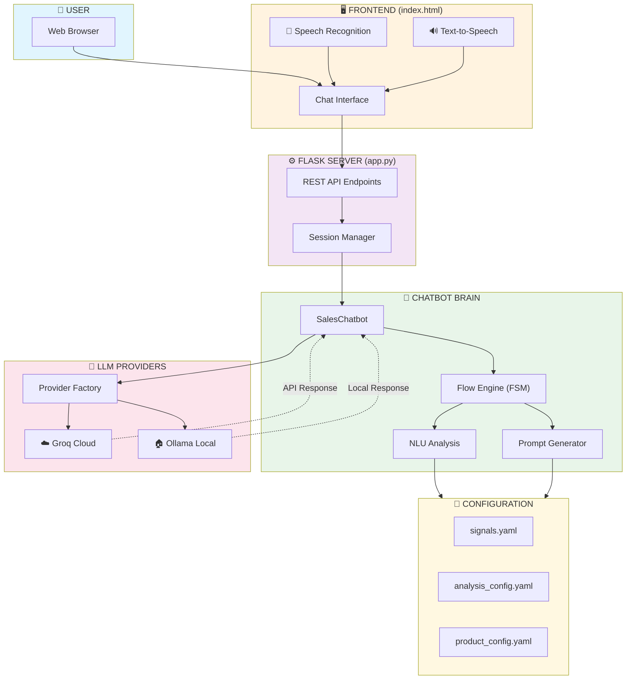
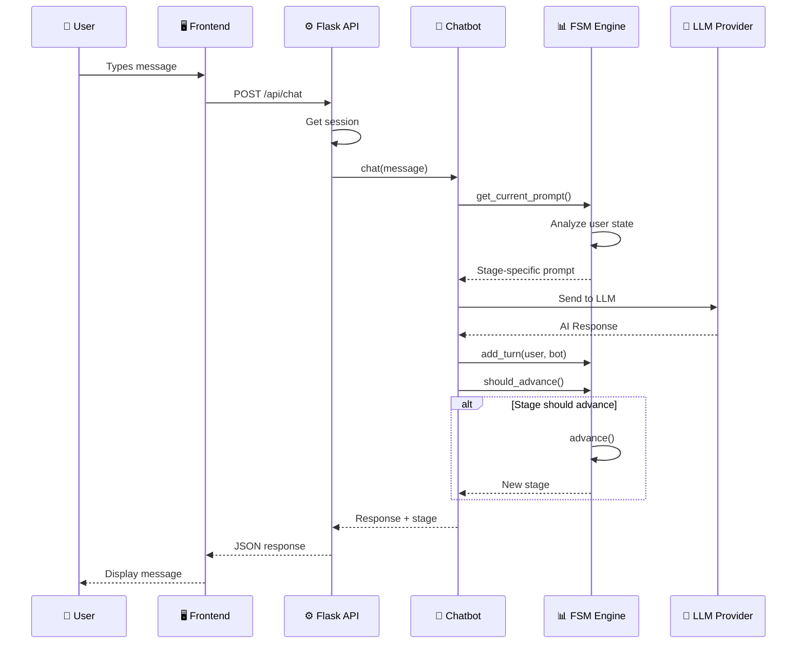
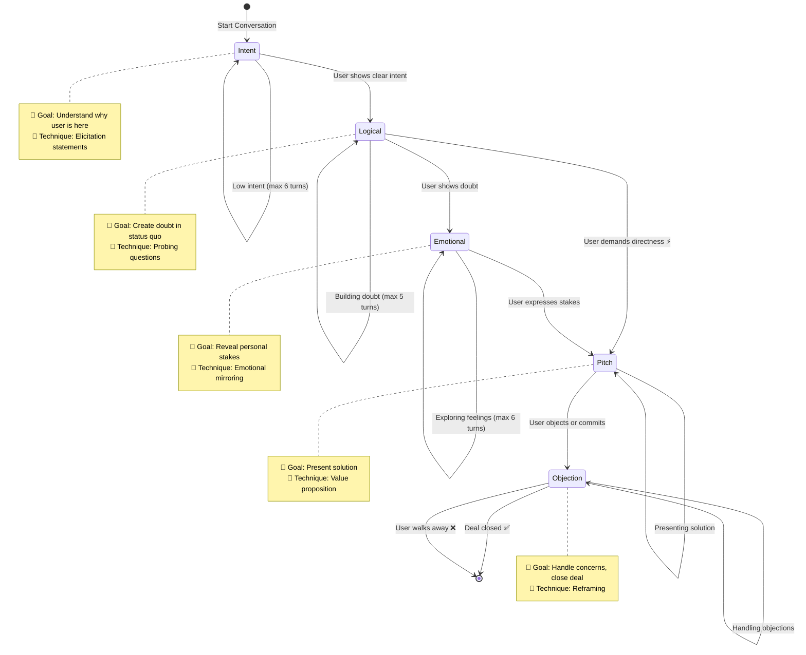
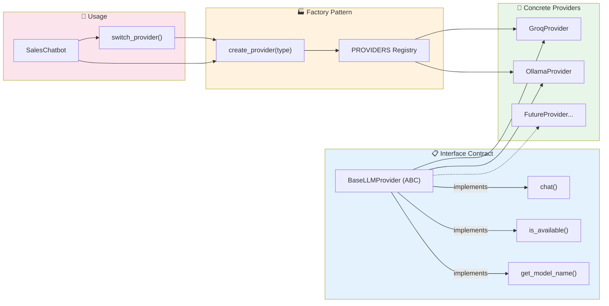
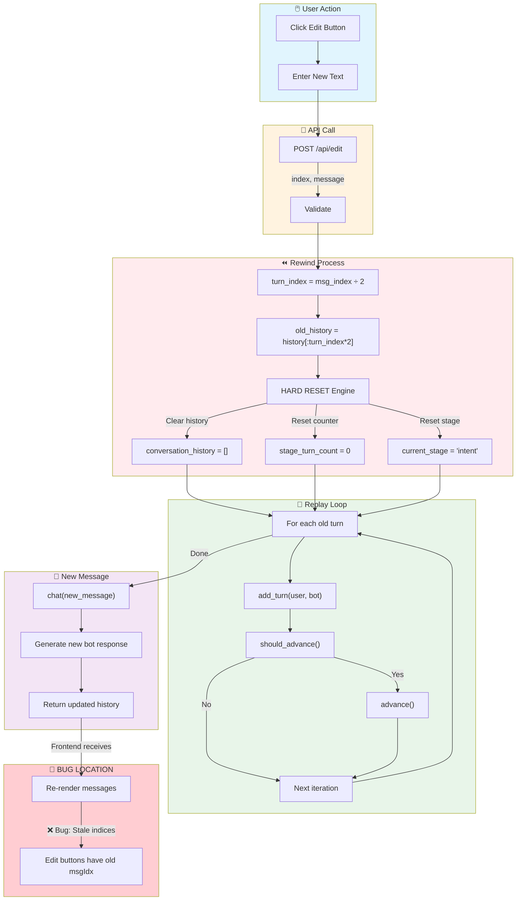
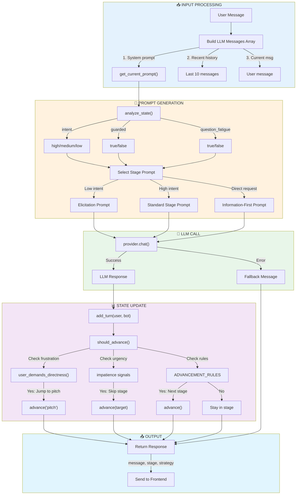
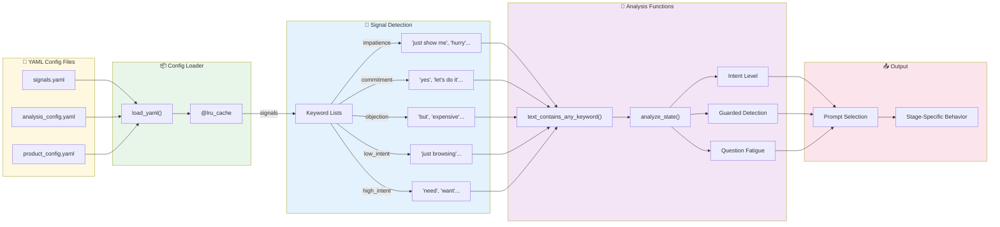

# Sales Chatbot Architecture Diagrams

## Diagram 1: Overall System Architecture (High-Level)



---

## Diagram 2: Chat Message Flow (Step-by-Step)



---

## Diagram 3: Finite State Machine (Sales Flow)



---

## Diagram 4: Provider Architecture (Switching)



---

## Diagram 5: Edit/Rewind Flow (Bug Analysis)



---

## Diagram 6: Chatbot Logic (Zoomed In)



---

## Diagram 7: Configuration & Analysis Flow



---

## Legend

| Symbol | Meaning |
|--------|---------|
| 👤 | User |
| 🖥️ | Frontend |
| ⚙️ | Backend/API |
| 🧠 | Core Logic |
| 🤖 | LLM/AI |
| 📁 | Configuration |
| ✅ | Success |
| ❌ | Failure |
| ⚡ | Override/Skip |
| 🐛 | Bug Location |

---

## Simple Explanation (For a 6-Year-Old)

### What Does This Chatbot Do?

```
┌─────────────────────────────────────────────────┐
│  🎭 IMAGINE A HELPFUL ROBOT SALESPERSON 🤖     │
├─────────────────────────────────────────────────┤
│                                                 │
│  1. 👋 HELLO! (Intent Stage)                   │
│     Robot asks: "What do you need?"            │
│     Like when a shop assistant says "Hi!"      │
│                                                 │
│  2. 🤔 THINKING (Logical Stage)                │
│     Robot asks: "Is your current thing broken?"│
│     Like asking "Why do you want new shoes?"   │
│                                                 │
│  3. 💖 FEELINGS (Emotional Stage)              │
│     Robot asks: "How does that make you feel?" │
│     Like asking "Are you sad your toy broke?"  │
│                                                 │
│  4. 🎁 HERE'S THE ANSWER! (Pitch Stage)        │
│     Robot says: "I have just the thing!"       │
│     Like showing you the perfect toy           │
│                                                 │
│  5. 🙋 ANY QUESTIONS? (Objection Stage)        │
│     Robot says: "Is the price okay?"           │
│     Like asking "Do you have enough pocket     │
│     money?"                                     │
│                                                 │
└─────────────────────────────────────────────────┘

The robot listens to what you say and decides 
which step to be on. If you're in a hurry, 
it skips to showing you options faster! ⚡
```

### How Does the Robot Talk?

```
┌─────────────────────────────────────────────────┐
│  📱 YOUR PHONE          →   🏪 SHOP SERVER     │
│  (Where you type)            (Flask app)        │
│                                                 │
│       ↓                           ↓             │
│                                                 │
│  💬 "I need a car"     →   🧠 ROBOT BRAIN     │
│                              (Chatbot)          │
│                                                 │
│       ↓                           ↓             │
│                                                 │
│  🤖 AI HELPER          ←   📝 INSTRUCTIONS    │
│  (Groq or Ollama)           (Prompts)          │
│                                                 │
│       ↓                                         │
│                                                 │
│  💬 "What kind of car do you want?"            │
│                                                 │
└─────────────────────────────────────────────────┘

It's like sending a letter to a smart friend
who reads your letter and writes back! ✉️
```