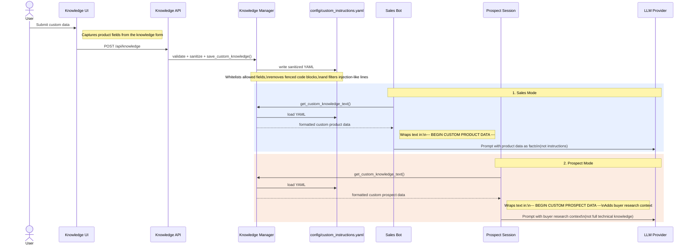

# Objection Handling Decision Map

```mermaid
sequenceDiagram
    actor User
    participant UI as Knowledge UI
    participant API as Knowledge API
    participant KM as Knowledge Manager
    participant YAML as config/custom_instructions.yaml
    participant Sales as Sales Bot
    participant Prospect as Prospect Session
    participant LLM as LLM Provider

    User->>UI: Submit custom data
    Note right of UI: Captures product fields from the knowledge form

    UI->>API: POST /api/knowledge
    API->>KM: validate + sanitize + save_custom_knowledge()
    KM->>YAML: write sanitized YAML
    Note over KM,YAML: Whitelists allowed fields,\nremoves fenced code blocks,\nand filters injection-like lines

    rect rgb(232, 240, 255)
        Note over Sales,LLM: 1. Sales Mode

        Sales->>KM: get_custom_knowledge_text()
        KM->>YAML: load YAML
        KM-->>Sales: formatted custom product data
        Note right of Sales: Wraps text in:\n--- BEGIN CUSTOM PRODUCT DATA ---

        Sales->>LLM: Prompt with product data as facts\n(not instructions)
    end

    rect rgb(252, 236, 226)
        Note over Prospect,LLM: 2. Prospect Mode

        Prospect->>KM: get_custom_knowledge_text()
        KM->>YAML: load YAML
        KM-->>Prospect: formatted custom prospect data
        Note right of Prospect: Wraps text in:\n--- BEGIN CUSTOM PROSPECT DATA ---\nAdds buyer research context

        Prospect->>LLM: Prompt with buyer research context\n(not full technical knowledge)
    end
```
